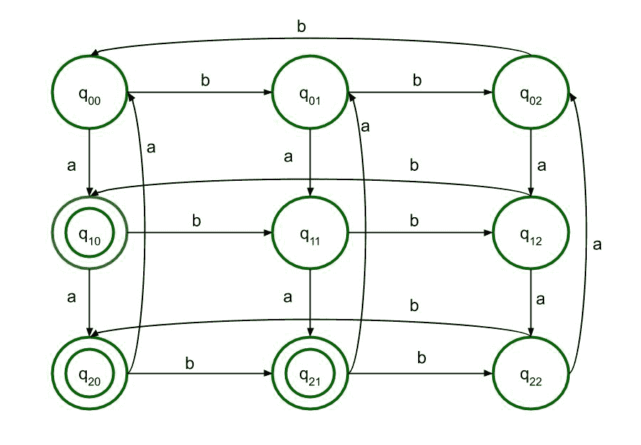

# 正则语言的 DFA L = { w∑{ a，b}* : Na(w) mod 3 > Nb(w) mod 3}

> 原文:[https://www . geesforgeks . org/DFA-of-regular-language-l-w-% E2 % 88% 88-ab-naw-mod-3-nbw-mod-3/](https://www.geeksforgeeks.org/dfa-of-regular-language-l-w-%e2%88%88-ab-naw-mod-3-nbw-mod-3/)

在本文中，我们将设计正则语言 L = { w∑{ a，b}* : Na(w) mod 3 > Nb(w) mod 3}的确定性有限自动机。

[正则表达式](https://www.geeksforgeeks.org/write-regular-expressions/)可以是从终端符号∅到两个正则表达式的并集(R1 + R2)、它们的交集(R1 + R2)或正则表达式的闭包(R1*)或 a∈σ，其中σ是输入符号的有限集合，也是语言{a}的正则表达式。

> 正则语言是一种可以用正则表达式表达的语言。

**正则表达式示例:**

1.  恰好有一个 a 的所有字符串σ= { a，b}集合的正则表达式。

    ```
    b*ab* 
    ```

2.  以前缀 ab 开头的所有字符串σ= { a，b}集合的正则表达式。

    ```
    ab(a+b)* 
    ```

**问题:**
正则语言 L = { w∑{ a，b}* : Na(w) mod 3 > Nb(w) mod 3}表示该语言接受字符串模 3 中 a 的计数大于 b 的模 3 的计数的所有字符串。

**示例:**

```
Input : aaabbbb

Output : Not Accepted

Reason : Na(w) = 3; 3 mod 3 = 0 and Nb(w) = 4; 4 mod 3 = 1\. So Na(w) mod 3 !> Nb(w) mod 3

Input : aabbbb

Output : Accepted

Reason : Na(w) = 2 and Nb(w) = 4; 2 mod 3 = 2 and 4 mod 3 = 1\. So Na(w) mod 3 > Nb(w) mod 3 

```

**逼近:**
既然是模 3，余数可以是 0，1，2。
当 Na(w) mod 3 = 0 时，那么无论 Nb(w) mod 3 的值是多少，语言都不会被接受。
当 Na(w) mod 3 = 1 时，则该语言在 Nb(w) mod 3 = 0 时被接受。
同样，当 Na(w) mod 3 = 2 时，那么当 Nb(w) mod 3 = 0 或 1 时，语言被接受。
这可以用表格形式解释:

| a | b | 输出 |
| Zero | Zero | 不接受 |
| Zero | one

 | 不接受 |
| Zero | Two | 不接受 |
| one | Zero | 可接受的 |
| one | one | 不接受 |
| one | Two | 不接受 |
| Two | Zero | 可接受的 |
| Two | one | 可接受的 |
| Two | Two | 不接受 |

因此，状态 q10、q20 和 q21 将是语言被接受的最终状态。

最终的 DFA 状态转换图将是:

