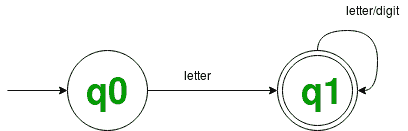

# 有效帕斯卡标识符的识别器

> 原文:[https://www . geeksforgeeks . org/DFA-identifier-for-valid-Pascal-identifier/](https://www.geeksforgeeks.org/dfa-recognizer-for-valid-pascal-identifiers/)

**问题–**基于接受属于同一语言定义的字符串的 DFA，实现帕斯卡标识符的识别器。

这里是帕斯卡标识符集合的常规定义，帕斯卡标识符被定义为以字母开头的字母和数字串的集合。

```
letter : A | B | . . . | Z | a | b | . . . | z
digit  : 0 | 1 | 2 | . . . | 9
ID : letter (letter | digit)* 
```

正则表达式标识是帕斯卡标识符令牌的模式，定义了字母和数字，其中字母是字母表中所有大小写字母集合的正则表达式，数字是所有十进制数字集合的正则表达式。

**DFA 状态图**



**识别器的工作代码:**

## C++

```
// C++ program to implement DFA based regonizer that accepts
// all strings which follow the language
// L = { letter (letter | digit)* }

#include <bits/stdc++.h>
#include <iostream>
using namespace std;

// dfa tells the number associated
// with the present state
int dfa;

// This function is for
// the starting state (zeroth) of DFA
void start(char c)
{
    if (isalpha(c))
        dfa = 1;
    else

// -1 is used to check for any invalid symbol
        dfa = -1;
}

// This function is for the first state of DFA
void state1(char c)
{
    if (isalnum(c))
        dfa = 1;
    else
        dfa = -1;
}

bool DFA_for_ID(string token)
{
    dfa = 0;
    int i, len = token.length();
    for (i = 0; i < len; i++) {
        if (dfa == 0)
            start(token[i]);
        else if (dfa == 1)
            state1(token[i]);
        else
            return 0;
    }
    if (dfa == 1)
        return 1;
    else
        return 0;
}

// driver code
int main()
{
    string input = "Geeks for Geeks is 9ice platfo$m for every1  ";

// to separate all the tokens by space in the string
// and checking for each token
    stringstream ss(input);
    string token;
    while (ss >> token) {
        bool isValid = DFA_for_ID(token);
        if (isValid)
            cout << token << " : "
                 << "Valid" << endl;
        else
            cout << token << " : "
                 << "Invalid" << endl;
    }
    return 0;
}
```

**输出:**

```
Geeks : Valid
for : Valid
Geeks : Valid
is : Valid
9ice : Invalid
platfo$m : Invalid
for : Valid
every1 : Valid
```