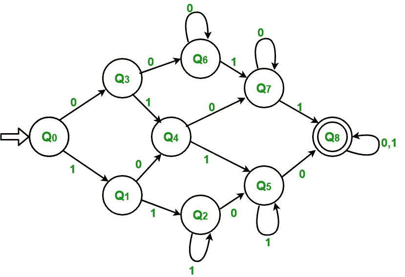

# 具有至少两个 0 和至少两个 1 的字符串的 DFA

> 原文:[https://www . geesforgeks . org/DFA-string-最少-2-0-最少-2-1/](https://www.geeksforgeeks.org/dfa-string-least-two-0s-least-two-1s/)

**问题–**绘制一个至少有两个 0 和两个 1 的字符串的判定有限自动机(DFA)

读完这个问题后，我们首先想到的是计算 1 和 0 的个数。此后，如果它们都至少为 2，则该字符串被接受，否则不被接受。但是我们在 DFA 中没有任何记忆的概念，所以我们不能用这种方法来做。

```
Input  : 1 0 1 1 0 0
Output : Accepted

Input  : 1 1 1 0 1 
Output : Not accepted

```

**使用的方法–**
我们观察到的第一件事是 0 和 1 都应该至少为 2。如果其中任何一个小于 2，则字符串将不被接受。在这种情况下，只有在 0 和 1 都至少为 2 的最后一种情况下，才会接受该字符串。

<center>

| 状态 | 计数为 0 | 计数为 1 |
| --- | --- | --- |
| Q0 | Zero | Zero |
| 雌三醇环戊醚 | Zero | one |
| Q2 | Zero | >=2 |
| Q3 | one | Zero |
| Q4 | one | one |
| Q5 | one | >=2 |
| Q6 | >=2 | Zero |
| Q7 | >=2 | one |
| Q8 已接受 | >=2 | >=2 |

最初，0 和 1 的计数都为零，我们处于状态 Q0。

*   **步骤-1:** 如果输入为 1，则计数 1 增加到 1。转到 Q1 状态
    如果输入为 0，则计数从 0 增加到 1。转到状态 Q3
*   **步骤 2:** 如果输入为 1，则计数 1 增加到 2。转到 Q2 状态
    如果输入为 0，则计数从 0 增加到 1。转到状态 Q4
*   **步骤 3:** 如果输入为 1，则计数 1 继续增加 1。保持相同状态
    如果输入为 0，则计数从 0 增加到 1。转到状态 Q5
*   **步骤-4:** 如果输入为 1，则计数 1 增加到 1。转到状态 Q4
    如果输入为 0，则 0 的计数增加到 2。转到状态 Q6
*   **步骤-5:** 如果输入为 1，则计数 1 增加到 2。转到状态 Q5
    如果输入为 0，则 0 的计数增加到 2。转到状态 Q7
*   **步骤-6:** 如果输入为 1，则计数 1 继续增加 1。保持同样的状态。
    如果输入为 0，则计数从 0 增加到 2。转到状态 Q8
*   **第 7 步:**如果输入为 1，则计数 1 增加到 1。转到状态 Q7
    如果输入为 0，则 0 的计数继续增加 1。保持同样的状态。
*   **步骤 8:** 如果输入为 1，则计数 1 增加到 2。转到状态 Q8
    如果输入为 0，则 0 的计数继续增加 1。保持同样的状态。
*   **步骤-9:** 如果输入为 1，则计数 1 继续增加 1。保持同样的状态。
    如果输入为 0，则 0 的计数持续增加 1。保持同样的状态。
    如果字符串结束，则接受



</center>