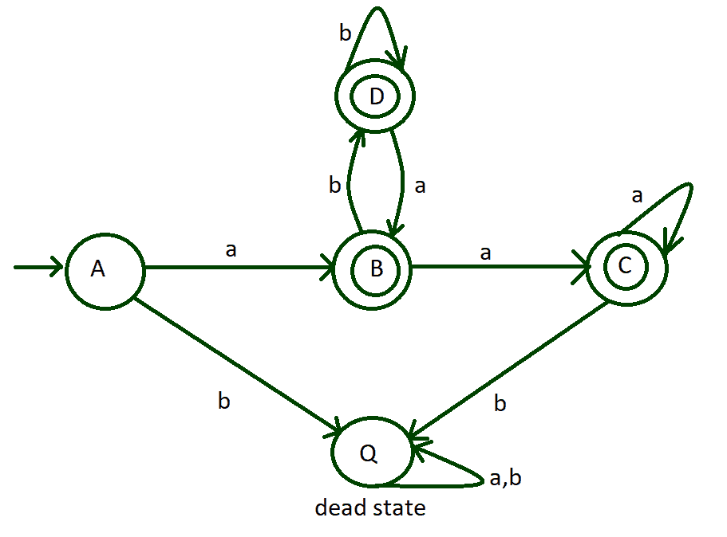

# 以‘a’开头但不包含子串‘aab’的 DFA

> 原文:[https://www . geesforgeks . org/DFA-以-a 开头但不包含-substring-aab/](https://www.geeksforgeeks.org/dfa-that-begins-with-a-but-does-not-contain-substring-aab/)

**先决条件:** [确定性有限自动机简介](https://www.geeksforgeeks.org/introduction-of-finite-automata/)
构建一个 DFA，该 DFA 接受以输入字母表 **'a'** 开始的字符串 **str** ，但不包含 **'aab'** 作为输入上的子字符串 **{a，b}** 。

**示例:**

> **输入:** str = "babba"
> **输出:**未接受
> **解释:**
> 给定的字符串不以‘a’开头。
> 
> **输入:** str = "abbaaaaa"
> **输出:**接受
> **解释:**
> 给定字符串以‘a’开头，不包含“aab”作为子字符串。

**方法:**
转换表有助于理解每个状态的转换是如何在输入字母上发生的。在过渡表中，初始状态由 **— >** 表示，最终状态由 ***** 表示。有 3 个最终状态，一个初始状态和一个死亡状态。

**给定 DFA 的状态转移表:**

<figure class="table">

| 状态 | 输入(a) | 输入(b) |
| --- | --- | --- |
| ——>一个 | B* | q(死状态) |
| B* | C* | D* |
| C* | C* | q(死状态) |
| D* | B* | D* |
| q(死状态) | q(死状态) | 问(死状态) |

**下图为 DFA 图:**



以下是上述 DFA 的实施情况:

## C++

```
// C++ code for the above DFA
#include <bits/stdc++.h>
using namespace std;
void stateQ(string);
void stateA(string);
void stateB(string);
void stateC(string);
void stateD(string);

// Function for state Q
// transition
void stateQ(string n)
{
  // In dead state
  // it shows string
  // not accepted
  cout << ("Not Accepted");
}

// Function for state A
// transition
void stateA(string n)
{
  // If at index 0
  // 'a' if found then
  // call stateB function
  // with passing n[1:] to it
  if (n[0] == 'a')
    stateB(n.substr(
           1, n.length() + 1));

  // If at index 0
  // 'b' if found then
  // call stateQ function
  // with passing n to it
  else
    stateQ(n);
}

// Function for state B transition
void stateB(string n)
{
  // Length of string
  // become 0 then
  // print Accepted
  if (n.length() == 0)
    cout << ("Accepted");
  else
  {
    // If at index 0
    // 'a' if found then
    // call stateC function
    // with passing n[1:] to it
    if (n[0] == 'a')
      stateC(n.substr(
             1, n.length() - 1));

    // If at index 0
    // 'b' if found then
    // call stateD function
    // with passing n[1:] to it
    else
      stateD(n.substr(
             1, n.length() - 1));
  }
}

// Function for state C
// transition
void stateC(string n)
{
  // Length of string
  // become 0 then
  // print Accepted
  if (n.length() == 0)
    cout << ("Accepted");

  else
  {
    // If at index 0
    // 'a' if found then
    // call stateC function
    // with passing n[1:] to it
    if (n[0] == 'a')
      stateC(n.substr(
             1, n.length() + 1));

    // If at index 0
    // 'b' if found then
    // call stateQ function
    // with passing n to it
    else
      stateQ(n);
  }
}

// Function for state D
// transition
void stateD(string n)
{
  // Length of string
  // become 0 then
  // print Accepted
  if (n.length() == 0)
    cout << ("Accepted");

  else
  {
    // If at index 0
    // 'a' if found then
    // call stateB function
    // with passing n[1:] to it
    if (n[0] == 'a')
      stateB(n.substr(
             1, n.length() + 1));

    // If at index 0
    // 'b' if found then
    // call stateD function
    // with passing n[1:] to it
    else
      stateD(n.substr(
             1, n.length() + 1));
  }
}

// Driver code
int main()
{
  // Take string input
  string n = "aaaba";

  // Call stateA to check
  // the input
  stateA(n);
}

// This code is contributed by Chitranayal
```

## Java 语言(一种计算机语言，尤用于创建网站)

```
// Java code for the
// above DFA
import java.util.*;

class GFG{

// Function for state
// A transition   
static void stateA(String n)
{

  // If at index 0
  // 'a' if found then
  // call stateB function
  // with passing n[1:] to it
  if (n.charAt(0) == 'a')
  {
    stateB(n.substring(1));
  }

  // If at index 0
  // 'b' if found then
  // call stateQ function
  // with passing n to it   
  else
  {
    stateQ(n);  
  }
}

// Function for transition
// state B        
static void stateB(String n)
{

  // length() of String
  // become 0 then
  // print Accepted
  if (n.length() == 0)
  {
    System.out.print("Accepted");
  }
  else
  {

    // If at index 0
    // 'a' if found then
    // call stateC function
    // with passing n[1:] to it
    if (n.charAt(0) == 'a')
      stateC(n.substring(1));

    // If at index 0
    // 'b' if found then
    // call stateD function
    // with passing n[1:] to it
    else
      stateD(n.substring(1));
  }    
}

// Function for transition
// state C
static void stateC(String n)
{

  // length() of String
  // become 0 then
  // print Accepted
  if (n.length() == 0)
    System.out.print("Accepted");
  else
  {

    // If at index 0
    // 'a' if found then
    // call stateC function
    // with passing n[1:] to it
    if (n.charAt(0) == 'a')
      stateC(n.substring(1));

    // If at index 0
    // 'b' if found then
    // call stateQ function
    // with passing n to it
    else
      stateQ(n);
  }
}

// Function for transition
// state D
static void stateD(String n)
{

  // length() of String
  // become 0 then
  // print Accepted
  if (n.length() == 0)
    System.out.print("Accepted");
  else
  {

    // If at index 0
    // 'a' if found then
    // call stateC function
    // with passing n[1:] to it
    if (n.charAt(0) == 'a')
    {
      stateB(n.substring(1));
    }

    // If at index 0
    // 'b' if found then
    // call stateQ function
    // with passing n to it
    else
    {
      stateD(n.substring(1));
    }
  }
}

// Function for state Q
// transition
static void stateQ(String n)
{

  // In dead state
  // it shows String
  // not accepted
  System.out.print("Not Accepted");
}

// Driver code
public static void main(String []args)
{

  // Take String input
  String n ="aaaba";

  // Call stateA to check the input
  stateA(n);
}
}

// This code is contributed by pratham76
```

## 蟒蛇 3

```
# Python3 code for the above DFA

# Function for state A transition
def stateA(n):

    # If at index 0
    # 'a' if found then
    # call stateB function
    # with passing n[1:] to it
    if (n[0]=='a'):
        stateB(n[1:])

    # If at index 0
    # 'b' if found then
    # call stateQ function
    # with passing n to it   
    else:
        stateQ(n)

# Function for state B transition
def stateB(n):

    # Length of string
    # become 0 then
    # print Accepted
    if(len(n)== 0):
        print("Accepted")
    else:   
        # If at index 0
        # 'a' if found then
        # call stateC function
        # with passing n[1:] to it
        if (n[0]=='a'):
            stateC(n[1:])

        # If at index 0
        # 'b' if found then
        # call stateD function
        # with passing n[1:] to it   
        else:
            stateD(n[1:])

# Function for state C transition
def stateC(n):  

    # Length of string
    # become 0 then
    # print Accepted
    if(len(n)== 0):
        print("Accepted")

    else:
        # If at index 0
        # 'a' if found then
        # call stateC function
        # with passing n[1:] to it
        if (n[0]=='a'):
            stateC(n[1:])

        # If at index 0
        # 'b' if found then
        # call stateQ function
        # with passing n to it   
        else:
            stateQ(n)

# Function for state D transition
def stateD(n):

    # Length of string
    # become 0 then
    # print Accepted
    if(len(n)== 0):
        print("Accepted")

    else:   
        # If at index 0
        # 'a' if found then
        # call stateB function
        # with passing n[1:] to it
        if (n[0]=='a'):
            stateB(n[1:])

        # If at index 0
        # 'b' if found then
        # call stateD function
        # with passing n[1:] to it   
        else:
            stateD(n[1:])

# Function for state Q transition
def stateQ(n):
    # In dead state
    # it shows string
    # not accepted
    print("Not Accepted")

# Take string input
n ="aaaba"

# Call stateA to check the input
stateA(n)
```

## C#

```
// C# code for the
// above DFA
using System;
using System.Collections;
using System.Collections.Generic;
class GFG{

// Function for state
// A transition   
static void stateA(string n)
{
  // If at index 0
  // 'a' if found then
  // call stateB function
  // with passing n[1:] to it
  if (n[0] == 'a')
  {
    stateB(n.Substring(1));
  }

  // If at index 0
  // 'b' if found then
  // call stateQ function
  // with passing n to it   
  else
  {
    stateQ(n);  
  }
}

// Function for transition
// state B        
static void stateB(string n)
{
  // Length of string
  // become 0 then
  // print Accepted
  if (n.Length == 0)
  {
    Console.Write("Accepted");
  }
  else
  {
    // If at index 0
    // 'a' if found then
    // call stateC function
    // with passing n[1:] to it
    if(n[0] == 'a')
      stateC(n.Substring(1));

    // If at index 0
    // 'b' if found then
    // call stateD function
    // with passing n[1:] to it
    else
      stateD(n.Substring(1));
  }    
}

// Function for transition
// state C
static void stateC(string n)
{
  // Length of string
  // become 0 then
  // print Accepted
  if (n.Length == 0)
    Console.Write("Accepted");
  else
  {
    // If at index 0
    // 'a' if found then
    // call stateC function
    // with passing n[1:] to it
    if (n[0] == 'a')
      stateC(n.Substring(1));

    // If at index 0
    // 'b' if found then
    // call stateQ function
    // with passing n to it
    else
      stateQ(n);
  }
}

// Function for transition
// state D
static void stateD(string n)
{
  // Length of string
  // become 0 then
  // print Accepted
  if (n.Length == 0)
    Console.Write("Accepted");
  else
  {
    // If at index 0
    // 'a' if found then
    // call stateC function
    // with passing n[1:] to it
    if (n[0] == 'a')
    {
      stateB(n.Substring(1));
    }

    // If at index 0
    // 'b' if found then
    // call stateQ function
    // with passing n to it
    else
    {
      stateD(n.Substring(1));
    }

  }
}

// Function for state Q
// transition
static void stateQ(string n)
{
  // In dead state
  // it shows string
  // not accepted
  Console.Write("Not Accepted");
}

// Driver code
public static void Main(string []args)
{
  // Take string input
  string n ="aaaba";

  // Call stateA to check the input
  stateA(n);
}
}

// This code is contributed by rutvik_56
```

## java 描述语言

```
<script>

// JavaScript program to implement
// the above approach

// Function for state
// A transition  
function stateA(n)
{

  // If at index 0
  // 'a' if found then
  // call stateB function
  // with passing n[1:] to it
  if (n[0] == 'a')
  {
    stateB(n.substr(1));
  }

  // If at index 0
  // 'b' if found then
  // call stateQ function
  // with passing n to it  
  else
  {
    stateQ(n); 
  }
}

// Function for transition
// state B       
function stateB(n)
{

  // length() of String
  // become 0 then
  // print Accepted
  if (n.length == 0)
  {
    document.write("Accepted");
  }
  else
  {

    // If at index 0
    // 'a' if found then
    // call stateC function
    // with passing n[1:] to it
    if (n[0] == 'a')
      stateC(n.substr(1));

    // If at index 0
    // 'b' if found then
    // call stateD function
    // with passing n[1:] to it
    else
      stateD(n.substr(1));
  }   
}

// Function for transition
// state C
function stateC(n)
{

  // length() of String
  // become 0 then
  // print Accepted
  if (n.length == 0)
    document.write("Accepted");
  else
  {

    // If at index 0
    // 'a' if found then
    // call stateC function
    // with passing n[1:] to it
    if (n[0] == 'a')
      stateC(n.substr(1));

    // If at index 0
    // 'b' if found then
    // call stateQ function
    // with passing n to it
    else
      stateQ(n);
  }
}

// Function for transition
// state D
function stateD(n)
{

  // length() of String
  // become 0 then
  // print Accepted
  if (n.length() == 0)
    document.write("Accepted");
  else
  {

    // If at index 0
    // 'a' if found then
    // call stateC function
    // with passing n[1:] to it
    if (n[0] == 'a')
    {
      stateB(n.substr(1));
    }

    // If at index 0
    // 'b' if found then
    // call stateQ function
    // with passing n to it
    else
    {
      stateD(n.substr(1));
    }
  }
}

// Function for state Q
// transition
function stateQ(n)
{

  // In dead state
  // it shows String
  // not accepted
  document.write("Not Accepted");
}

// Driver code

    // Take String input
  let n ="aaaba";

  // Call stateA to check the input
  stateA(n);

  // This code is contributed by sanjoy_62.
</script>
```

**Output:** 

```
Not Accepted
```

***时间复杂度** : O(N)*
***辅助空间** : O(N)*

</figure>