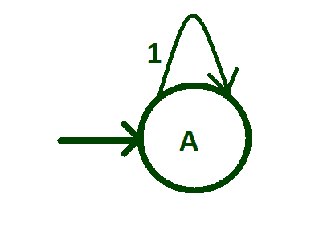
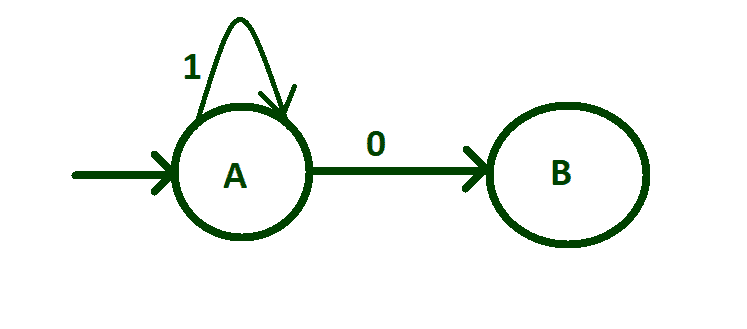
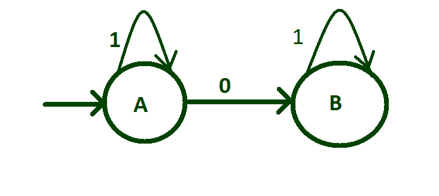
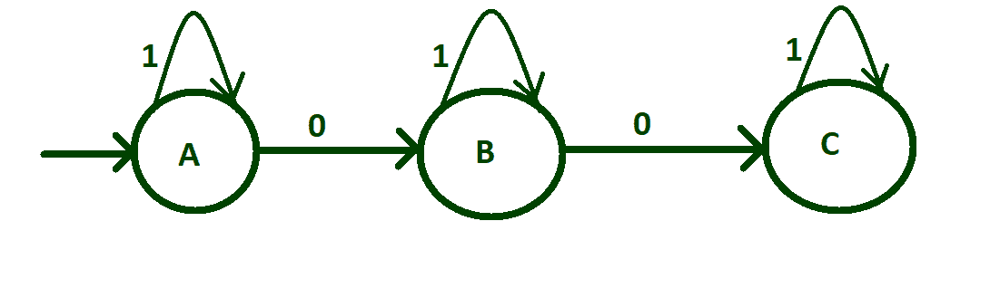
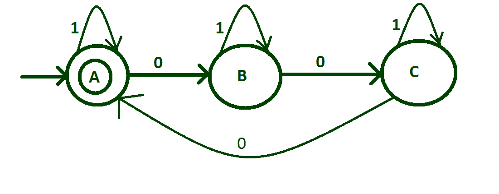
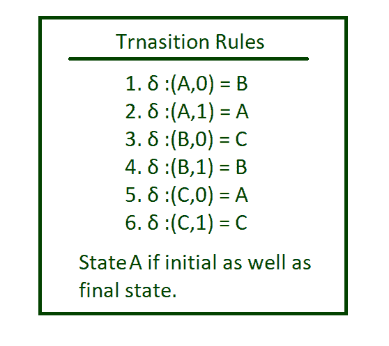

# 在输入{0，1}

上识别 0 的数字是 3 的倍数的 DFA

> 原文:[https://www . geesforgeks . org/DFA-识别 0 的数字是输入 3 的倍数-01/](https://www.geeksforgeeks.org/dfa-that-recognizes-number-of-0-is-multiple-of-3-on-input-01/)

[有限自动机](https://www.geeksforgeeks.org/introduction-of-finite-automata/)被认为是一种有限状态机，可以接受，也可以不接受。在输入字母“0”和“1”上。

*   确定初始状态。
*   转换发生在每个输入字母表上。
*   确定自循环是否适用。
*   马克的最终状态。

**分步设计 DFA:**
**Step-1:**
使初始状态为“A”则有可能字符串中没有任何‘0’而只有‘1’，这是可以接受的，因为 0 可以被 3 整除。因此，在这种情况下，这里可以有任意数量的 1，因此，在初始状态“A”上可以有“1”的自循环。



**步骤 2:**
创建输入字母“0”从状态“A”到状态“B”的转换。



**第三步:**
在一个“0”之后，可以出现任意数量的 1，即没有“1”或有一个以上的“1”。为此，将“1”的自循环置于状态“B”。



**步骤 4:**
现在创建输入字母“0”从状态“B”到状态“C”的转换，在两个 0 之后，可以在字符串中找到任意数量的 1，因此将“1”的自循环放在初始状态“C”上。



**Step-5:**
在第三个“0”的转换之前，我们需要考虑逻辑，以便在这个转换之后，机器将接受具有可被 3 整除的零个数的字符串。对于从状态“C”到状态“A”的这种转换“o”。由于第三个零点到达状态“A”，所以使状态“A”成为最终状态。



上述 DFA 的过渡表:

<figure class="table">

| 州 | 输入(0) | 输入(1) |
| --- | --- | --- |
| —> A * | B | A |
| B | C | B |
| C | A | C |

在上表中，—>代表初始状态，*代表最终状态。在本文中，初始状态和最终状态是相同的，即最终状态。
上述 DFA 的过渡规则:



**实施:**

## Java 语言(一种计算机语言，尤用于创建网站)

```
// Java code for the above DFA
import java.util.*;

class GFG{

// Function for the state A
static void checkStateA(String n)
{

    // Check length of n
    // is 0 then print
    // String accepted
    if (n.length() == 0)
        System.out.print("String accepted");

    // If 1 is found call function
    // checkStateA otherwise if 0
    // is found call function stateB
    else
    {
        if (n.charAt(0) == '1')
            checkStateA(n.substring(1));
        else
            stateB(n.substring(1));
    }
}

// Function for the state B
static void stateB(String n)
{

    // Check length of n
    // is 0 then print
    // String not accepted
    if (n.length() == 0)
        System.out.print("String not accepted");

    // If 1 is found call function
    // stateB otherwise if 0
    // is found call function stateC   
    else
    {
        if (n.charAt(0) == '1')
            stateB(n.substring(1));
        else
            stateC(n.substring(1));
    }
}

// Function for the state C
static void stateC(String n)
{

    // Check length of n
    // is 0 then print
    // String not accepted
    if (n.length() == 0)
        System.out.print("String not accepted");

    // If 1 is found call function
    // stateC otherwise if 0
    // is found call function checkStateA
    else
    {
        if (n.charAt(0) == '1')
            stateC(n.substring(1));
        else
            checkStateA(n.substring(1));
    }
}

// Driver code
public static void main(String []args)
{
    Scanner sc = new Scanner(System.in);

    // Take String input
    String n = sc.nextLine();

    // Call checkStateA to
    // check the inputted String
    checkStateA(n);
}
}

// This code is contributed by pratham76
```

## 蟒蛇 3

```
# Python3 code for the above DFA
def checkStateA(n):

    # check length of n
    # is 0 then print
    # string accepted
    if(len(n)== 0):
        print("string accepted")

    # if 1 is found call function
    # checkStateA otherwise if 0
    # is found call function stateB
    else:   
        if(n[0]=='1'):
            checkStateA(n[1:])
        else:
            stateB(n[1:])

def stateB(n):

    # check length of n
    # is 0 then print
    # string not accepted
    if(len(n)== 0):
        print("string not accepted")

    # if 1 is found call function
    # stateB otherwise if 0
    # is found call function stateC   
    else:   
        if(n[0]=='1'):
            stateB(n[1:])
        else:
            stateC(n[1:])

def stateC(n):

    # check length of n
    # is 0 then print
    # string not accepted
    if(len(n)== 0):
        print("string not accepted")

    # if 1 is found call function
    # stateC otherwise if 0
    # is found call function checkStateA
    else:   
        if(n[0]=='1'):
            stateC(n[1:])
        else:
            checkStateA(n[1:])

# take string input
n = input()

# call checkStateA
# to check the inputted string
checkStateA(n)
```

## C#

```
// C# code for the above DFA
using System;
using System.Collections;
using System.Collections.Generic;
class GFG{

// Function for the state A
static void checkStateA(string n)
{
  // check length of n
  // is 0 then print
  // string accepted
  if(n.Length == 0)
    Console.Write("string accepted");

  // if 1 is found call function
  // checkStateA otherwise if 0
  // is found call function stateB
  else
  {
    if(n[0] == '1')
      checkStateA(n.Substring(1));
    else
      stateB(n.Substring(1));
  }
}

// Function for the state B
static void stateB(string n)
{
  // check length of n
  // is 0 then print
  // string not accepted
  if(n.Length == 0)
    Console.Write("string not accepted");

  // if 1 is found call function
  // stateB otherwise if 0
  // is found call function stateC   
  else{
    if(n[0] == '1')
      stateB(n.Substring(1));
    else
      stateC(n.Substring(1));
  }
}

// Function for the state C
static void stateC(string n)
{
  // check length of n
  // is 0 then print
  // string not accepted
  if(n.Length == 0)
    Console.Write("string not accepted");

  // if 1 is found call function
  // stateC otherwise if 0
  // is found call function checkStateA
  else
  {
    if(n[0] == '1')
      stateC(n.Substring(1));
    else
      checkStateA(n.Substring(1));
  }
}

// Driver code
public static void Main(string []args)
{
  // take string input
  string n = Console.ReadLine();

  // call checkStateA
  // to check the inputted string
  checkStateA(n);
}
}

// This code is contributed by rutvik_56
```

</figure>