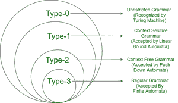

# 上下文无关语法和常规语法的区别

> 原文:[https://www . geesforgeks . org/上下文无关语法和常规语法的区别/](https://www.geeksforgeeks.org/difference-between-context-free-grammar-and-regular-grammar/)

[诺姆·乔姆斯基将语法分为四种类型](https://www.geeksforgeeks.org/chomsky-hierarchy-in-theory-of-computation/) :

<figure class="table">

| **类型** | **名称** |
| Zero

 | 无限制语法 |
| one | 上下文敏感语法 |
| Two | 上下文无关语法 |
| three | 常规语法 |



乔姆斯基层次结构

**1。上下文无关语法:**

*   由上下文无关语法生成的语言被下推自动机接受
*   它是类型 0 和类型 1 语法的子集，也是类型 3 语法的超集。
*   也称为阶段结构化语法。
*   不同的上下文无关语法可以生成相同的上下文无关语言。
*   上下文无关语法的分类是基于解析树的数量进行的。
*   只有一个解析树->明确。
*   多个解析树->不明确。

**产品形式为–**

```
A->B;
A∈N i.e A is a non-terminal.
B∈V*(Any string).
```

**示例–**

```
S –> AB
A –> a
B –> b
```

**2。常规语法:**

*   它被有限状态自动机所接受。
*   它是类型 0、类型 1 和类型 2 语法的子集。
*   它生成的语言称为正则语言。
*   常规语言在并集、交集、补集等操作下是封闭的。
*   它们是最受限制的语法形式。

**产品形式为–**

```
V –> VT / T (left-linear grammar)
  (or)
V –> TV /T (right-linear grammar)
```

**示例–**

```
1\. S –> ab. 
2\. S -> aS | bS | ∊ 
```

**上下文无关语法和常规语法的区别:**

<figure class="table">

| **参数** | **上下文无关语法** | **常规语法** |
| 类型 | 类型 2 | 类型 3 |
| 承认 | 下推自动机。 | 有限状态自动机 |
| 规则 | 作品的形式为:
A->B；
A∈N(非终端)
B∈V <sup>*</sup> (任意字符串) | 作品的形式为:
V–>VT/T(左线性语法)
(或)
V–>TV/T(右线性语法) |
| 限制 | 低于常规语法 | 比任何其他语法都重要 |
| 右手边 | 生产的右侧没有限制。 | 生产的右侧应该是左线性或右线性。 |
| 设置属性 | 正则语法的超集 | 上下文无关语法的子集 |
| 交集 | 两个 CFL 的交集不一定是 CFL | 两个 RG 的交集就是一个 RG。 |
| 补充 | 它们在补码下不闭合 | 补码下闭合 |
| 范围 | CFG 下的语言范围很广。 | RG 下的语言范围小于 CFG。 |
| 例子 | s–> AB；a–> a；b–> b | S -> aS &#124; bS &#124; ∊ |

</figure>

</figure>