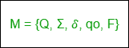

# DFA 和 NFA 的区别

> 原文:[https://www . geesforgeks . org/DFA 和-nfa 的区别/](https://www.geeksforgeeks.org/difference-between-dfa-and-nfa/)

先决条件–[有限自动机](https://www.geeksforgeeks.org/introduction-of-finite-automata/)

**1。**
DFA 是指确定性有限自动机。有限自动机(FA)被认为是确定性的，如果对应于一个输入符号，则只有一个合成状态，即只有一个转换。
确定性有限自动机由五个元组组成，

其中，
Q:有限控制中存在的非空有限状态集(Q0，q1，q2，…)。
σ:输入符号的非空有限集合。
δ:它是一个带有两个参数的转换函数，一个状态和一个输入符号，它返回一个状态。
Q0:是起始状态，是 q 中的状态之一
F:是属于 q 的集合中最终状态/接受状态的非空集合

**2。NFA :**
NFA 指的是非确定有限自动机。如果在同一个输入符号上，从一个状态有一个以上可能的转换，那么有限自动机(FA)被认为是不确定的。
非确定性有限自动机也是五元组的集合，

其中，
Q:一组非空有限状态。
σ:一组非空的有限输入符号。
δ:它是一个转换函数，从 Q 中取一个状态，从 Q 中取一个输入符号，并返回 Q 的子集。
qo:NFA 的初始状态和 Q 的成员。
F:Q 的最终状态和成员的非空集合

**DFA 和 NFA 的区别:**

<figure class="table">

| 不，先生。 | 美术博士（Doctor of Fine Arts 的缩写） | (美)全国铸造协会(National Foundry Association) |
| --- | --- | --- |
| one | DFA 代表确定性有限自动机。 | NFA 代表不确定有限自动机。 |
| Two | 对于字母表的每个符号表示，DFA 中只有一个状态转换。 | 没有必要根据某个符号来说明 NFA 是如何反应的。 |
| three | DFA 不能使用空字符串转换。 | NFA 可以使用空字符串过渡。 |
| four | DFA 可以理解为一台机器。 | NFA 可以理解为多个小机器同时计算。 |
| five | 在 DFA 中，下一个可能的状态被清楚地设置。 | 在 NFA，每对状态和输入符号可以有许多可能的下一个状态。 |
| six | DFA 更难构建。 | NFA 更容易建造。 |
| seven | 如果字符串终止于不同于接受状态的状态，DFA 将拒绝该字符串。 | 如果所有的树枝都枯死或拒绝弦，NFA 就会拒绝弦。 |
| eight | 执行输入字符串所需的时间更少。 | 执行输入字符串所需的时间更多。 |
| nine | 所有 DFA 都是 NFA 的。 | 并非所有 NFA 都是 DFA。 |
| Ten | DFA 需要更多的空间。 | NFA 比 DFA 需要更少的空间。 |
| 11. | 可能需要死状态。 | 不需要死状态。 |
| 12. | δ: QxΣ -> Q 即下一个可能的状态属于 Q。 | δ:qxσ-> 2^q 即下一个可能的状态属于 q 的幂集 |

</figure>