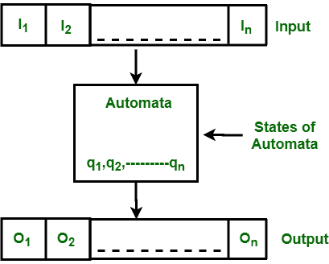
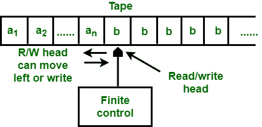

# 有限自动机和图灵机的区别

> 原文:[https://www . geesforgeks . org/有限自动机和图灵机的区别/](https://www.geeksforgeeks.org/difference-between-finite-automata-and-turing-machine/)

**1。[有限自动机](https://www.geeksforgeeks.org/introduction-of-finite-automata/) :**
有限自动机或有限状态机是具有五个元素或元组的抽象机器。它有一组从一个状态移动到另一个状态的状态和规则，但它取决于所应用的输入符号。基本上它是数字计算机的抽象模型。下图显示了一般自动化的一些基本特征。

**图:**有限自动机的特征

上图显示了自动机的以下特征:

1.  投入
2.  输出
3.  自动机的状态
4.  国家关系
5.  输出关系

**2。[图灵机](https://www.geeksforgeeks.org/turing-machine-in-toc/) :**
这是一个强大的模型，由艾伦·图灵在 1936 年提出。早期的模型如有限自动机和下推自动机由于不能识别简单的语言而被认为是精确的模型。但是图灵机是个人电脑最精确的模型。图灵机能够解决真正计算机能解决的所有问题。还有一些问题是图灵机无法解决的，因为这些问题超出了计算的理论极限。

**图:**图灵机模型

**有限自动机与图灵机的区别:**

| 有限自动机 | 车床 |
| --- | --- |
| 它识别出一种叫做常规语言的语言。 | 它不仅能识别常规语言，还能识别上下文无关语言、上下文敏感语言和递归可枚举语言。 |
| 在这种情况下，输入磁带的左右两边长度都是有限的。 | 在这种情况下，输入磁带从左到右的长度是有限的，但从右到右的长度是无限的。 |
| 它由有限数量的状态、有限组输入符号、自动机的初始状态和从一个状态移动到另一个状态的有限组转移规则组成。 | 除了有限数量的状态、有限数量的输入符号集、自动机的初始状态和从一个状态移动到另一个状态的有限数量的转换规则集之外，它还包含有限数量的磁带符号集和磁带上的空白符号。 |
| 在这个头部只能向正确的方向移动。在双向自动机中，头部能够双向移动。 | 在这种情况下，头部可以双向移动。 |
| 磁头只能从磁带上读取符号，但不能在磁带上写入符号。 | 磁头能够在磁带上读取和写入符号。 |
| 与图灵机相比，它很弱。 | 它比有限自动机更强大。 |
| 设计有限自动机更容易。 | 设计图灵机既困难又复杂。 |
| 有限自动机中的转移函数可以表示为:
**δ:Q×σ*→Q** | The transition function in turing machine can be represented by :**δ : Q × T → Q × T × {L，R}**其中 L 和 R 指定磁头的左右移动。 |

