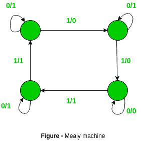
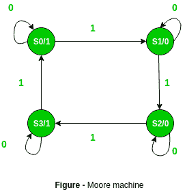

# 美利机器和摩尔机器的区别

> 原文:[https://www . geesforgeks . org/mealy-machine-and-Moore-machine/](https://www.geeksforgeeks.org/difference-between-mealy-machine-and-moore-machine/)之间的差异

先决条件–[米莱和摩尔机器](https://www.geeksforgeeks.org/mealy-and-moore-machines/)
**米莱机器–**米莱机器被定义为计算理论中的机器，其输出值由其当前状态和当前输入决定。在这种机器氛围下，一次转换是可能的。
有 6 个元组:(Q，q0，∑O，δ，λ')
Q 是有限状态集
q0 是初始状态
∑是输入字母表
O 是输出字母表
δ是映射 Q×∑ → Q 的转移函数
‘λ’是映射 Q×∑→ O 的输出函数

**图表–**

**摩尔机器–**摩尔机器在计算理论中被定义为其输出值仅由其当前状态决定的机器。
也有 6 个元组:(Q，q0，∑O，δ，λ)
Q 是有限状态集
q0 是初始状态
∑是输入字母表
O 是输出字母表
δ是映射 Q×∑ → Q
λ是映射 Q → O 的输出函数

**图表–**

**摩尔机器–**

1.  输出仅取决于当前状态。

2.  如果输入改变了，输出也会改变。

3.  需要更多的状态。

4.  对电路实现的硬件要求较低。

5.  它们对输入的反应较慢(一个时钟周期后)。

6.  同步输出和状态生成。

7.  输出置于状态。

8.  易于设计。

**米粉机–**

1.  输出取决于当前状态和当前输入。

2.  如果输入改变，输出也会改变。

3.  需要较少数量的状态。

4.  对电路实现有更多的硬件要求。

5.  他们对输入的反应更快。

6.  异步输出生成。

7.  输出放在转场上。

8.  很难设计。