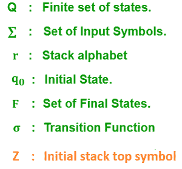
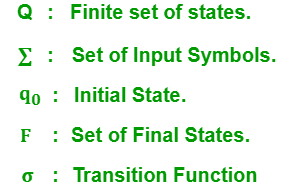

# 下推自动机和有限自动机的区别

> 原文:[https://www . geesforgeks . org/下推自动机和有限自动机的区别/](https://www.geeksforgeeks.org/difference-between-pushdown-automata-and-finite-automata/)

[**下推自动机**](https://www.geeksforgeeks.org/introduction-of-pushdown-automata/) **:**
一个下推自动机(PDA)是一个添加了栈存储的有限状态机。除了输入符号和当前状态之外，附加堆栈还用于决定转换。它包含以下 7 个元组:

[**有限自动机**](https://www.geeksforgeeks.org/introduction-of-finite-automata/) **:**
有限自动机是任何机器的数学模型，通过它我们可以计算每个输入符号上的状态转移。有限自动机中的每个转换都取决于输入符号和当前转换状态。它包含以下 5 个元组:

我们来看看下推自动机和有限自动机的区别:

<figure class="table">

| S.NO | 下推自动机 | 有限自动机 |
| --- | --- | --- |
| 1. | 对于类型 2 语法，我们可以设计下推自动机。 | 对于类型 3 语法，我们可以设计有限自动机。 |
| 2. | 非确定性下推自动机比确定性下推自动机更强大。 | 非确定性有限自动机与确定性有限自动机具有相同的能力。 |
| 3. | 不是每一个非确定性下推自动机都转化为它的等价确定性下推自动机。 | 每个非确定性有限自动机都被转化为一个等价的确定性有限自动机 |
| 4. | 下推自动机可以识别上下文无关语言。 | 正则语言可以被有限自动机识别。 |
| 5. | 下推自动机有额外的堆栈来存储长序列的字母。 | 有限自动机没有任何空间来存储输入字母。 |
| 6. | 它通过进入空堆栈和最终状态来接受输入字母集。 | 它通过进入最终状态来接受输入的字母。 |

</figure>