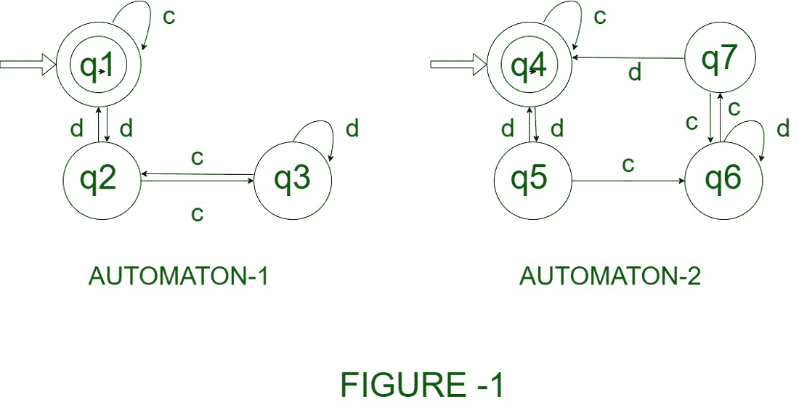
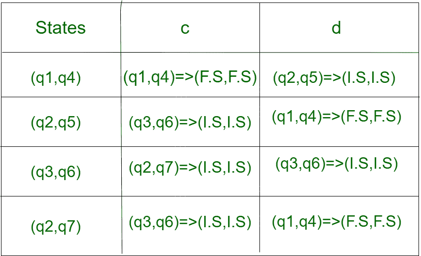
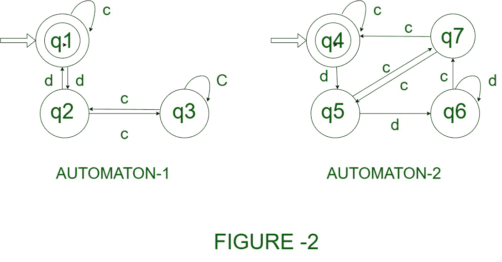
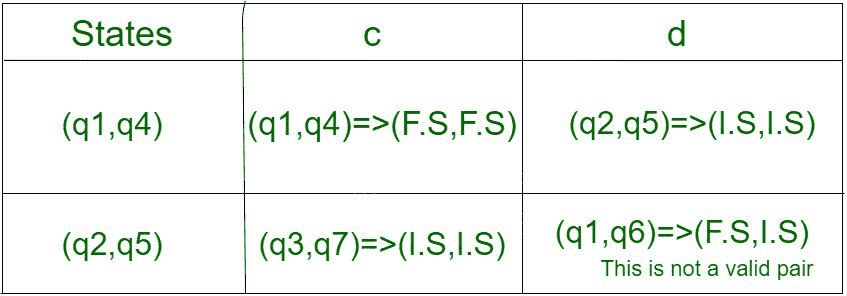
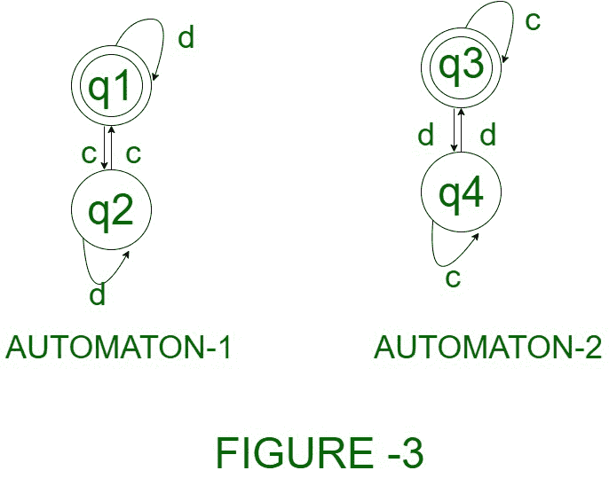
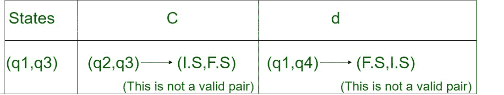
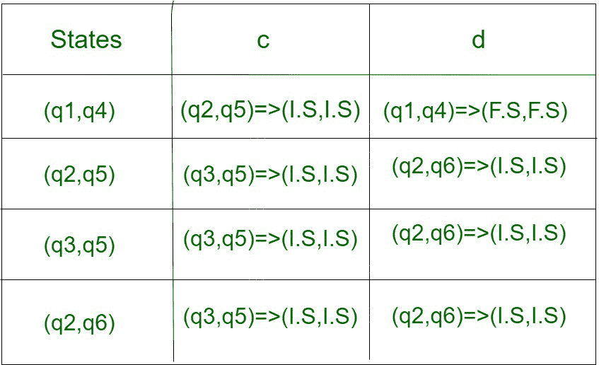

# 有限状态自动机的等价性

> 原文:[https://www . geesforgeks . org/等价的-f-s-a-有限状态自动机/](https://www.geeksforgeeks.org/equivalence-of-f-s-a-finite-state-automata/)

自动机是具有有限数量状态的机器。如果任意两个自动机都接受完全相同的输入字符串集，则称它们是等价的。
**如果两个自动机满足以下条件，则它们是等价的:**

> 1.两个自动机的初始和最终状态必须相同。
> 2。选择的每一对状态都来自不同的自动机。
> 3。将状态与输入字母组合时，配对结果必须是最终状态或中间状态。(即两者都应处于最终状态或非最终状态)。
> 4。如果结果对具有不同类型的状态，那么它将是不等价的。(即一个处于最终状态，另一个处于中间状态)。

**示例 1–**
考虑两个不同的自动机，如图 1 所示。

**解决方案–**
**步骤 1–**由于两个自动机的初始状态和最终状态是相同的，因此它会进行验证。
**步骤 2–**通过制作与输入字母相关的状态表来检查每个状态。

这里，
F.S 代表- >最终状态。
I.S 代表- >中间状态(非最终状态)。

**步骤 3–**对于每对状态，合成状态或者位于 F.S 中，或者作为组合位于 I.S 中。

> 结论——两个自动机是等价的。

**注:**如果合成的状态对具有不同的状态组合(即(F.S，I.S)或(I.S，F.S)，那么这两个自动机被认为是不等价的。

**示例 2–**
考虑两个不同的自动机，如下图 2 所示。

**解决方案–**
**步骤 1–**由于两个自动机的初始和最终状态相同，因此它会进行验证。
**步骤 2–**通过制作与输入字母相关的状态表来检查每个状态。

这里，
F.S 代表- >最终状态。
I.S 代表- >中间状态(非最终状态)。
**步骤 3–**对于第一对状态，合成状态作为组合位于 F.S 中
**步骤 4–**但是对于在输入字母上操作的这对(q2，q5)，它们位于不同的状态。(即一个在旧金山，另一个在旧金山)。

> 结论——给定的自动机是不等价的。

**示例 3–**
考虑两个不同的自动机，如图 3 所示。

**解决方案–**
**步骤 1–**由于两个自动机的初始和最终状态相同，因此它会进行验证。
**步骤 2–**通过制作与输入字母相关的状态表来检查每个状态。

这里，
F.S 代表- >最终状态。
I.S 代表- >中间状态(非最终状态)。
**步骤 3–**对于这对(q1，q3)，当在输入字母上操作时，它们处于不同的状态。(即一个在旧金山，另一个在旧金山)。

> 结论——给定的自动机是不等价的。

**示例 4–**
考虑两个不同的自动机，如图 4 所示。

**解决方案–**
**步骤 1–**由于两个自动机的初始状态和最终状态是相同的，因此它会进行验证。
**步骤 2–**通过制作与输入字母相关的状态表来检查每个状态**。**

这里，
F.S 代表- >最终状态。
I.S 代表- >中间状态(非最终状态)。
**第三步–**对于每一对状态，合成状态或者位于 F.S 中，或者作为组合位于 I.S 中。

> 结论——两个自动机是等价的。