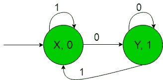
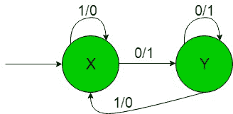
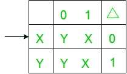
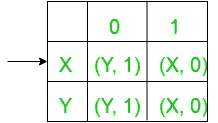

# 有输出的有限自动机(集合 11)

> 原文:[https://www . geesforgeks . org/有限自动机带输出集-11/](https://www.geeksforgeeks.org/finite-automata-with-output-set-11/)

**前提:** [美利和摩尔机器](https://www.geeksforgeeks.org/mealy-and-moore-machines/)[美利机器和摩尔机器](https://www.geeksforgeeks.org/difference-between-mealy-machine-and-moore-machine/)
的区别在本文中，我们将看到一些有输出的有限自动机的设计，即摩尔和美利机器。

**问题:**以二进制数{0，1}为输入并产生该数的 1 的补码作为输出的机器的构造。
这里的假设是，从最低有效位读取输入字符串，并丢弃结束进位。
这就是我们这里的，
ε= { 0，1}和
δ= { 0，1}
其中ε和δ分别是输入和输出字母表。

**所需的摩尔机构造如下:**

**说明:**
在上图中，初始状态‘X’在获得‘1’作为输入时，它保持自身的状态并打印‘0’作为输出，在获得‘0’作为输入时，它传输到状态‘Y’并打印‘1’作为输出，以此类推其余状态。

例如，当输入字符串为“101”时，上面的摩尔机器产生的输出为“010”，它只是给定输入的 1 的补码，即 1 被转换为 0，反之亦然。
这样最后上面的摩尔机器就可以很容易地产生给定输入二进制串的 1 的补码。

**所需的 Mealy 机器构造如下:-**

**说明:**
在上图中，初始状态‘X’在获得‘1’作为输入时，它保持自身的状态并打印‘0’作为输出，在获得‘0’作为输入时，它传输到状态‘Y’并打印‘1’作为输出，依此类推剩余状态。

例如，当输入字符串为“101”时，上面的摩尔机器产生的输出为“010”，它只是给定输入的 1 的补码，即 1 被转换为 0，反之亦然。
因此，最终以上 Mealy 机器可以很容易地产生给定输入二进制字符串的 1 的补码。

**从摩尔机到美利机的转换:**
摩尔机的状态转移图:

以上摩尔机以二进制数{0，1}为输入，产生该数的 1 的补码作为输出。
这里的假设是从 LSB(最低有效位)读取输入字符串，并丢弃结束进位。

现在我们需要把上面摩尔机的过渡图转换成等价的 Mealy 机过渡图。所需转换的步骤如下:

*   **Step-1:** Formation of State Transition Table of the above Moore machine-
    

    在上面的转换表中，状态“X”和“Y”被保存在第一列中，当得到“0”作为输入时，它分别转换到“Y”和“Y”状态，被保存在第二列中，当得到“1”作为输入时，它分别转换到“X”和“X”状态，被保存在第三列中，在δ下的第四列中，有第一列状态的相应输出。在表格中，箭头(→)表示初始状态。

*   **Step-2:** Formation of Transition Table for Mealy machine from above Transition Table of Moore machine-
    Below transition table is going to be formed with the help of the above table and its entries just by using the corresponding output of the states of the first column and placing them in the second and third column accordingly.
    
    In the above table, the states in the first column like ‘X’ on getting ‘0’ as the input it goes to a state ‘Y’ and gives ‘1’ as the output and on getting ‘1’ as the input it goes to the state ‘X’ and gives ‘0’ as the output and so on for the remaining states in the first column. In the table, An arrow (→) indicates the initial state.
*   **第三步:**最后我们可以借助上面的转换表来形成 Mealy 机器的状态转换图。
    如下图所示-
    
    以上美利机器将二进制数{0，1}作为输入，并产生该数的 1 的补码作为输出。
    这里的假设是从 LSB(最低有效位)读取输入字符串，并丢弃结束进位。

**注意:**当从摩尔转换到米莱机时，摩尔和米莱机的状态数保持不变，但是在米莱到摩尔转换的情况下，它给出的状态数并不相同。