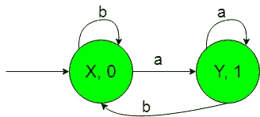

# 有输出的有限自动机(集合 3)

> 原文:[https://www . geesforgeks . org/有限自动机带输出集-3/](https://www.geeksforgeeks.org/finite-automata-with-output-set-3/)

**前提:** [美利和摩尔机器](https://www.geeksforgeeks.org/mealy-and-moore-machines/)[美利机器和摩尔机器](https://www.geeksforgeeks.org/difference-between-mealy-machine-and-moore-machine/)
的区别在本文中，我们将看到一些有输出的有限自动机的设计，即摩尔和美利机器。

**问题:**以{a，b}上所有字符串的集合为输入，统计子串' a '个数的机器的构造。
这就是我们这里的，
ε= { a，b}和
δ= { 0，1}
其中ε和δ分别是输入和输出字母表。
**所需的摩尔机构造如下:-**

**说明:**
在上图中，初始状态‘X’在获取‘b’作为输入时保持自身状态并打印‘0’作为输出，在获取‘a’作为输入时过渡到状态‘Y’并打印‘1’作为输出。状态“Y”在获取“a”作为输入时，它保持自身状态，并打印“1”作为输出，在获取“b”作为输入时，它返回状态“X”，并打印“0”作为输出。
因此，最后上面的摩尔机器可以很容易地计数子串“a”，即，在获得“a”作为子串时，它给出“1”作为输出，因此在计数“1”的数量时，我们可以计数子串“a”的数量。

**所需的 Mealy 机器构造如下:-**

**说明:**
在上图中，初始状态‘X’在获得‘b’作为输入时保持自身状态并打印‘0’作为输出，在获得‘a’作为输入时过渡到状态‘Y’并打印‘1’作为输出。状态“Y”在获取“a”作为输入时，它保持自身状态，并打印“1”作为输出，在获取“b”作为输入时，它返回状态“X”，并打印“0”作为输出。
因此，最后上面的摩尔机器可以很容易地计算子串“a”，即在获得“a”作为子串时，它给出“1”作为输出，因此在计算“1”的数量时，我们可以计算子串“a”的数量。