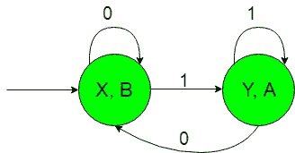
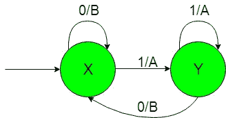

# 有输出的有限自动机(集合 5)

> 原文:[https://www . geesforgeks . org/有限自动机带输出集-5/](https://www.geeksforgeeks.org/finite-automata-with-output-set-5/)

**先决条件:** [美利和摩尔机器](https://www.geeksforgeeks.org/mealy-and-moore-machines/)[美利机器和摩尔机器](https://www.geeksforgeeks.org/difference-between-mealy-machine-and-moore-machine/)的区别

在这篇文章中，我们将看到一些有输出的有限自动机的设计，即摩尔和米莱机器。
**问题:**构造这样的机器:如果输入包含“1”作为子串，或者输入字符串以“1”开头或以“1”结尾，则将{0，1}上的所有字符串集合作为输入，并生成“A”作为输出。
这就是我们这里的，
ε= { 0，1}和
δ= { A，B}
其中ε和δ分别是输入和输出字母表。

**所需的摩尔机构造如下:-**

**说明:**
在上图中，初始状态‘X’在得到‘0’作为输入时保持自身状态并打印‘B’作为输出，在得到‘1’作为输入时过渡到状态‘Y’并打印‘A’作为输出。状态“Y”在获取“1”作为输入时，它保持自身状态，并打印“A”作为输出，在获取“0”作为输入时，它返回状态“X”，并打印“B”作为输出。
这样最后上面的摩尔机器就可以很容易地给出‘A’作为输出，得到‘1’作为输入子串。

**所需的 Mealy 机器构造如下:-**

**说明:**
在上图中，初始状态‘X’在获得‘0’作为输入时，它保持自身的状态并打印‘B’作为输出，在获得‘1’作为输入时，它过渡到状态‘Y’并打印‘A’作为输出。状态“Y”在获取“1”作为输入时，它保持自身状态，并打印“A”作为输出，在获取“0”作为输入时，它返回状态“X”，并打印“B”作为输出。
这样最后上面的 Mealy 机器可以很容易地给出‘A’作为输出，得到‘1’作为输入子串。