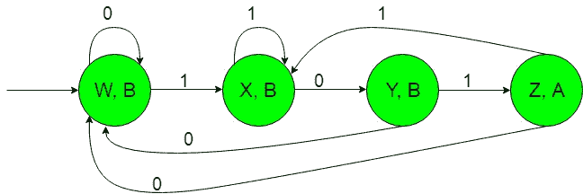
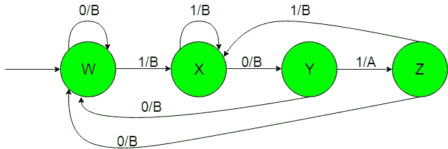

# 有输出的有限自动机(集合 6)

> 原文:[https://www . geesforgeks . org/有限自动机带输出集-6/](https://www.geeksforgeeks.org/finite-automata-with-output-set-6/)

**先决条件:** [【米莱和摩尔机器】](https://www.geeksforgeeks.org/mealy-and-moore-machines/)[米莱机器和摩尔机器的区别](https://www.geeksforgeeks.org/difference-between-mealy-machine-and-moore-machine/)
在本文中，我们将看到一些带输出的有限自动机的设计，即摩尔和米莱机器。

**问题:**以{0，1}上所有字符串的集合作为输入，如果输入包含“101”作为子串，或者输入字符串以“101”开头或以“101”结尾，则产生“A”作为输出的机器的构造。
这就是我们这里的，
ε= { 0，1}和
δ= { A，B}
其中ε和δ分别是输入和输出字母表。

**所需的摩尔机构造如下:-**

**说明:**
在上图中，初始状态‘w’在得到‘0’作为输入时保持自身状态并打印‘B’作为输出，在得到‘1’作为输入时过渡到状态‘X’并打印‘B’作为输出。状态“X”在获取“1”作为输入时，它保持自身状态，并打印“B”作为输出，在获取“0”作为输入时，它传输到状态“Y”，并打印“B”作为输出，以此类推其余状态。
这样最后上面的摩尔机器就可以很容易地给出‘A’作为输出，得到‘101’作为输入子串。

**所需的粉饼机构造如下:-**

**说明:**
在上图中，初始状态“w”在获得“0”作为输入时保持其自身状态，并打印“B”作为输出，在获得“1”作为输入时转变为状态“X”并打印“B”作为输出。获取“1”作为输入时，状态“X”保持其自身状态，并打印“B”作为输出，获取“0”作为输入时，它会将其余状态传输到状态“Y”并打印“B”作为输出，以此类推。
因此最终摩尔机器可以很容易地给出“A”作为输出，得到“101”作为输入子串。