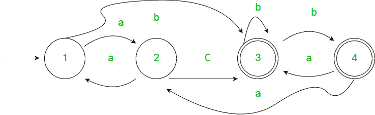
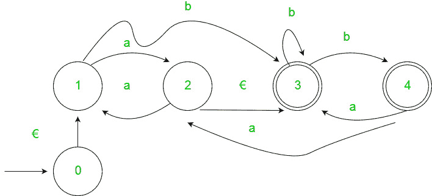
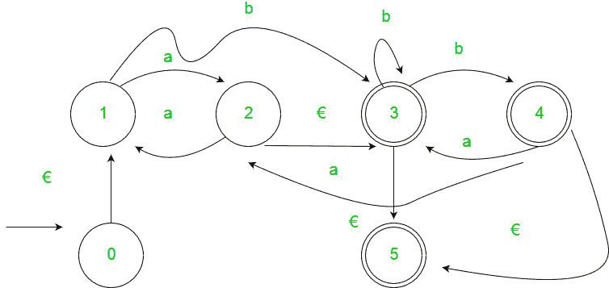
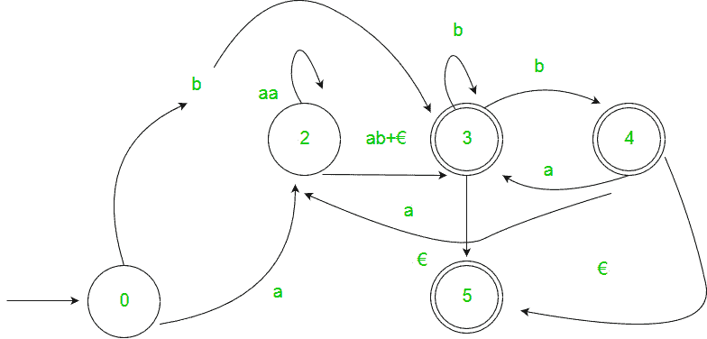
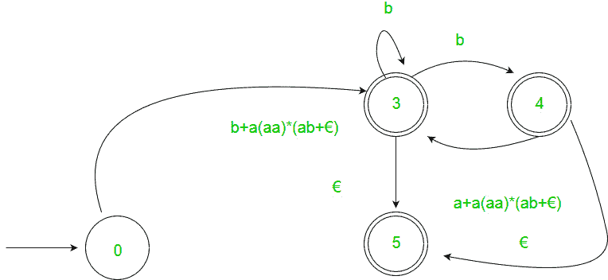
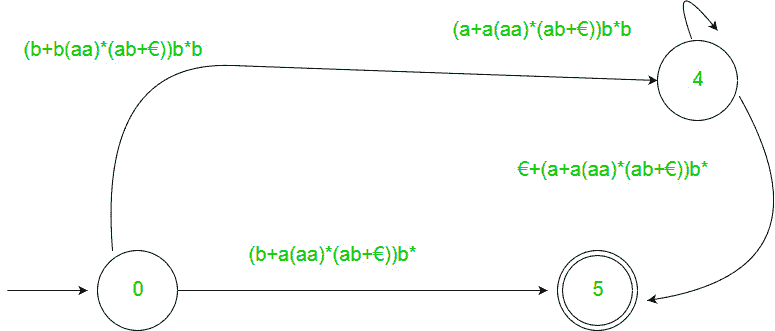
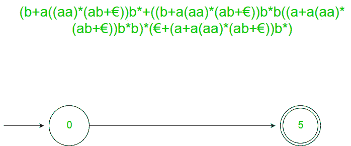
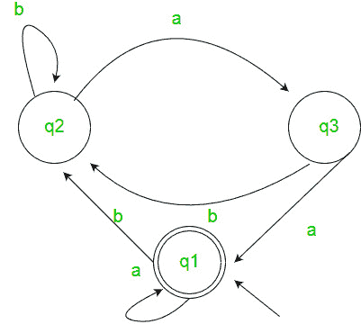

# 从有限自动机生成正则表达式

> 原文:[https://www . geeksforgeeks . org/generating-正则表达式-从-有限自动机/](https://www.geeksforgeeks.org/generating-regular-expression-from-finite-automata/)

先决条件–[FA 介绍](https://www.geeksforgeeks.org/toc-finite-automata-introduction/)、[正则表达式、语法和语言](https://www.geeksforgeeks.org/regular-expressions-regular-grammar-and-regular-languages/)、[从正则表达式](https://www.geeksforgeeks.org/designing-finite-automata-from-regular-expression/)设计 FA

将 FA 转换为正则表达式有两种方法–
**1。状态消除法–**

*   **步骤 1–**
    如果开始状态是接受状态或有转换，则添加新的不接受开始状态，并在新的开始状态和以前的开始状态之间添加€转换。
*   **步骤 2–**
    如果存在多个接受状态，或者如果单个接受状态已经转变出来，则添加一个新的接受状态，使所有其他状态都不接受，并添加一个从每个以前的接受状态到新的接受状态的€转变。
*   **步骤 3–**
    依次针对每个未启动未接受状态，消除该状态并相应更新转换。

**<u>例</u>** :-

**<u>解</u> :-
<u>第一步</u>
**

<u>第二步</u>

<u>第三步</u>

**2。阿登定理–**让 P 和 Q 为 2 个正则表达式。如果 P 不包含空字符串，那么在 R 中的以下等式，即 R = Q + RP，通过 R = QP*有唯一的解

**假设–**

*   转换图不应该有€移动。
*   它必须只有一个初始状态。

**<u>利用阿登定理寻找确定性有限自动机的正则表达式–</u>**

1.  For getting the regular expression for the automata we first create equations of the given form for all the states
    **q1 = q1w11 +q2w21 +…+qnwn1 +€ (q1 is the initial state)
    q2 = q1w12 +q2w22 +…+qnwn2
    .
    .
    .
    qn = q1w1n +q2w2n +…+qnwnn** 
    wij is the regular expression representing the set of labels of edges from qi to qj

    **注意–**对于平行边，表达式中会有很多该状态的表达式。

2.  然后我们求解这些方程，得到 q i 的方程，用 w ij 表示，这个表达式就是所需的解，其中 q i 是最终状态。

**<u>例</u> :-**

****

 **<u>解</u>** :-
此处初始状态为 q 2 ，最终状态为 q 1 。
三种状态 q 1 ，q 2 ，q 3 的方程如下？
q1= q1a+q3a+€(€此举是因为 q 1 是初始状态)
q2= q1b+q2b+q3b
q3= q q2= q1b+ q2b+ q3b
= q1b+ q2b+(q2a)b(q3的替代值)
= q 1
q1= q1a+q3a+€
= q1a+q2aa+€(q3的替代值)
= q1a+q1b(b+ab +€
=€(a+ b(b + ab)*aa)*
=(a+b(b+ab)* aa)*
因此，正则表达式为(a+b(b+ab)* aa)*。

**GATE CS 角题**

练习下列问题将帮助你测试你的知识。所有的问题在前几年的 GATE 考试或 GATE 模拟考试中都被问过。强烈建议你练习一下。

1.  [GATE CS 2008，问题 52](https://www.geeksforgeeks.org/gate-gate-cs-2008-question-52/)
2.  [GATE CS 2007，问题 74](https://www.geeksforgeeks.org/gate-gate-cs-2007-question-74/)
3.  [GATE CS 2014(第 1 集)，第 25 题](https://www.geeksforgeeks.org/gate-gate-cs-2014-set-1-question-25/)
4.  [GATE CS 2014(第 1 集)，第 65 题](https://www.geeksforgeeks.org/gate-gate-cs-2014-set-1-question-46/)
5.  [GATE IT 2006，问题 5](https://www.geeksforgeeks.org/aptitude-gate-it-2006-question-5/)
6.  [GATE CS 2013，第 33 题](https://www.geeksforgeeks.org/gate-gate-cs-2013-question-33/)
7.  [GATE CS 2012，第 12 题](https://www.geeksforgeeks.org/gate-gate-cs-2012-question-16/)