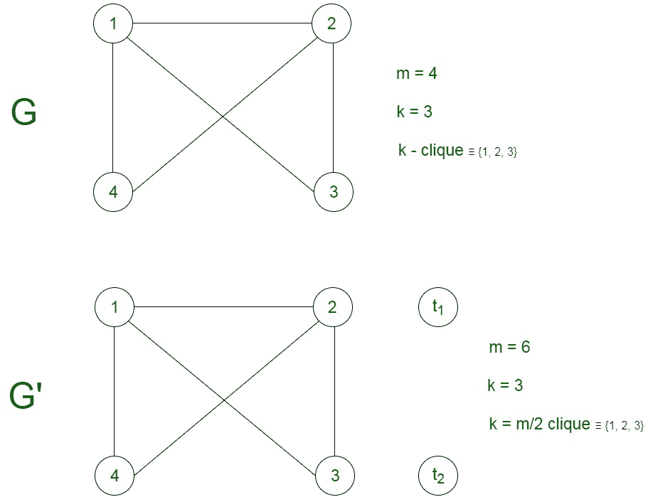
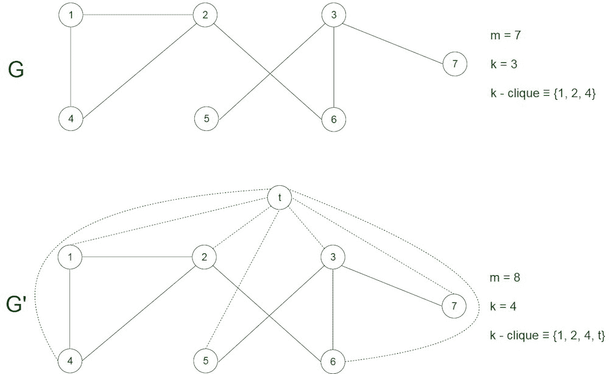

# 半团 NP 完全问题

> 原文:[https://www . geesforgeks . org/半团-np-complete-problem/](https://www.geeksforgeeks.org/half-clique-np-complete-problem/)

图中的半团是一组 n/2 个顶点，使得每个顶点与每隔一个顶点共享一条边，即图的 k = n/2 个顶点形成一个完整的图。

**问题–**给定一个图 G(V，E)，问题是确定该图是否包含大小至少为 k = |V/2|的团。

**解释-**
问题的一个实例是指定给问题的输入。半团问题的一个例子是一个图 G (V，E)和一个正整数 k，问题是检查 G 中是否存在大小为 k = |V/2|的团。由于 NP 完全问题，顾名思义，是一个 NP 难和 NP 难的问题，问题是 NP 完全的证明由两部分组成:

**1。半团问题在 NP 中:**
如果有任何问题在 NP 中，那么，给定一个‘证书’，它是问题的解和问题的一个实例(在这种情况下是一个图 G 和一个正整数 k)，我们将能够在多项式时间内验证(检查给定的解是否正确)证书。
证书是顶点的子集 V’，它包括属于半团的顶点。我们可以通过检查属于该解决方案的每对顶点是否相邻来验证该解决方案，只需验证它们彼此共享一条边。这可以在多项式时间内完成，即使用图 G(V，E)的以下策略进行 O(V+E):

```
flag=true
Count the number of vertices in the subset V' 
If not equal to V/2 :
    flag = false
Else : 
    For every pair {u,v} in the subset V’:
        Check that these two vertices {u,v} share an edge
        If there is no edge ,set flag to false and break
If flag is true:
    Solution is correct
Else:
    Solution is incorrect 
```

**2。半团问题是 NP 难的:**
为了证明半团问题是 NP 难的，我们借助一个已经是 NP 难的问题，说明这个问题可以化为半团问题。为此，我们考虑团问题，它是 NP 完全的(因此是 NP 难的)。
由图 G (V，E)和整数 k 组成的团问题的每一个实例都可以转化为半团问题所需的图 G’(V’，E’)和 k’。可以做的推论是，图 G’将有一个大小为 n/2 的团，如果图 G 有一个大小为 k 的团，设 m 为图 G 中的节点数，我们现在将证明计算团的问题确实归结为独立集的计算。这种简化可以通过以下两个命题来证明:

*   如果 k > = m/2，那么对于一个常数 t，我们为一个图 G’增加 t 个节点，每个节点的度数为 0。图 G’的节点总数等于 n = m + t，也就是说，图 G 的所有节点加上额外的节点的总和，这样，对于 k 的任意值，它等于 2k。这可以通过取 t = 2k -m 来实现。然后，当且仅当图 G’具有大小为 k 的团时，图 G 具有大小为 k 的团



*   如果 k < m/2，那么我们为图 G’的创建增加 t 个额外的节点。边也可以从图中的每个新节点添加到每个其他节点。因此，G’中的任何 k-团，对于 k 的任何任意值，都与 t 个新节点组合成 G’中的(k+t)-团，因为在每对顶点之间添加了边。G’中 k+t 大小的团必须至少包括 k 个旧节点，这些旧节点在图 G 中形成团，因此，t 的值被选择为 k+t = (m+t)/2，或者 t = m-2k，这使得 G’中的团大小正好等于 n/2。

