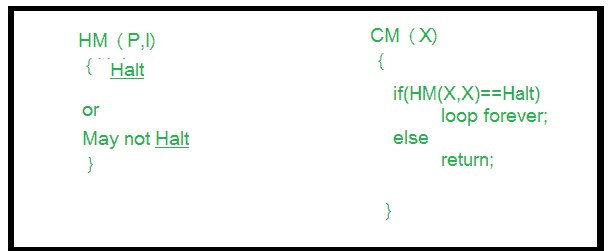

# 计算理论中的停顿问题

> 原文:[https://www . geeksforgeeks . org/暂停-计算理论中的问题/](https://www.geeksforgeeks.org/halting-problem-in-theory-of-computation/)

为了更好地理解停顿问题，我们必须知道[可判定性](https://www.geeksforgeeks.org/theory-of-computation-decidability/)、[不可判定性](https://www.geeksforgeeks.org/undecidability-and-reducibility/)和[图灵机](https://www.geeksforgeeks.org/turing-machine/)、[决策问题](https://www.geeksforgeeks.org/theory-computation-decidable-undecidable-problems/)，以及一个被称为可计算性理论和计算复杂性理论的理论。

一些重要术语:

*   **可计算性理论–**
    计算理论的一个分支，研究使用不同的模型可以通过计算解决哪些问题。在计算机科学中，计算的复杂性，或者简单地说算法的复杂性是运行它所需的资源量。
*   **决策问题–**
    决策问题在任何输入上只有两种可能的输出(是或否)。在可计算性理论和计算复杂性理论中，决策问题是可以作为输入值的是非问题提出的问题。比如某个特定的问题有什么解决方案吗？答案可能是肯定的，也可能是否定的。决策问题是关于无限组输入的任意是/否问题。
*   **图灵机–**
    图灵机是计算的数学模型。图灵机是控制计算机完成的所有数据操作的中央处理器的一般例子。图灵机可以停止，也可以不停止，这取决于算法和与算法相关的输入。

现在，让我们讨论停止问题:

**暂停问题–**给定的程序/算法是否会暂停？
停止意味着程序在某些输入下会接受它并停止或拒绝它并停止，它永远不会进入无限循环。基本上停止意味着终止。那么我们能有一个算法来告诉给定的程序是否会停止。就图灵机而言，它会在某台机器上运行某个特定的给定输入字符串时终止吗？

答案是否定的，我们不能设计一个通用的算法来恰当地说明给定的程序是否会停止？
唯一的办法就是运行程序，检查是否停机。
我们也可以这样克制停顿问题:给定一个用某种编程语言(c/c++/java)编写的程序，它会进入无限循环(循环永不停止)还是会一直终止(停顿)？

这是一个不可判定的问题，因为我们不能有一个算法来告诉我们一个给定的程序是否会以一种一般化的方式停止，即通过特定的程序/算法。一般来说，我们不能总是知道这就是为什么我们不能有一个通用的算法。最好的方法是运行程序，看看它是否停止。通过这种方式，对于许多程序来说，我们可以看到它有时会循环并总是停止。

**矛盾证明–**
**问题陈述:**我们能否设计一种机器，如果给定一个程序，它可以发现该程序在特定输入下是否会一直停止？

**解法:**假设我们可以设计那种称为 HM(P，I)的机器，其中 HM 是机器/程序，P 是程序，I 是输入。在输入这两个参数时，机器 HM 将告诉程序 P 要么停止，要么不停止。
如果我们能设计这样一个程序，这就允许我们编写另一个程序，我们称这个程序为 CM(X)，其中 X 是任何程序(作为自变量)，并且根据图中所示的程序 CM(X)的定义。

在程序 CM(X)中，我们调用函数 HM(X)，我们已经定义了函数 HM(X)，我们将参数(X，X)传递给 HM()，根据 HM()的定义，它可以接受两个参数，即一个是程序，另一个是输入。现在在第二个程序中，我们将 X 作为程序传递，将 X 作为函数 HM()的输入。我们知道程序 HM()给出两个输出，要么“暂停”，要么“不暂停”。但是在第二个程序的情况下，当 HM(X，X)将停止循环时，循环体告诉进入循环，当它不停止时，这意味着循环，它被要求返回。

现在我们再举一个例子，程序 CM 被传递给 CM()函数作为参数。那么就会有一些不可能，即出现了一个不可能的条件。

如果外部函数的代码(内部体)在循环中，外部函数是不可能停止的，即使在内部代码停止后，外部非停止函数也不可能停止。所以这两种情况对于 CM 机器/程序来说都是不停止的，即使我们在开始时假设它会停止。所以这就是矛盾，我们可以说我们的假设是错误的，这个问题，即停顿问题是不可判定的。

这就是我们如何证明停顿问题是不可判定的。