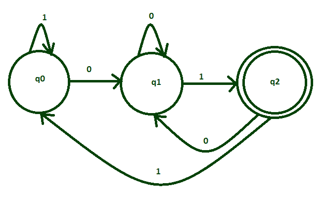
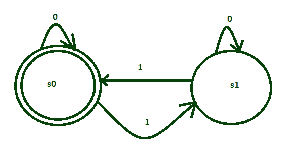
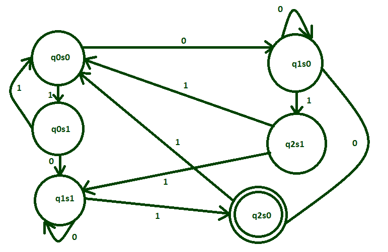

# 两个 DFA 的相交过程

> 原文:[https://www . geesforgeks . org/intersection-process-of-two-dfas/](https://www.geeksforgeeks.org/intersection-process-of-two-dfas/)

先决条件–[设计有限自动机](https://www.geeksforgeeks.org/designing-finite-automata-from-regular-expression-set-1/)

让我们用一个例子来理解两个 DFA 的交集。
为{0，1}上的字符串集设计一个 DFA，使其以 01 结尾，并且具有偶数个 1。
将形成两种所需的语言:

```
L1= {01, 001, 101, 0101, 1001, 1101, ....} 
L2= {11, 011, 101, 110, 0011, 1100, .....}
```

```
L = L1 and L2 = L1 ∩ L2 
```

**语言 L<sub>1</sub>:**T4 的状态转换图这是语言 L <sub>1</sub> 的 DFA



它接受结尾接受 01 的所有字符串。

**语言 L <sub>2</sub> :**
的状态转换图这是语言 L <sub>2</sub>
的 DFA



它接受所有接受偶数 1 的字符串。

**L<sub>1</sub>∩L<sub>2</sub>:**
L<sub>1</sub>和 L <sub>2</sub> 的交点可以用{0，1}以上的字符串接受的语言来解释，使其以 01 结束，并且具有偶数个 1。

```
L = L1 ∩ L2
= {1001, 0101, 01001, 10001, ....} 

```



因此，正如我们看到的，L <sub>1</sub> 和 L <sub>2</sub> 已经通过交集过程被组合，并且这个最终的 DFA 接受所有具有偶数 1 并且以 01 结尾的语言。