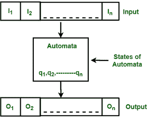
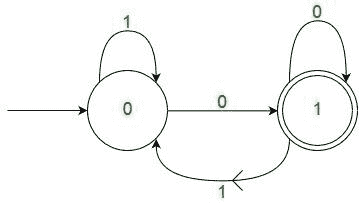
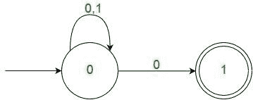

# 有限自动机介绍

> 原文:[https://www . geesforgeks . org/有限自动机简介/](https://www.geeksforgeeks.org/introduction-of-finite-automata/)

有限自动机是识别模式最简单的机器。有限自动机或有限状态机是具有五个元素或元组的抽象机器。它有一组从一个状态移动到另一个状态的状态和规则，但它取决于所应用的输入符号。基本上，它是数字计算机的抽象模型。下图显示了一般自动化的一些基本特征。



**图:**有限自动机的特点

上图显示了自动机的以下特性:

1.  投入
2.  输出
3.  自动机的状态
4.  国家关系
5.  输出关系

有限自动机由以下部分组成:

```
Q : Finite set of states.
Σ : set of Input Symbols.
q : Initial state.
F : set of Final States.
δ : Transition Function.
```

机器的正式规格是

```
{ Q, Σ, q, F, δ }
```

FA 分为两种类型:

**1)确定性有限自动机(DFA)**–

```
DFA consists of 5 tuples {Q, Σ, q, F, δ}. 
Q : set of all states.
Σ : set of input symbols. ( Symbols which machine takes as input )
q : Initial state. ( Starting state of a machine )
F : set of final state.
δ : Transition Function, defined as δ : Q X Σ --> Q.
```

在 DFA 中，对于特定的输入字符，机器只进入一种状态。为每个输入符号的每个状态定义一个转换函数。同样在 DFA 中，不允许空(或ε)移动，即没有任何输入字符，DFA 不能改变状态。

例如，下面σ= { 0，1}的 DFA 接受所有以 0 结尾的字符串。



**图:**σ= { 0，1} 的 DFA

需要注意的一点是， ***对于一个模式*** 可以有很多可能的 DFA。具有最少状态数的 DFA 通常是优选的。

**2)非确定有限自动机(NFA)**
NFA 与 DFA 相似，除了以下附加特征:

1.  允许零(或ε)移动，即它可以向前移动而不读取符号。
2.  能够针对特定输入传输到任意数量的状态。

然而，以上这些特点并没有给 NFA 增加任何力量。如果我们比较两者的力量，两者是相等的。

由于上述附加功能，NFA 具有不同的过渡功能，其余功能与 DFA 相同。

```
δ: Transition Function
δ:  Q X (Σ U ε ) --> 2 ^ Q. 
```

正如您在转换函数中看到的，对于包括 null(或ε)在内的任何输入，NFA 可以进入任意状态数的状态。
例如，下面是一个针对上述问题的 NFA。



**NFA**

需要注意的一点是， ***在 NFA，如果一个输入字符串的任何路径都通向一个最终状态，那么这个输入字符串*** **就是** ***所接受的*** 。例如，在上面的 NFA 中，输入字符串“00”有多个路径。由于其中一条路径通向最终状态，“00”被上述 NFA 接受。

**一些要点:**

*   **理由:**

Since all the tuples in DFA and NFA are the same except for one of the tuples, which is Transition Function (δ) 

```
In case of DFA
δ : Q X Σ --> Q
In case of NFA
δ : Q X Σ --> 2Q
```

现在如果你观察你会发现 Q Xσ–> Q 是 Q Xσ–> 2<sup>Q</sup>的一部分。

在 RHS 方面，Q 是 2 <sup>Q</sup> 的子集，这表明 Q 包含在 2 <sup>Q</sup> 中，或者 Q 是 2 <sup>Q</sup> 的一部分，然而，事实并非如此。所以从数学上来说，我们可以得出**每个 DFA 都是 NFA 的结论，但反之亦然**。然而，有一种方法可以将 NFA 转换成 DFA，所以每个 NFA 都有一个等效的 DFA。

1.  NFA 和 DFA 拥有相同的权力，每个 NFA 都可以被翻译成 DFA。
2.  DFA 和 NFA 都可以有多个最终状态。
3.  NFA 更多的是一个理论概念。
4.  DFA 用于编译器的词法分析。

参见[正则表达式和有限自动机](https://www.geeksforgeeks.org/regular-languages-and-finite-automata-gq/)测验。

如果发现有不正确的地方，请写评论，或者想分享更多关于以上讨论话题的信息