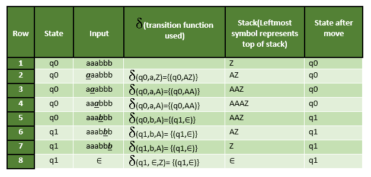

# 下推自动机介绍

> 原文:[https://www . geesforgeks . org/introduction-of-push down-automate/](https://www.geeksforgeeks.org/introduction-of-pushdown-automata/)

我们已经讨论过[有限自动机](https://www.geeksforgeeks.org/introduction-of-finite-automata/)。但是有限自动机只能用来接受常规语言。
下推自动机是一种有额外内存的有限自动机，称为堆栈，帮助下推自动机识别上下文无关语言。

下推自动机(PDA)可以定义为:

*   q 是状态集
*   ∑是一组输入符号
*   γ是一组下推符号(可以从堆栈中推送和弹出)
*   q0 是初始状态
*   z 是初始下推符号(它最初出现在堆栈中)
*   f 是最终状态的集合
*   δ是将 Q x {σ∞∑} xγ映射成 Q xγ*的转移函数。在给定的状态下，PDA 将读取输入符号和堆栈符号(堆栈顶部)，并移动到新的状态，更改堆栈的符号。

**瞬时描述(ID)**
瞬时描述(ID)是 PDA 如何“计算”输入字符串并决定该字符串是接受还是拒绝的非正式符号。

一个 ID 是一个三元组(q，w，α)，其中:
1。q 是当前状态。
2。w 是剩余的输入。
3.α是堆栈内容，位于左侧顶部。

**十字转门批注**
⊢标志被称为“十字转门批注”，代表
一步到位。
⊢*符号代表一系列动作。
Eg- (p，b，T) ⊢ (q，w，α)
这意味着当从状态 p 转换到状态 q 时，输入符号“b”被消耗，堆栈顶部的“t”被新字符串“α”替换

**例:**定义语言{ Anbn| n>0 }
**解:** M =其中 Q = { q0，q1 }和σ= { A，b }和γ= { A，Z }和δ由下式给出:

δ( q0，A，Z ) = { ( q0，AZ ) }
δ( q0，A，A) = { ( q0，AA ) }
δ( q0，b，A) = { ( q1，∑)}
δ(Q1，b，A) = { ( q1，∑)}
δ(Q1，∑，Z) = { ( q1，∑)}
T5】让我们看看这个自动机是如何为 aabbb 工作的。

**说明:**最初自动机状态为 q0，栈上符号为 Z，输入为 aaabbb，如第 1 行所示。读取“A”(第 2 行粗体显示)时，状态将保持为 q0，并将符号 A 推入堆栈。在下一个“A”上(如第 3 行所示)，它将在堆栈上推送另一个符号 A。读完 3 a 后，堆栈将是 AAAZ，A 在顶部。读取“b”后(如第 5 行所示)，它将弹出 A 并移动到状态 q1，堆栈将是 AAZ。当读取所有 b 时，状态将为 q1，堆栈将为 Z。在第 8 行，在输入符号“∑”和堆栈上的 Z 时，它将弹出 Z，堆栈将为空。这种类型的承兑被称为**空栈承兑。**

**注:**

*   上面的下推自动机本质上是确定性的，因为从输入符号和堆栈符号的状态只有一次移动。
*   非确定性下推自动机可以从输入符号和堆栈符号的状态进行多次移动。
*   将非确定性下推自动机转换为确定性下推自动机并不总是可能的。
*   与表达确定性的 PDA 相比，非确定性的 PDA 的表达能力更强，因为有些语言被 NPDA 接受，但不被确定性的 PDA 接受，这将在下一篇文章中讨论。
*   下推自动机既可以通过空栈加速实现，也可以通过最终状态加速实现，并且一个可以转换成另一个。

**提问:**以下哪一对有不同的表现力？

A.确定性有限自动机(DFA)和非确定性有限自动机(NFA)
B .确定性下推自动机(DPDA)和非确定性下推自动机(NPDA)
C .确定性单带图灵机和非确定性单带图灵机
D .单带图灵机和多带图灵机

**解:**每个 NFA 都可以转换成 DFA。所以，表现力是一样的。如上所述，每一个 NPDA 都不可能转变成 DPDA。所以，NPDA 和 DPDA 的实力是不一样的。因此，选项(B)是正确的。

本文由 Sonal Tuteja 供稿。

如果发现有不正确的地方，请写评论，或者想分享更多关于以上讨论话题的信息