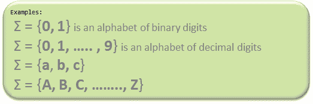

# 计算理论介绍

> 原文:[https://www . geeksforgeeks . org/计算理论导论/](https://www.geeksforgeeks.org/introduction-of-theory-of-computation/)

**自动机**理论(也称**计算理论**)是计算机科学和数学的一个理论分支，主要处理关于简单机器的计算逻辑，简称自动机。

自动机*使科学家能够理解机器如何计算函数和解决问题。发展自动机理论的主要动机是发展描述和分析离散系统动态行为的方法。

自动机起源于与“自动化”密切相关的“自动机”一词。

现在，让我们了解一下计算理论中重要且常用的基本术语。

**符号:**符号(通常也称为**字符**)是最小的积木，可以是任何字母、字母或图片。


**字母**(**σ**)**:**字母是一组符号，总是 ***有限*** 。



**字符串:**字符串是由一些字母表中的符号组成的 ***有限的*** 序列。一根弦一般表示为 ***w*** ，弦的长度表示为 ***|w|*** 。

**注:**σ*是所有可能的字符串的集合(通常是字符串的幂集(这里不必是唯一的，或者我们可以说是多集的)所以这意味着 ***语言**是*σ*的子集。

```
Empty string is the string with 
zero occurrence of symbols, 
represented as ε.
```

```
Number of Strings (of length 2) 
that can be generated over the alphabet {a, b} -
 -   -
                     a   a
                     a   b
                     b   a
                     b   b

Length of String |w| = 2
Number of Strings = 4

Conclusion:
For alphabet {a, b} with length n, number of 
strings can be generated = 2<sup>n</sup>.
```

**注–**如果σ的个数用|σ|表示，那么长度为 n 的若干串，可能超过σ的是**|σ|<sup>n</sup>**。

**语言:**语言是一组*字符串*，选自一些σ*或者我们可以说- **'** 语言是σ***'**的子集。可以在“σ”上构成的语言可以是**有限**或**无限**。

```
Example of Finite Language: 
          L1 = { set of string of 2 }
         L1 = { xy, yx, xx, yy }

Example of Infinite Language:
         L1 = { set of all strings starts with 'b' }
         L1 = { babb, baa, ba, bbb, baab, ....... }
```