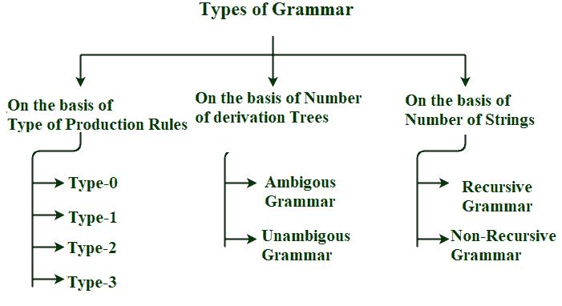

# 计算理论语法导论

> 原文:[https://www . geesforgeks . org/计算理论语法导论/](https://www.geeksforgeeks.org/introduction-to-grammar-in-theory-of-computation/)

**先决条件–**[计算理论](https://www.geeksforgeeks.org/introduction-of-theory-of-computation/)

**语法:**
它是一组有限的形式规则，用于生成语法正确的句子或有意义的正确句子。

**构成语法:**
语法基本上由两个基本要素组成–

1.  **终结符号–**
    终结符号是那些使用语法生成的句子的组成部分，并使用 a、b、c 等小写字母表示。
2.  **非终结符号–**
    非终结符号是那些参与句子生成但不是句子成分的符号。非终结符号也称为辅助符号和变量。这些符号用大写字母表示，如 A、B、C 等。

**语法的形式定义:**
任何语法都可以用 4 元组来表示–<N、T、P、S >

*   **N–**非终结符号的有限非空集合。
*   **T–**有限组终端符号。
*   **P–**有限非空生产规则集。
*   **S–**Start Symbol(从我们开始产生句子或字符串的地方开始的符号)。

**产生式规则:**
计算机科学中的产生式或产生式规则是一种重写规则，规定了可以递归执行以生成新符号序列的符号替换。它的形式是α- > β，其中α是一个非终结符号，可以用β代替，β是一串终结符号或非终结符号。

**示例-1 :**
考虑语法 G1 = < N，T，P，S >

```
T = {a,b}    #Set of terminal symbols
P = {A->Aa,A->Ab,A->a,A->b,A-> }    #Set of all production rules

S = {A}    #Start Symbol
```

由于起始符号是 S，因此我们可以产生 Aa、Ab、A、b、，这可以进一步产生字符串，其中 A 可以被产生规则中提到的字符串替换，因此该语法可以用于产生(a+b)*形式的字符串。

**字符串的派生:**

```
A->a    #using production rule 3
OR
A->Aa    #using production rule 1
Aa->ba    #using production rule 4
OR
A->Aa    #using production rule 1
Aa->AAa    #using production rule 1
AAa->bAa    #using production rule 4
bAa->ba    #using production rule 5
```

**示例-2 :**
考虑语法 G2 = < N，T，P，S >

```
N = {A}   #Set of non-terminals Symbols
T = {a}    #Set of terminal symbols
P = {A->Aa, A->AAa, A->a, A->}    #Set of all production rules

S = {A}   #Start Symbol
```

由于起始符号是 S，因此我们可以产生 Aa、AAa、A、，这可以进一步产生字符串，其中 A 可以被产生规则中提到的字符串替换，因此该语法可以用于产生形式(a)*的字符串。

**字符串的派生:**

```
A->a    #using production rule 3
OR
A->Aa    #using production rule 1
Aa->aa    #using production rule 3
OR
A->Aa    #using production rule 1
Aa->AAa    #using production rule 1
AAa->Aa    #using production rule 4
Aa->aa    #using production rule 3
```

**等价语法:**
语法被认为是等价的，因为它们产生相同的语言。

**不同类型的语法:**
语法可以根据–

*   生产规则的类型
*   派生树的数量
*   字符串数

