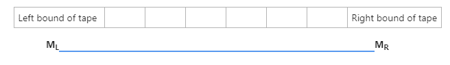
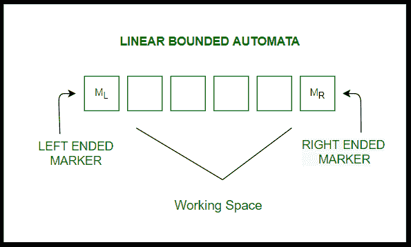

# 线性有界自动机介绍(LBA)

> 原文:[https://www . geesforgeks . org/introduction-to-linear-有界自动机-lba/](https://www.geeksforgeeks.org/introduction-to-linear-bounded-automata-lba/)

**历史:**
1960 年，**迈希尔**引入了关联度自动机模型，如今这种自动化模型被理解为确定性线性有界自动机。在此之后，另一位名叫**兰德韦伯**的科学家对此进行了研究，并提出确定性 LBA 所接受的语言是持续的上下文敏感语言。

1964 年，**黑田东彦**专门为非确定性线性有界自动机引入了一个替换和很多通用模型，并确立了非确定性线性有界自动机所接受的语言正是上下文敏感语言。

**线性有界自动机简介:**
线性有界自动机(LBA)与[图灵机](https://www.geeksforgeeks.org/turing-machine-in-toc/)类似，具有如下一些特性:

*   带有[非确定性逻辑](https://www.geeksforgeeks.org/multitape-nondeterministic-turing-machine-simulator/)的图灵机，
*   多轨迹图灵机
*   带长度有限的图灵机。



**LBA 使用的元组:**
LBA 可以用八元组(有助于设计自动机的元素)定义为:

```
M = (Q , T , E , q0 , M<sub>L</sub> , M<sub>R</sub> , S , F), 

where,  
Q -> A finite set of transition states
T -> Tape alphabet
E -> Input alphabet
q0 -> Initial state
M<sub>L</sub>-> Left bound of tape
M<sub>R</sub> -> Right bound of tape
S -> Transition Function
F -> A finite set of final states 
```

**LBA 示意图:**



**示例:**

[如上图用胶带形成 LBA 的语言](https://www.geeksforgeeks.org/introduction-of-theory-of-computation/)，

*   L = {a <sup>n！</sup> | n > = 0}
*   L = {wn | w 来自{a，b}+，n >= 1}
*   L = {wwwR | w 来自{a，b}+}

**事实:**

```
Suppose that a given LBA M has
    --> q states,
    --> m characters within the tape alphabet, and
    --> the input length is n
```

1.  那么 M 最多可以是 f(n) = q * n * mn 的配置，即 n 个单元和 M 个符号的磁带，我们可以有完全不同的磁带。
2.  磁头通常位于 n 个单元中的任何一个单元上，在 q 个状态中的任何一个中，我们都倾向于使用死刑。