# 队列自动机介绍

> 原文:[https://www . geesforgeks . org/introduction-to-queue-automator/](https://www.geeksforgeeks.org/introduction-to-queue-automata/)

我们已经知道[有限自动机](https://www.geeksforgeeks.org/introduction-of-pushdown-automata/)可以用来接受正则语言，[下推自动机](https://www.geeksforgeeks.org/introduction-of-pushdown-automata/)可以用来识别上下文无关语言。

队列自动机(QDA)是一种非确定性自动机，类似于下推自动机，但有一个队列而不是堆栈，这有助于队列自动机识别上下文无关语言之外的语言。

QDA 是一个 6 元组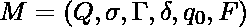

在哪里

1.  **Q** 是有限状态的集合。
2.  是有限输入字母的集合。
3.  是有限队列字母表的集合。
4.  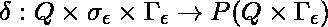。
5.  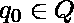是开始状态。
6.  **F**T2【Q】是接受状态的集合。

**接受一根绳子**

如果可以写成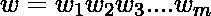，则 QDA 接受输入，其中每个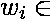 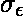都存在状态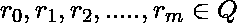和字符串，满足以下条件:

1.  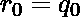和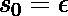。
2.  对于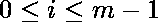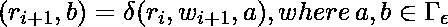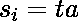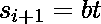和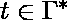
3.  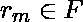

**例:**
定义语言的队列自动机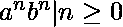

**解:**
Q = {q0，q1，q2，q3}和 ={a，b}和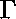 = {a，b，$}
而过渡函数由:
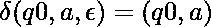
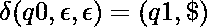
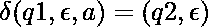
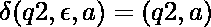
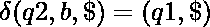
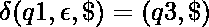给出

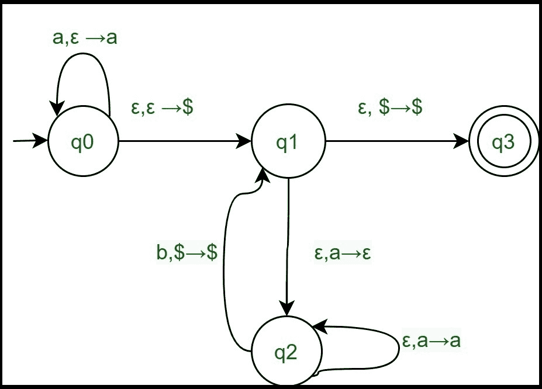

让我们看看这个自动机是如何为 aabb 工作的。

| 排 | 状态 | 投入 | 过渡函数 | 队列(从左输入) | 移动后的状态 |
| --- | --- | --- | --- | --- | --- |
| one | q0 | 【T0 之二】【T1 之二 | δ(q0，a，ε)={(q0，a)} | a | q0 |
| Two | q0 | 一**一** bb | δ(q0，a，ε)={(q0，a)} | 嗜酒者互诫协会 | q0 |
| three | q0 | E | δ(q0，ε，ε)={(q1，$)} | $aa | 雌三醇环戊醚 |
| four | 雌三醇环戊醚 | E | d（q1， e， a）={（q2， e）} | 一美元 | q2 |
| five | q2 | E | δ(q2，ε，a)={(q2，a)} | 一美元 | q2 |
| six | q2 | aa **b** b | δ(q2，b，$)={(q1，$)} | 一美元 | 雌三醇环戊醚 |
| seven | 雌三醇环戊醚 | E | d（q1， e， a）={（q2， e）} | $ | q2 |
| eight | q2 | aab**b**的缩写形式 | δ(q2，b，$)={(q1，$)} | $ | 雌三醇环戊醚 |
| nine | 雌三醇环戊醚 | E | δ(q1，ε，$)={(q3，$)} | $ | q3 |

