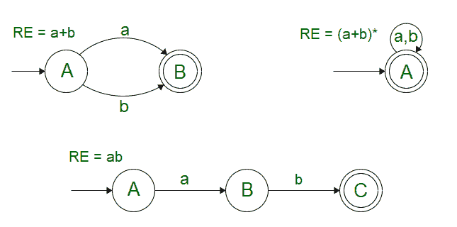
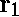
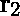
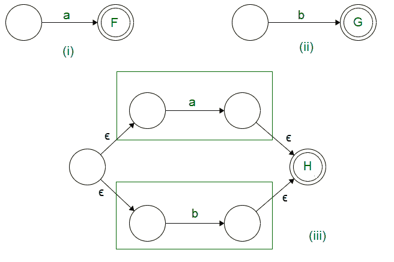
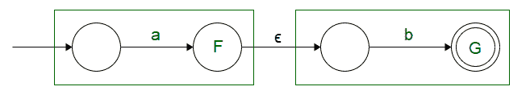
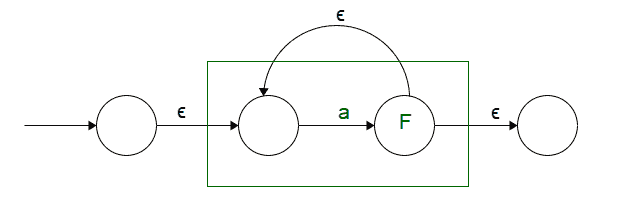
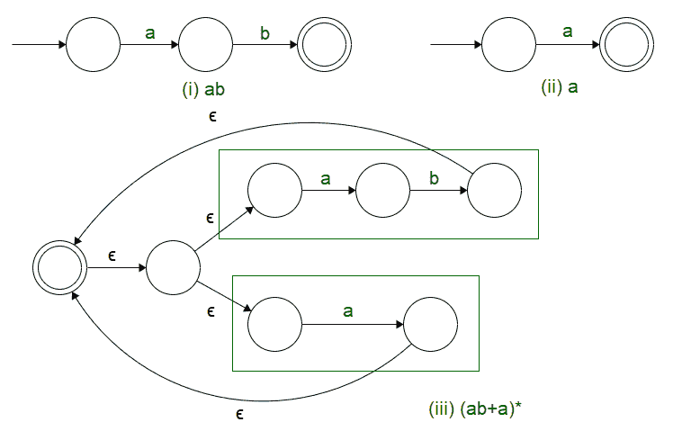

# 目录中的克莱尼定理|第 1 部分

> 原文:[https://www . geesforgeks . org/kleenes-定理-in-toc-part-1/](https://www.geeksforgeeks.org/kleenes-theorem-in-toc-part-1/)

如果一种语言可以用[有限自动机](https://www.geeksforgeeks.org/toc-finite-automata-introduction/)来表示，或者可以为其生成一个[正则表达式](https://www.geeksforgeeks.org/theory-computation-generating-regular-expression-finite-automata/)，那么这种语言就是正则的。这个定义把我们引向一个普遍的定义:对于与语言相对应的每个正则表达式，可以生成一个有限自动机。

对于某些表达式，如:- (a+b)、ab、(a+b)*；只凭直觉制作有限自动机相当容易，如下所示。当我们得到一个更长的正则表达式时，问题就出现了。这就需要一种系统的方法来产生 FA，这是克莱尼在**克莱尼定理-I**中提出的

**克莱尼定理-I :**

> 对于任何表示语言 L(r)的正则表达式 *r* ，都有一个接受相同语言的有限自动机。



为了理解克莱尼定理-1，让我们考虑正则表达式的基本定义，其中我们观察到、和单个输入符号“a”可以包含在正则语言中，并且可以通过这些的组合来执行的相应操作是:

说，和是两个正则表达式。然后，

1.   + 也是正则表达式，对应的语言是 L(  ) U L( )
2.  。也是正则表达式，对应的语言是 L( )。L( )
3.   *也是正则表达式，对应的语言是 L(  )*

我们可以进一步将这个定义与空转换结合起来，通过组合两个或多个更小的有限自动机(每个对应一个正则表达式)来产生一个 FA。

让 S 接受 L = {a}，T 接受 L = {b}，那么 R 可以用提供的操作表示为 S 和 T 的组合，如下所示:

```
R = S + T
```



我们注意到，

1.  在联合操作的情况下，我们可以有一个新的开始状态，从这个状态，空转换前进到两个有限状态机的开始状态。
2.  两个有限自动机的最终状态都被转换成中间状态。最终状态被统一为一个可以被空转换遍历的状态。

```
R = S.T 
```



我们注意到，

1.  在串联操作的情况下，我们可以有与 S 相同的起始状态，唯一的变化发生在 S 的结束状态，它被转换为中间状态，然后是空转换。
2.  空转换之后是 T 的起始状态，T 的最终状态用作 r 的结束状态。

```
 R = S*
```



我们注意到，

1.  添加了一个新的开始状态，并且将 S 作为一个中间状态，以便可以合并自循环条件。
2.  开始和结束状态已分别定义，因此不会干扰自循环条件。

既然我们知道了一般操作。让我们看看克莱尼定理——我可以用来为给定的正则表达式生成一个 FA。

```
Example:
Make a Finite Automata for the expression (ab+a)* 
```



我们看到，使用克莱尼定理，我给出了一个系统的方法来为所提供的正则表达式生成有限自动机。