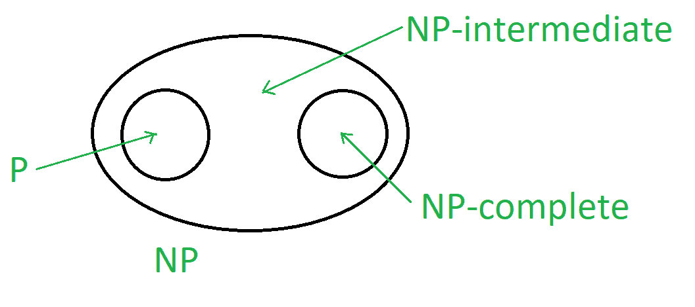

# TOC 中的拉德纳定理

> 原文:[https://www.geeksforgeeks.org/ladners-theorem-in-toc/](https://www.geeksforgeeks.org/ladners-theorem-in-toc/)

**TOC 中的拉德纳定理:**
想必大家都知道，不管 P = NP 是否是计算机科学领域一个重大的令人困惑的问题。在计算复杂性中，那些属于 NP-问题但不能属于 P 或 NP-完全的问题被称为**NP-中间问题**。

考虑到 NP-complete 问题，继续思考我们是否在 P 和 NP-complete 之间有一个划分是正常的，具体来说，P 或 NP 是否只包括 NP-complete 问题，取决于 P ≠ NP 的可能性。

即使你想到了 P ≠ NP，也很容易相信 NP = P∪NP-complete——NP 中的每个问题都可以在多项式时间内解决，或者有足够的表达能力来编码 SAT。所有这些问题都被拉德纳解决了，他的定理证明了中间复杂性的存在。

**NP-中级问题:**
一个语言 L ∈ NP 是**NP-中级**当且仅当 L∉ P 和 l∉NP-完全。

**拉德纳定理:**
如果 P ≠ NP，那么有一种语言 L 是 NP 中间语言。
换句话说，如果 P ≠ NP 为真，那么 NP 中间体不为空，意味着 NP 包含了既不在 P 中也不在 NP-complete 中的问题。

**证明:**
利用对角化，

让我们假设一个特殊的函数:

*   O(m 3 )从 m 处理 H(m)所需的时间
*   h(m)–>∞带 m if SAT H ∉ P。
*   如果 SAT H ∈ P，H(m) ≤ C (C=常数)。
*   现在，让 sath= {ψ01m^ h(m):ψ∈sat 和|ψ| = m }

考虑到 P ≠ NP，对 H 进行特征化，使 SAT H 为 NP-中间体。

**1。让 SAT H ∈ P .然后 H(m) ≤ C.**
这建议 SAT 的多时间算法如下:

*   首先输入ϕ，得到 m = |ϕ|.的值
*   现在根据计算出的 H(m)生成字符串ϕ 0 1 m^ H(m) 。
*   验证字符串ϕ 0 1 m^ H(m) ∈ SAT H.

**结果**–因此应该是坐 H ∉ P，因为 P ≠ NP。

**2。让 SAT H ∈ NP-complete。这意味着 H(m)–>∞与 m.**
这为 SAT 建议了如下的多时间算法:

*   SAT ≤ p SAT H 和t5】ϕ–>ψ0 1k
*   首先用 m = |ψ|输入ϕ，得到 f(ϕ的值)=ψ0 1k。
*   通过处理 H(m)验证 k = m H(m) 。
*   这表明，n c = |f(ϕ)| ≥ k ≥ m 2c 。

因此，如果ψ∈sat，则√n ≥ m 也是ϕ ∈ SAT。
只需要 O(log log n)个递归步骤。

**结果–**因此 SAT H ∉ NP-complete，为 P ≠ NP。

**H 的构造:**
现在对于 H 的构造，我们注意到 H(m)的值支配弦的 SAT H 上的
成员，这里弦的 SAT H 的长度≥ m

*   因此我们将定义长度为< m , according to string in SAT H 的 H(m)。
*   现在进行施工，我们知道 H(m)是最小的 k < log (log m) such that M k 在 SATHk | x |k时间中选择长度最大为对数 m 弦 x 的参与。如果不是，那么我们可以说 H(m) = log (log m)。
*   现在 H(m) ≤ C 当且仅当 SAT H ∈ P 为真。

c. |x| c 时间内有一个多时间 M 选择每个 x ∈ SAT H 的报名。这里 M 可以用很多字符串来表示，有α ≥ c，这样 M = M*α选择参与α内的每个 x ∈ SAT H 。|x| α 时间。
因此满足α < log (log m)的所有 m 的 H(m) ≤ α。

*   如果 SAT H ∈ P，那么 H(m) ≤ C(对于无限多 m)。
    H(m) = k 对于无穷多个 m 当 k ≤ C 时这个条件成立。

现在求任意 x∑{ 0，1}*最大的 M，使得|x| ≤ log m 和 H(m) = k，这里 x 由 k 中的 M k 决定|x| k 时间。
SAT H 由多时光机 M k 决定。

**H 的属性:**
H 的属性如下:

*   O(m3)从 m 处理 H(m)所需的时间
*   h(m)–>∞带 m if SAT H ∉ P。
*   如果 SAT H ∈ P，H(m) ≤ C (C=常数)。

**对角化的极限:**
对角化是一种用于分离集合的技术。这里我们要把 NP 中间集的两个集合 NP 和 P 分开。Kozen 定理表明强对角化不相对化。

虽然 P 对 NP 的问题仍未解决，但我们已经将注意力放在了这个问题上。尽管事实上有确凿的证据证明对角化具有隔离 P 和 NP 的能力，但我们已经表明，这与我们的实对角化思想无关。此外，立体对角化是隔离这些 P 和 NP 的最好方法，正如 Kozen 在他的定理中所说明的那样。

**NP-中间问题示例:**

*   计算离散对数。
*   图同构问题。
*   分解离散对数。
*   格中最短向量的逼近。
*   最小电路尺寸问题。