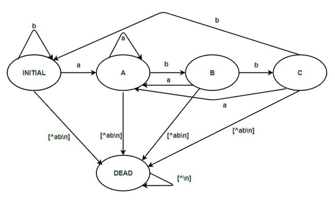
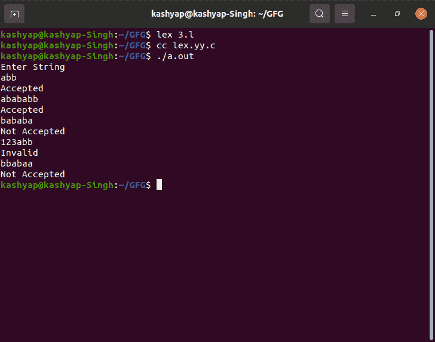

# 在输入字母{a，b}

上接受以“abb”结尾的字符串的 LEX 代码

> 原文:[https://www . geesforgeks . org/lex-code-accept-the-string-以-abb-over-input-alphabet-ab/](https://www.geeksforgeeks.org/lex-code-that-accepts-the-string-ending-with-abb-over-input-alphabet-ab/)

在本文中，我们将讨论在输入字母表{a，b}上接受以' abb '结尾的字符串的 LEX code，并将看到使用 LEX Code 的实现，并将理解这种方法。我们一个一个来讨论。

**问题概述:**
LEX 代码，在输入字母表{a，b}上接受以“abb”结尾的字符串。

**示例–**

```
Input  : abb
Output : Accepted

Input  : abababb
Output : Accepted

Input  : 23ab
Output : Invalid

Input  : ab345
Output : Invalid

Input  : bbabaa
Output : Not Accepted
```

**方法:**
LEX 默认为我们提供一个 INITIAL 状态。所以要做一个 DFA，用这个作为 DFA 的初始状态。我们定义了另外四种状态:A、B、C 和 DEAD，如果遇到错误或无效的输入，将使用 DEAD 状态。当用户输入无效字符时，移动到“死亡”状态，然后打印“无效”。如果输入字符串以 C 结尾，则显示消息“已接受”。否则，如果输入字符串在状态 INITIAL、A 或 B 结束，则显示消息“不接受”。



**注意–**
要编译 lex 程序，我们需要一个安装了 flex 的 Unix 系统。然后我们需要用。l 分机。

**示例–**

```
filename.l
```

然后在保存程序后，关闭 lex 文件，然后打开终端，编写如下命令。

```
lex filename.l
cc lex.yy.c
./a.out
```

**实现- LEX 代码:**

```
%{
%}

%s A B C DEAD

// not accepted state after visiting A 
%%
<INITIAL>a BEGIN A;
<INITIAL>b BEGIN INITIAL;
<INITIAL>[^ab\n] BEGIN DEAD;
<INITIAL>\n BEGIN INITIAL; {printf("Not Accepted\n");}

// not accepted state after visiting A and B state
<A>a BEGIN A;
<A>b BEGIN B;
<A>[^ab\n] BEGIN DEAD;
<A>\n BEGIN INITIAL; {printf("Not Accepted\n");}

// // not accepted state after visiting A and C state  
<B>a BEGIN A;
<B>b BEGIN C;
<B>[^ab\n] BEGIN DEAD;
<B>\n BEGIN INITIAL; {printf("Not Accepted\n");}

// Accepted case
<C>a BEGIN A;
<C>b BEGIN INITIAL;
<C>[^ab\n] BEGIN DEAD;
<C>\n BEGIN INITIAL; {printf("Accepted\n");}

// Invalid Case 
<DEAD>[^\n] BEGIN DEAD;
<DEAD>\n BEGIN INITIAL; {printf("Invalid\n");}

%%
// yywrap method
int yywrap()
{
return 1;
}  

// main method 
int main()
{
   printf("Enter String\n");
   // called yylex
   yylex();
return 0;
}
```

**输出:**

