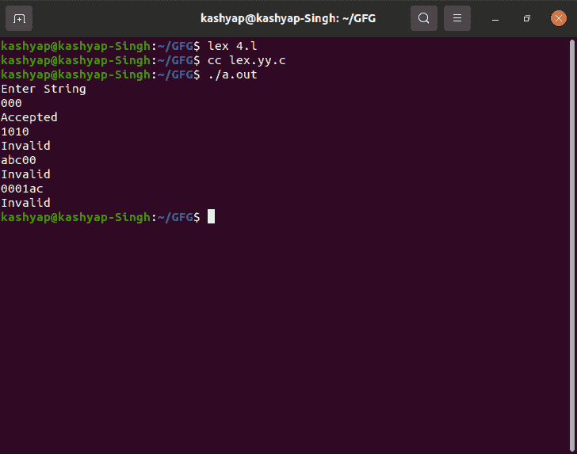

# 只接受 0 字符串的 LEX 代码

> 原文:[https://www . geeksforgeeks . org/lex-code-只接受带 0 的字符串/](https://www.geeksforgeeks.org/lex-code-that-accepts-the-string-with-0-only/)

在本文中，我们将讨论只接受 0 字符串的 LEX 代码的概述。并且还将使用 LEX 代码实现，我们将理解这种方法。我们一个一个来讨论。

**问题概述:**
只接受 0 的字符串的 LEX 代码。

**示例–**

```
Input  : 00
Output : Accepted

Input  : 1000
Output : Invalid

Input  : 23ab
Output : Invalid

Input  : ab345
Output : Invalid

Input  : 00000
Output : Accepted
```

**方法:**
LEX 默认为我们提供一个 INITIAL 状态。所以要做一个 DFA，用这个作为 DFA 的初始状态。我们定义了另外两种状态:A 和 DEAD，如果遇到错误或无效的输入，将使用 DEAD 状态。当用户输入无效字符时，移动到“死亡”状态，然后打印“无效”。如果输入字符串以 A 结尾，则显示消息“已接受”。否则，如果输入字符串在初始状态结束，则显示消息“不接受”。


**注意–**
要编译 lex 程序，我们需要一个安装了 flex 的 Unix 系统。然后我们需要用。l 分机。

**示例:**

```
filename.l
```

然后在保存程序后，关闭 lex 文件，然后打开终端，编写如下命令。

```
lex filename.l
cc lex.yy.c
./a.out
```

**LEX Code :**

## C

```
%{
%}

%s A DEAD

// logic for dead state  
%%
<INITIAL>0 BEGIN A;
<INITIAL>[^0\n] BEGIN DEAD;
<INITIAL>\n BEGIN INITIAL; {printf("Not Accepted\n");}

// Initial node - Accepted
<A>0 BEGIN A;
<A>[^0\n] BEGIN DEAD;
<A>\n BEGIN INITIAL; {printf("Accepted\n");}

// Invalid Case
<DEAD>[^\n] BEGIN DEAD;
<DEAD>\n BEGIN INITIAL; {printf("Invalid\n");}

%%

// Method - yywrap  
int yywrap()
{
return 1;
}  

// main method
int main()
{
   printf("Enter String\n");
  // called yylex method
   yylex();
return 0;
}
```

**输出:**

