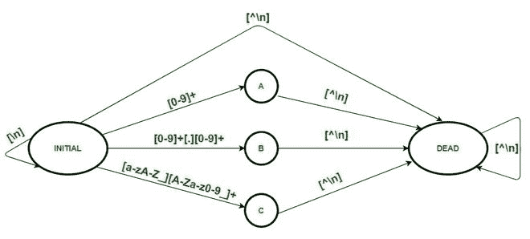
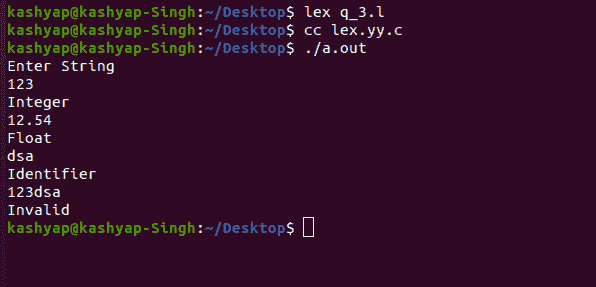
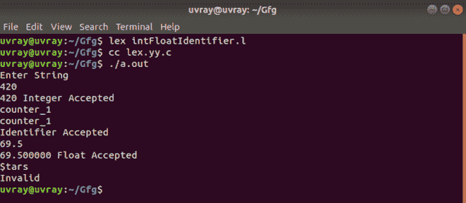

# 识别和打印整数的 LEX 代码&浮点常量和标识符

> 原文:[https://www . geesforgeks . org/lex-code-to-identificate-print-integer-float-constants-and-identifier/](https://www.geeksforgeeks.org/lex-code-to-identify-and-print-integer-float-constants-and-identifier/)

在本文中，我们将讨论如何解决这个问题，并且您将看到如何在 LEX 代码中设计与 [DFA](https://www.geeksforgeeks.org/minimization-of-dfa/) 相关的问题，以识别和打印整数&浮点常量和标识符。我们一个一个来讨论。

**问题概述:**
在 LEX 代码中设计一个 DFA 来识别和打印整数&浮点常量和标识符。

**注意–**
整数、浮点和标识符的正则表达式如下。

```
Integer    - [0-9]+
Float      - [0-9]+[.][0-9]+
Identifier - [A-Za-z_][A-Za-z0-9_]+
```

**示例–**

```
Input  : 35
Output : Integer

Input  : 3.98
Output : Float

Input  : kashyap
Output : Identifier

Input  : 123Singh
Output : Invalid
```

**方法:**
LEX 默认为我们提供一个 INITIAL 状态。所以要做一个 DFA，用这个初始状态作为 DFA 的初始状态。再定义四种状态 A、B、C 和 DEAD。DEAD 是当遇到无效或错误的输入时将使用的死状态，它打印“无效”。遇到整数时使用 a，它打印“integer”，遇到浮点常数时使用 B，它打印“Float”，遇到标识符时使用 C，它打印“identifier”。新的行字符(\n)标记输入的结束，因此转换到初始状态并打印输出或打印“不接受”或“无效”



**<u>注意:-</u>**
要编译 lex 程序，我们需要一个安装了 flex 的 Unix 系统。然后我们需要用。l 分机。例如- **filename.l** 然后在保存程序后关闭 lex 文件，然后打开终端，写下以下命令。

```
lex filename.l
cc lex.yy.c
./a.out
```

#### 方法 1

**lex code–**

## C

```
// Declaration Section
%{
%}

%s A B C DEAD        // Declaring states

// Rules Section
%%
<INITIAL>[0-9]+ BEGIN A;
<INITIAL>[0-9]+[.][0-9]+ BEGIN B;
<INITIAL>[A-Za-z_][A-Za-z0-9_]* BEGIN C;
<INITIAL>[^\n] BEGIN DEAD;
<INITIAL>\n BEGIN INITIAL; {printf("Not Accepted\n");}

<A>[^\n] BEGIN DEAD;
<A>\n BEGIN INITIAL; {printf("Integer\n");}

<B>[^\n] BEGIN DEAD;
<B>\n BEGIN INITIAL; {printf("Float\n");}

<C>[^\n] BEGIN DEAD;
<C>\n BEGIN INITIAL; {printf("Identifier\n");}

<DEAD>[^\n] BEGIN DEAD;
<DEAD>\n BEGIN INITIAL; {printf("Invalid\n");}

%%

// Auxillary Functions
int yywrap()
{
 return 1;
}

int main()
{
 printf("Enter String\n");
 yylex();
 return 0;
}
```

**输出:**



#### 方法 2

如果您也想打印标识的令牌，那么您可以应用下面的 Lex 代码来打印匹配的整数、浮点数和标识符。

**LEX Code-**

## C

```
//Declaration Section
%{
#include<stdlib.h>
int num_int;            // stores integer
char *str;                // stores identifier
double num_float;        // stores float
%}

%s A B C DEAD        //Declaring States

//Rules Section
%%
<INITIAL> [0-9]+ BEGIN A;                    {num_int = atoi(yytext);}
<INITIAL> [0-9]+"."[0-9]+ BEGIN B;            {num_float = atof(yytext);}           
<INITIAL> [a-zA-Z_][a-zA-Z0-9_]* BEGIN C;    {str = yytext;}
<INITIAL> [^\n] BEGIN DEAD;
<INITIAL> [\n] BEGIN INITIAL;        {printf("Not Accepted\n");}

<A> [^\n] BEGIN DEAD;
<A> \n BEGIN INITIAL;        {printf("%d Integer Accepted\n", num_int);}

<B> [^\n] BEGIN DEAD;
<B> \n BEGIN INITIAL;        {printf("%lf Float Accepted\n", num_float);}

<C> [^\n] BEGIN DEAD;
<C> \n BEGIN INITIAL;        {printf("%sIdentifier Accepted\n", str);}

<DEAD> [^\n] BEGIN DEAD;
<DEAD> \n BEGIN INITIAL;    {printf("Invalid\n");}
%%

//Auxillary Functions
int yywrap()
{
      return 1;
}

int main(){
    printf("Enter String:\n");
     yylex();
     return 0;
}
```

**输出:**

