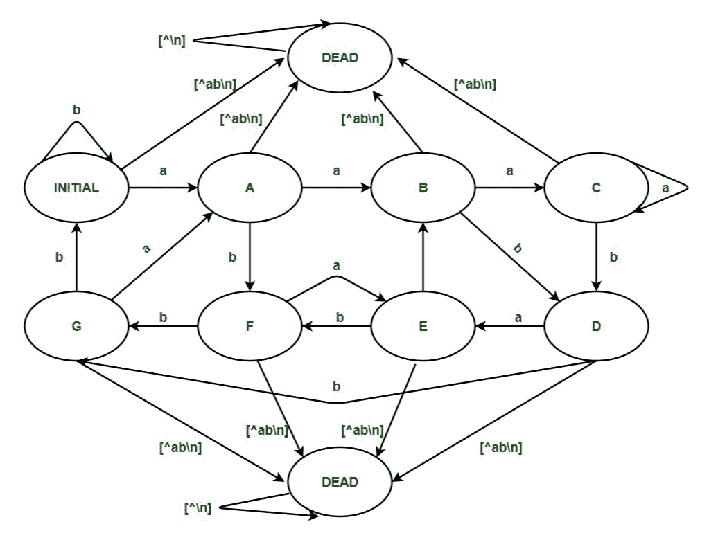
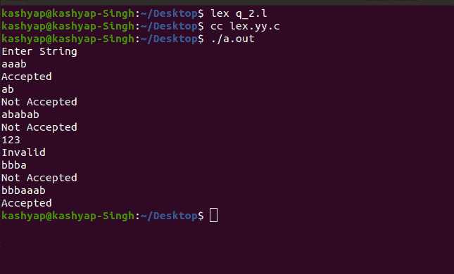

# LEX 代码，接受输入字母表{a，b}

中包含第三个最后一个元素' a '的字符串

> 原文:[https://www . geeksforgeeks . org/lex-code-accept-string-containing-third-last-element-a-over-input-alphabet-a-b/](https://www.geeksforgeeks.org/lex-code-which-accepts-string-containing-third-last-element-a-over-input-alphabet-a-b/)

在本文中，我们将借助示例讨论 LEX 代码中的 [DFA](https://www.geeksforgeeks.org/minimization-of-dfa/) ，该代码接受包含输入字母表{a，b}上倒数第三个元素' a '的字符串。让我们逐一讨论。

**先决条件–**[设计有限自动机](https://www.geeksforgeeks.org/designing-deterministic-finite-automata-set-1/)

**问题概述:**
在 LEX 代码中设计一个 [DFA](https://www.geeksforgeeks.org/union-process-in-dfa/) ，该代码接受一个包含输入字母表{a，b}中倒数第三个元素“a”的字符串。

**示例–**

```
Input : aaab
Output: Accepted

Input : ab
Output: Not Accepted

Input: ababab
Output:Not Accepted

Input:123
Output:Invalid

Input:bbba
Output:Not Accepted

Input:bbbaaab
Output:Accepted
```

**方法:**
LEX 默认为我们提供一个 INITIAL 状态。所以要做一个 [DFA](https://www.geeksforgeeks.org/introduction-of-finite-automata/) ，用这个作为 [DFA](https://www.geeksforgeeks.org/introduction-of-finite-automata/) 的初始状态。我们定义了另外八种状态:A、B、C、D、E、F、G 和 DEAD，如果遇到错误或无效的输入，将使用 DEAD 状态。当用户输入无效字符时，移动到“死亡”状态，打印消息“无效”。如果输入字符串在初始状态 A、B 或 F 结束，则显示消息“不接受”。否则，如果输入字符串在状态 C、D、E 或 G 结束，则显示“已接受”消息。



**注意–**
所以要编译 lex 程序，我们需要一个安装了 flex 的 Unix 系统。然后我们需要用。l 分机。例如- **filename.l** 然后在保存程序后关闭 lex 文件，然后打开终端，写下如下命令。

```
lex filename.l
cc lex.yy.c
./a.out
```

**LEX Code :**

```
%{
%}
%s A B C D E F G DEAD
%%
<INITIAL>b BEGIN INITIAL;
<INITIAL>a BEGIN A;
<INITIAL>[^ab\n] BEGIN DEAD;
<INITIAL>\n BEGIN INITIAL; {printf("Not Accepted\n");}

<A>b BEGIN F;
<A>a BEGIN B;
<A>[^ab\n] BEGIN DEAD;
<A>\n BEGIN INITIAL; {printf("Not Accepted\n");}

<B>b BEGIN D;
<B>a BEGIN C;
<B>[^ab\n] BEGIN DEAD;
<B>\n BEGIN INITIAL; {printf("Not Accepted\n");}

<C>b BEGIN D;
<C>a BEGIN C;
<C>[^ab\n] BEGIN DEAD;
<C>\n BEGIN INITIAL; {printf("Accepted\n");} 

<D>b BEGIN G;
<D>a BEGIN E;
<D>[^ab\n] BEGIN DEAD;
<D>\n BEGIN INITIAL; {printf("Accepted\n");}

<E>b BEGIN F;
<E>a BEGIN B;
<E>[^ab\n] BEGIN DEAD;
<E>\n BEGIN INITIAL; {printf("Accepted\n");}

<F>b BEGIN G;
<F>a BEGIN E;
<F>[^ab\n] BEGIN DEAD;
<F>\n BEGIN INITIAL; {printf("Not Accepted\n");}

<G>b BEGIN INITIAL;
<G>a BEGIN A;
<G>[^ab\n] BEGIN DEAD;
<G>\n BEGIN INITIAL; {printf("Accepted\n");}

<DEAD>[^\n] BEGIN DEAD;
<DEAD>\n BEGIN INITIAL; {printf("Invalid\n");}

%%
int yywrap()
{
 return 1;
}
int main()
{
 printf("Enter String\n");
 yylex();
 return 0;
}
```

**输出:**

