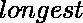
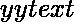
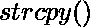
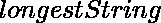
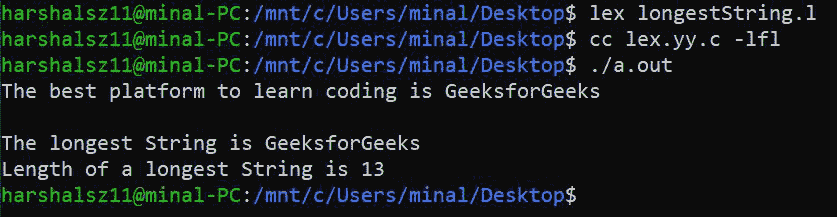
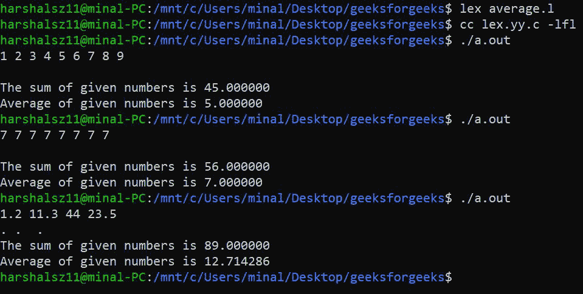

# LEX 程序打印最长的字符串，并找出给定数字的平均值

> 原文:[https://www . geesforgeks . org/lex-程序打印-最长字符串-查找给定数字的平均值/](https://www.geeksforgeeks.org/lex-program-to-print-the-longest-string-and-to-find-average-of-given-numbers/)

**Lex:**
Lex 程序的目的是生成词法分析器。Lex 分析器是一个将输入流转换成标记序列的程序。一个 C 程序实现了词法分析器来读取输入流并产生作为源代码的输出。

**要使用的命令–**

```
lex file_name.l   // To produce a c program
cc lex.yy.c -lfl  // To compile the c program and produces object program a.out.
./a.out           // To transforms an input stream into a sequence of tokens.    
```

**1。最长的字符串:**
在这个例子中，我们使用名为的函数来计算最长字符串的长度(它返回给定字符串的长度)。我们将返回值存储在变量中。要打印最长的字符串或单词，我们使用和功能。我们将字符串或单词存储在类型为的 char 变量中。

**程序–**

## C

```
%{
   //to find longest string and its length
    #include<stdio.h>
    #include<string.h>
    int longest = 0;
    char longestString[30];
%}
%%
[a-zA-Z]+ {
if(yyleng>longest){
    longest = yyleng;
    strcpy(longestString,yytext);
}
}

%%

int main(void){
    yylex();
    printf("The longest string is %s \n", longestString);
    printf("Length of a longest string is %d \n",longest);
}
```

**输出–**



**2。给定数字的平均值:**
所以，首先我们要计算用户给出的所有数字的和。将总和存储在可变总和中。然后计算整数的数量(用户给出的数字)。将此计数存储在变量 n 中
之后，只需将数字的总和和计数相除即可。你会得到你的结果。
这里，我们使用的是 inbuild 函数 atoi()。一个字符串可以被传递到 atoi()函数，该函数会将它们转换成一个整数。输入字符串是可以转换为数值的文本字符串。当输入字符串中的第一个字符不是数字的一部分时，atoi()函数停止读取它。这可能是字符串末尾的空字符。它不支持指数和小数。
atoi()函数删除字符串开头的所有空白。

**程序–**

## C

```
%{
    //Average of given numbers.
    #include<stdio.h>
    #include<math.h>
%}
digit[0-9]+
%%
{digit} return atoi(yytext);
%%

int main(){
    float sum=0, num, n=0;
    while((num=yylex())>0){
    sum = sum+num;
    n = n+1;
}
printf("The sum of given numbers is %f\n",sum);
printf("Average of given numbers is %f\n",sum/n);
yylex();
return 0;
}
```

**输出–**

