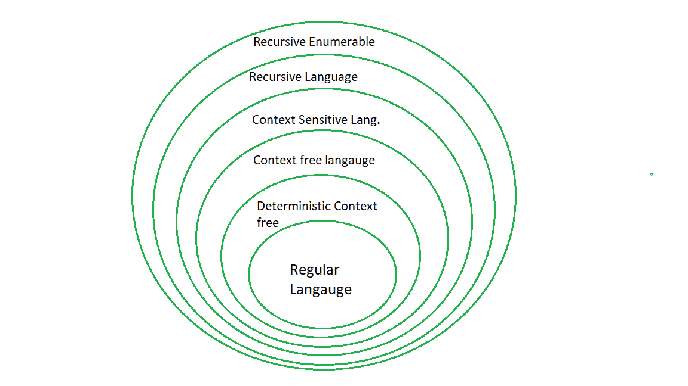

# 最后一分钟笔记–计算理论

> 原文:[https://www.geeksforgeeks.org/lmn-toc/](https://www.geeksforgeeks.org/lmn-toc/)

参见所有科目的最后一分钟笔记[此处](https://www.geeksforgeeks.org/lmns-gq/)。

我们将以总结的形式讨论对 GATE 考试有用的重要要点。详情可参考[本](https://www.geeksforgeeks.org/gate-cs-notes-gq/)。 

[**有限自动机**](https://www.geeksforgeeks.org/toc-finite-automata-introduction/) :用于识别特定类型输入的模式。它是最受限制的自动机类型，只能接受常规语言(可以使用 OR (+)、Concatenation()通过正则表达式表达的语言。)、克莱尼闭包(*)如 a*b*、(a+b)等。)

**确定性 FA 和非确定性 FA:** 在确定性 FA 中，每个输入符号的每个状态只有一次移动，但在非确定性 FA 中，一个输入符号的一个状态可以有零次或多次移动。

**注:**

*   NDFA 和 DFA 接受的语言是一样的。T3】
*   NDFA 和 DFA 的实力是一样的。T3】
*   NDFA 的州数小于或等于等效 DFA 中的州数。T3】
*   对于有 n 个状态的 NFA，最坏的情况下，DFA 中可能的最大状态是 2<sup>n</sup>T5】
*   每个 NFA 都可以转换成对应的 DFA。T3】

**正则表达式的身份:**

> F + R = R + F = R
> Φ * R = R * F = F
> e * R = R = R * e = R
> e* = e
> F* = e
> e + RR* = R*R +e = R*
> 
> (a+b)* =(a *+b *)* =(a * b *)* =(a *+b)* =(a+b *)* = a *(ba *)* = b *(ab *)*

[**摩尔机器**](https://www.geeksforgeeks.org/mealy-and-moore-machines/) :摩尔机器是有输出值的有限状态机，其输出只依赖于当前状态。
[**Mealy Machine**](https://www.geeksforgeeks.org/mealy-and-moore-machines/):Mealy Machine 也是有输出值的有限状态机，其输出取决于当前状态和当前输入符号。

[**下推自动机**](https://www.geeksforgeeks.org/theory-of-computation-pushdown-automata/) :下推自动机有额外的内存，称为堆栈，它比有限自动机给出更多的功率。它用于识别上下文无关语言。

**确定性和非确定性 PDA:** 在确定性 PDA，每个输入符号上的每个状态只有一次移动，但在非确定性 PDA，一个输入符号可以有多个状态移动。

**注:**

*   NPDA 的力量超过 DPDA。T3】
*   不可能把每个 NPDA 都转换成对应的 DPDA。T3】
*   DPDA 接受的语言是 NPDA 接受的语言的子集。T3】
*   DPDA 接受的语言被称为 DCFL(确定性上下文无关语言)，是 NPDA 接受的 NCFL(非确定性 CFL)的子集。T3】

**线性边界自动机:** 线性边界自动机有有限的内存量，称为磁带，可以用来识别上下文相关语言。

*   LBA is more powerful than Push down automata.

    ```
     FA < PDA < LBA < TM 
    ```

    **[图灵机](https://www.geeksforgeeks.org/turing-machine/)** :图灵机有无限大小的磁带，用来接受递归枚举语言。

    *   图灵机可以双向移动。还有，它不接受ε。T3】*   If the string inserted in not in language, machine will halt in non-final state.

    **确定性和非确定性图灵机:** 在确定性图灵机中，每个输入符号上的每个状态只有一次移动，但在非确定性图灵机中，一个输入符号可以有多个状态的移动。

    **注:**

    *   NTM 接受的语言，多带 TM 和 DTM 一样。T3】
    *   NTM、多带 TM、DTM 的威力相同。T3】
    *   每个 NTM 都可以转换成对应的 DTM。T3】

    **乔姆斯基语言分类:**

    <colgroup><col><col><col><col><col></colgroup>
    | **语法类型** | **生产规则**T5】 | **语言接受** | **自动机** | **关闭**T5】 |
    | **Type-3(常规语法)** | A→AT5或A→aB 在哪里 A、BT35∏ | 常规 | 有限自动机 | 联合、交叉、互补、串联、克莱尼闭合T3】 |
    | **Type-2(上下文无关语法)** | A→【ρ其中 A∑Nρ∑(T∑N)<sup>*</sup> |  | 下推自动机 | 联合、串联、克莱尼闭合T3】 |
    | **Type-1(上下文敏感语法)** | α→【β】其中αT5、β∑T22(T∩T36 | 上下文敏感 | 线性边界自动机 | 联合、交叉、互补、串联、克莱尼闭合T3】 |
    | **类型-0(递归枚举)** | α→【β】其中α 、β∑(T∑N)<sup>*</sup>和 α至少包含 1 个非端 | 递归枚举 | 图灵机 | 联合、交叉、串联、克莱尼闭合T3】 |

    这些之间的关系可以表示为:
    

    [**可判定和不可判定的问题:**](https://www.geeksforgeeks.org/theory-computation-decidable-undecidable-problems/)

    一种语言是 **【可判定的】或【递归的】** 如果一个图灵机可以被构造成接受作为语言一部分的字符串而拒绝其他字符串。例如:一个数是否是质数是一个可判定的问题。

    一种语言是**Semi**–**可判定的或递归可枚举的** 如果可以构造一个图灵机，它接受作为语言一部分的字符串，并且它可以为不是语言一部分的字符串永远循环。

    一个问题是 **不可判定** 如果我们不能构造出一个能给出是或否答案的算法和图灵机。例如:CFG 是否模糊不清是不可判定的。

    

    **可数性:**

    *   任意有限字母表上所有字符串的集合都是可数的。T3】*   可数集的每个子集要么是有限的，要么是可数的。T3】*   所有图灵机的集合都是可数的。T3】*   The set of all languages that are not recursive enumerable is Uncountable.