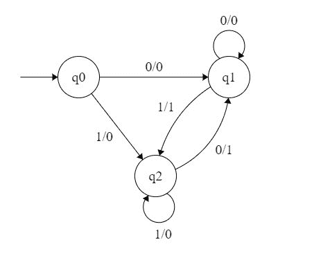
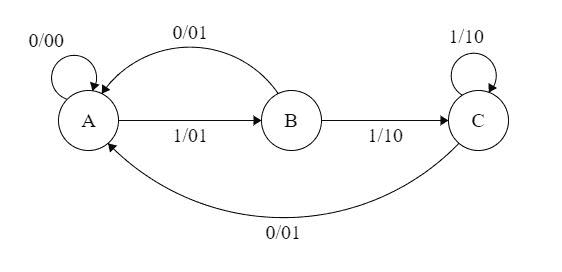

# TOC 中的美利和摩尔机器

> 原文:[https://www . geesforgeks . org/mealy-and-Moore-machines-in-TOC/](https://www.geeksforgeeks.org/mealy-and-moore-machines-in-toc/)

**Moore Machines:**Moore Machines 是有输出值的有限状态机，其输出只依赖于当前状态。可以定义为(Q，q0， **∑，** O，δ，λ)其中:

*   q 是有限状态集。
*   q0 是初始状态。
*   **∑** 为输入字母表。
*   o 是输出字母表。
*   δ是映射 Q× **∑** → Q 的过渡函数。
*   λ是映射 Q → O 的输出函数。

**Figure 1**

在图 1 所示的系泊机器中，输出由/分隔的每个输入状态表示。系泊设备的输出长度比输入长度大 1。

*   **输入:** 11
*   **跃迁:** δ (q0，11)= > δ(q2，1)= > q2
*   **输出:** 000 (0 代表 q0，0 代表 q2，0 代表 q2)

****melay Machines:**melay Machines 也是有输出值的有限状态机，其输出取决于当前状态和当前输入符号。可以定义为(Q，q0， **∑，** O，δ，λ')，其中:**

*   **q 是有限状态集。**
*   **q0 是初始状态。**
*   ****∑** 为输入字母表。**
*   **o 是输出字母表。**
*   **δ是映射 Q× **∑** → Q 的过渡函数。**
*   **‘λ’是映射 Q× **∑** → O 的输出函数。**

**** 

****Figure 2****

**在图 1 所示的机器中，输出用每个状态的每个输入符号表示，用/分隔。粉磨机的输出长度等于输入长度。**

*   ****输入:** 11**
*   ****跃迁:** δ (q0，11)= > δ(q2，1)= > q2**
*   ****输出:** 00 (q0 至 q2 转换具有输出 0，q2 至 q2 转换也具有输出 0)**

****从美利到摩尔机器的转换****

**让我们看一下图 2 所示的粉饼机的转换表。**

|  | **输入=0** | **输入=1** |
| **当前状态** | **下一状态** | **输出** | **下一状态** | **输出** |
| q0 | 雌三醇环戊醚 | Zero | q2 | Zero |
| 雌三醇环戊醚 | 雌三醇环戊醚 | Zero | q2 | one |
| q2 | 雌三醇环戊醚 | one | q2 | Zero |

****表 1****

****第一步。**首先找出那些有 1 个以上相关输出的状态。q1 和 q2 是输出 0 和 1 都与之相关联的状态。**

****第二步。**为这些状态创建两个状态。对于 q1，两个状态将是 q10(输出为 0 的状态)和 q11(输出为 1 的状态)。类似地，对于 q2，两个状态将是 q20 和 q21。**

****第三步。**用新生成的状态创建一个空的停泊机器。对于系泊机器，输出将与每个状态相关联，而与输入无关。**

|  | 输入=0 | 输入=1 |  |
| 现状 | 次状态 | 次状态 | 输出 |
| q0 |  |  |  |
| q10 |  |  |  |
| q11 |  |  |  |
| q20 |  |  |  |
| q21 |  |  |  |

****表 2****

****第四步。**使用表 1 所示的机器转换表填充下一个状态的条目。对于输入 0 上的 q0，下一个状态是 q10(输出 0 的 q1)。同样，对于输入 1 上的 q0，下一个状态是 q20(输出 0 的 q2)。对于输入 0 上的 Q1(q10 和 q11)，下一个状态是 Q10。类似地，对于 Q1(Q10 和 q11)，下一个状态是 q21。对于 q10，输出为 0，对于 q11，输出为 1。同样，也可以填写其他条目。**

|  | 输入=0 | 输入=1 |  |
| 现状 | 次状态 | 次状态 | 输出 |
| q0 | q10 | q20 | Zero |
| q10 | q10 | q21 | Zero |
| q11 | q10 | q21 | one |
| q20 | q11 | q20 | Zero |
| q21 | q11 | q20 | one |

****表 3****

**这是图 1 所示系泊机的过渡表。**

****从系泊机到粉磨机的转换****

**让我们以图 1 的系泊设备为例，其转换表如表 3 所示。**

****第一步。**如表 4 所示，使用系泊设备的所有状态构建一台空的粉状设备。**

|  | **输入=0** | **输入=1** |
| **当前状态** | **下一状态** | **输出** | **下一状态** | **输出** |
| q0 |  |  |  |  |
| q10 |  |  |  |  |
| q11 |  |  |  |  |
| q20 |  |  |  |  |
| q21 |  |  |  |  |

****表 4****

****步骤 2:** 每个状态的下一个状态也可以直接从摩尔机器转换表中找到，如下所示:**

|  | **输入=0** | **输入=1** |
| **当前状态** | **下一状态** | **输出** | **下一状态** | **输出** |
| q0 | q10 |  | q20 |  |
| q10 | q10 |  | q21 |  |
| q11 | q10 |  | q21 |  |
| q20 | q11 |  | q20 |  |
| q21 | q11 |  | q20 |  |

****表 5****

****第 3 步:**正如我们在摩尔机器转换表中可以看到的与每个输入对应的输出。用它来填充输出条目。例如:q10、q11、q20、q21 对应的输出分别为 0、1、0、1。**T3】****

|  | **输入=0** | **输入=1** |
| **当前状态** | **下一状态** | **输出** | **下一状态** | **输出** |
| q0 | q10 | Zero | q20 | Zero |
| q10 | q10 | Zero | q21 | one |
| q11 | q10 | Zero | q21 | one |
| q20 | q11 | one | q20 | Zero |
| q21 | q11 | one | q20 | Zero |

****表 6****

****第四步:**从表 6 可以看出，q10 和 q11 是相似的(不同输入下一个状态和输出的值相同)。同样，q20 和 q21 也是相似的。所以，q11 和 q21 可以去掉。**

|  | **输入=0** | **输入=1** |
| **当前状态** | **下一状态** | **输出** | **下一状态** | **输出** |
| q0 | q10 | Zero | q20 | Zero |
| q10 | q10 | Zero | q21 | one |
| q20 | q11 | one | q20 | Zero |

****表 7****

**这是表 1 中所示的同一台磨粉机。因此，我们将 melay 转换为 moore 机器，并将 moore 转换回 melay。**

****注意:**粉饼机的状态数不能大于摩尔机的状态数。**

****例:**以下状态图描述的有限状态机，以 A 为起始状态，其中一个弧标号为 x / y，x 代表 1 位输入，y 代表 2 位输出？**

****

**输出输入的当前位和先前位的总和。**

1.  **每当输入序列包含 11 时，输出 01。**
2.  **每当输入序列包含 10 时，输出 00。**
3.  **这些都不是。**

****解决方案:**让我们获取不同的输入及其输出，并检查哪个选项有效:**

****输入:** 01**

****输出:** 00 01(对于 0，输出为 00，状态为 a，那么对于 1，输出为 01，状态为 B)**

****输入:** 11**

****输出:** 01 10(对于 1，输出为 01，状态为 b，然后对于 1，输出为 10，状态为 C)**

**正如我们所看到的，它给出了现在位和以前位的二进制和。对于第一位，前一位被视为 0。**

**本文由 **Sonal Tuteja** 供稿。如果您发现任何不正确的地方，或者您想分享更多关于上面讨论的主题的信息，请写评论**