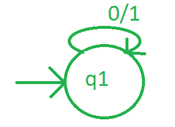
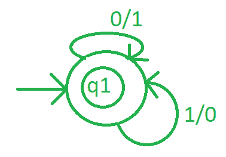

# 1 进制粉饼机

> 原文:[https://www . geesforgeks . org/melay-machine-for-1s-complete/](https://www.geeksforgeeks.org/mealy-machine-for-1s-complement/)

将一个数转换成二进制形式后，用 0 替换每一个数，用 1 替换每一个 0，那么得到的数就是该二进制数的 1，s 补码。

```
Input-1 :
101010
Output-1 : 
010101 

Input-2 :
1110100
Output-2 :
0001011 
```

**进场:**

1.  首先做一个初始状态。
2.  然后把每个 0 转换成 1，每个 1 转换成 0，到达下一个可能的状态。
3.  对二进制数的每个数字执行步骤 2 后，到达某个最终状态以完成该过程。

**设计粉饼机:**

**Step-1:**
取一个初始状态比如 q1，如果发现输入为 0，将其转换为 1，保持相同状态，检查另一个输入字母表。



**Step-2:**
如果状态 q1 取输入字母表为 1，那么将其转换为 0 并保持相同状态。


**第三步:**当转换完所有字母表后，它处于相同的状态，那么这个状态也将是最终状态。



**示例:**
假设一个字符串 10001，从左到右开始解析。每个 0 将被 1 替换，每个 0 将被 0 替换。那么输出就是 01110。