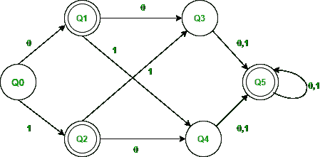
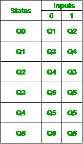
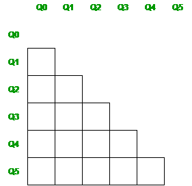
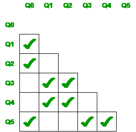
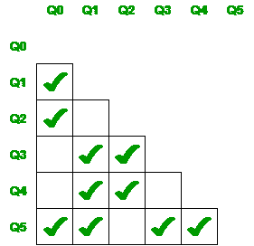
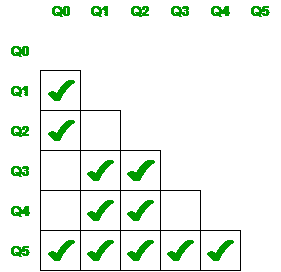
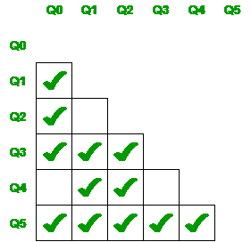
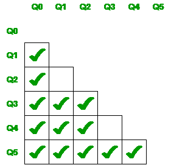
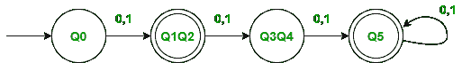
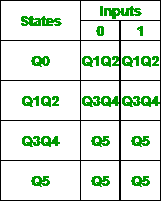

# 利用迈希尔-内罗德定理最小化离散傅立叶变换

> 原文:[https://www . geesforgeks . org/最小化 DFA-using-my hill-nerode-定理/](https://www.geeksforgeeks.org/minimization-of-dfa-using-myhill-nerode-theorem/)

**利用迈希尔-内罗德定理最小化离散傅立叶变换:**
最小化离散傅立叶变换是获得由最小可能状态数组成的任意离散傅立叶变换的最小等价形式所必需的。迈希尔-内罗德定理可以用来将一个离散傅立叶变换转化为具有最小状态数的等价离散傅立叶变换。这种最小化方法也称为表格填充法。还有一种方法叫做划分法或等价法，用于最小化 DFA(请访问[https://www.geeksforgeeks.org/minimization-of-dfa/](https://www.geeksforgeeks.org/minimization-of-dfa/)了解等价/划分法)。

#### DFA 最小化的步骤:

1.  创建给定 DFA 中涉及的所有状态对。
2.  标记所有配对(Q a 、Qb)a，使得 Q a 为最终状态，Qb 为非最终状态。
3.  如果有任何未标记的对(Qa，Qb)a 标记了δ(Qa，x)和δ(Q b ，x)，则标记(Qa，Qb)。这里 x 是输入符号。重复此步骤，直到无法再做标记。
4.  组合所有未标记的对，并使它们在最小化的 DFA 中成为单一状态。

#### 例子

考虑以下 DFA，

以下是上述 DFA 的过渡表

**使用迈希尔-内罗德定理最小化上述 DFA:**

**步骤 1:** 创建 DFA 中涉及的所有状态对。

**步骤 2:** 标记所有对(Qa，Qb)，使 Qa 为最终状态，Qb 为非最终状态。

**步骤 3:** 如果有任何未标记的对(Qa，Qb)使得δ(Qa，x)和δ(Qb，x)被标记，则标记(Qa，Qb)。这里 x 是输入符号。重复此步骤，直到无法再做标记。

*   检查没有标记的一对 Q2，Q1
    *   检查当 x=0 : δ(Q2，0) = Q4 和δ(Q1，0) = Q3 时，检查 Q4、Q3 对是否标记，否则不标记。
    *   检查当 x=1 : δ(Q2，1) = Q3 和δ(Q1，1) = Q4 时，检查 Q4、Q3 对是否标记，否则不标记。
    *   因此，我们无法标记这对 Q1 Q2。
*   检查未标记的对 Q3、Q0
    *   检查当 x=0 : δ(Q3，0) = Q5 和δ(Q0，0) = Q1 时，检查对 Q5、Q1 是否有标记，否则没有标记。
    *   检查当 x=1 : δ(Q3，1) = Q5 和δ(Q0，1) = Q2 时，检查对 Q5、Q2 是否有标记，否则没有标记。
    *   因此，我们不能标记 Q3、Q0 对。
*   检查未标记的对 Q4、Q0
    *   检查当 x=0 : δ(Q4，0) = Q5 和δ(Q0，0) = Q1 时，检查对 Q5、Q1 是否有标记，否则没有标记。
    *   检查当 x=1 : δ(Q4，1) = Q5 和δ(Q0，1) = Q2 时，检查对 Q5，Q2 是否有标记，否则没有标记。
    *   因此，我们不能标记 Q4、Q0 对。
*   检查未标记的对 Q4、Q3
    *   检查当 x=0 : δ(Q4，0) = Q5 和δ(Q3，0) = Q5 时，这样的状态对 Q5、Q5 不存在。
    *   检查当 x=1 : δ(Q4，1) = Q5 和δ(Q3，1) = Q5 时，这样的状态对 Q5、Q5 不存在。
    *   因此，我们无法标记 Q4 和 Q3 对。
*   检查没有标记的 Q5 对，Q1
    *   检查当 x=0 : δ(Q5，0) = Q5 和δ(Q1，0) = Q3 时，检查对 Q5、Q3 是否有标记，是则有标记。
    *   因此，我们可以标记这对 Q5，Q1。

*   检查没有标记的 Q5 对，Q2
    *   检查当 x=0 : δ(Q5，0) = Q5 和δ(Q2，0) = Q4 时，检查对 Q5、Q4 是否有标记，是则有标记。
    *   因此，我们可以标记这对 Q5，Q2。

*   我们已经检查了所有未标记的对，但不需要在这里停止，我们需要继续这个过程，直到没有更多的标记可以做。
*   检查没有标记的一对 Q2，Q1
    *   检查当 x=0 : δ(Q2，0) = Q4 和δ(Q1，0) = Q3 时，检查 Q4、Q3 对是否标记，否则不标记。
    *   检查当 x=1 : δ(Q2，1) = Q3 和δ(Q1，1) = Q4 时，检查 Q4、Q3 对是否标记，否则不标记。
    *   因此，我们无法标记这对 Q1 Q2。
*   检查未标记的对 Q3、Q0
    *   检查当 x=0 : δ(Q3，0) = Q5 和δ(Q0，0) = Q1 时，检查对 Q5，Q1 是否有标记，是的，它有标记。
    *   因此，我们可以标记 Q3、Q0 对。

*   检查未标记的对 Q4、Q0
    *   检查当 x=0 : δ(Q4，0) = Q5 和δ(Q0，0) = Q1 时，检查对 Q5，Q1 是否有标记，是的，它有标记。
    *   因此，我们不能标记 Q4、Q0 对。

*   检查未标记的对 Q4、Q3
    *   检查当 x=0 : δ(Q4，0) = Q5 和δ(Q3，0) = Q5 时，这样的状态对 Q5、Q5 不存在。
    *   检查当 x=1 : δ(Q4，1) = Q5 和δ(Q3，1) = Q5 时，这样的状态对 Q5、Q5 不存在。
    *   因此，我们无法标记 Q4 和 Q3 对。
*   现在，即使我们重复该过程，我们也无法标记 Q2、Q1(因为 Q4、Q3 未被标记)和 Q4、Q3(因为 Q5、Q5 这样的状态对不存在)。).因此我们就此打住。

**步骤-4:** 合并所有未标记的对，并使它们在最小化的 DFA 中成为单个状态。

*   未标记的对是 Q2、Q1 和第 4 季度、第 3 季度，因此我们将它们组合在一起。

以下是最小化 DFA，Q1Q2 和 Q3Q4 为组合状态。

*   Q0 仍然是我们的起始状态。
*   Q1 和 Q2 是我们的最终状态，所以即使我们将它们合并，它们仍将作为合并后的最终状态。
*   Q5 是我们的另一个最终状态。
*   如果我们检查原始的转换表
    *   δ(Q0，0)为 Q1，δ(Q1，1)为 Q2。当这些状态组合在一起时，输入 0 和 1 上的 Q0 转换到 Q1Q2 状态。
    *   δ(Q1，0)为 Q3，δ(Q1，1)为 Q4，δ(Q2，0)为 Q4，δ(Q1，1)为 Q3。当状态被组合时，输入 0 和 1 上的 Q1Q2 的转变将是状态 Q3Q4。
    *   δ(Q3，0)为 Q5，δ(Q3，1)为 Q5，δ(Q4，0)为 Q5，δ(Q4，1)为 Q5。当状态被组合时，输入 0 和 1 上的 Q3Q4 的转变将是状态 Q5。
    *   δ(Q5，0)为 Q5，δ(Q5，1)为 Q5。因此，两个输入端上的状态 Q5 转换到状态 Q5 本身。

最小化 DFA 的转换表

