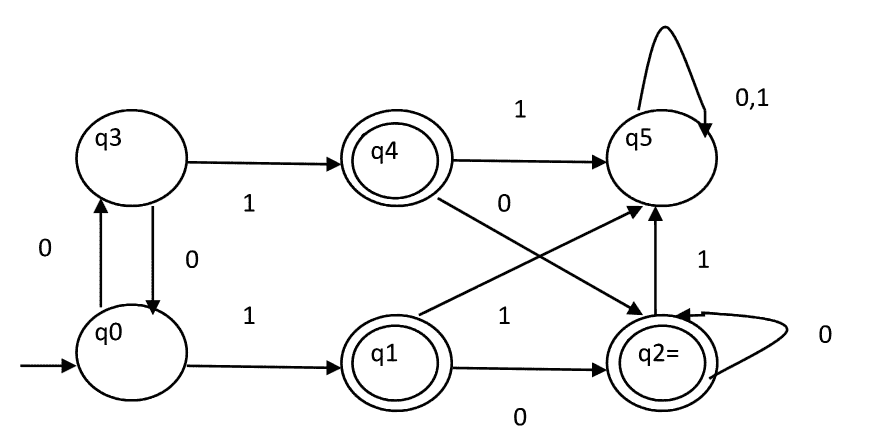
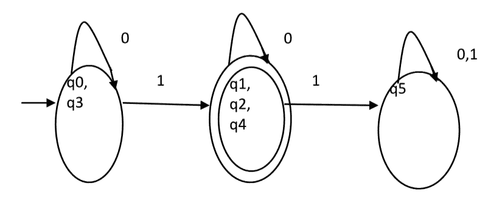
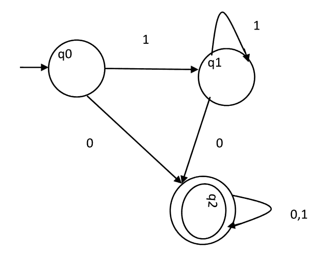

# DFA 最小化

> 原文:[https://www.geeksforgeeks.org/minimization-of-dfa/](https://www.geeksforgeeks.org/minimization-of-dfa/)

DFA 最小化是指将一个给定的 DFA 转换成具有最小状态数的等价 DFA。

**DFA 的最小化**
假设有一个 DFA D < Q，σ，q0，δ，F >识别一个语言 L，那么语言 L 的最小化 DFA D<Q’，σ，q0，δ’，F’>可以构造为:
**第一步:**我们将把 Q(状态集)分成两组。一组将包含所有最终状态，另一组将包含非最终状态。这个分区叫做 P 0 。
**第二步:**初始化 k = 1
**第三步:**通过划分 P k-1 的不同集合，找到 P k 。在每一组 P k-1 中，我们将采取所有可能的状态对。如果一个集合的两个状态是可区分的，我们将在 P k 中把集合分成不同的集合。
**步骤 4:** 当 P k = P k-1 (分区无变化)
**步骤 5:** 一个集合的所有状态合并为一个。最小化 DFA 中的状态数将等于 P k 中的集合数。

**如何发现分区 P k 中的两个状态是否可区分？**
如果对于任何输入符号 a，δ ( qi，a)和δ ( qj，a)在分区 P k-1 中的不同集合中，则两个状态(qi，qj)在分区 P k 中是可区分的。
**示例**
考虑下图所示的 DFA。

**第一步。** P0 将有两组状态。一组将包含 q1、q2、q4，它们是 DFA 的最终状态，另一组将包含剩余状态。所以 P0 = { { q1，q2，q4 }，{ q0，q3，q5 } }。
T3】第二步。为了计算 P1，我们将检查分区 P0 的集合是否可以分区:

**i)对于集合{ q1，q2，q4 } :**
δ ( q1，0 ) = δ ( q2，0 ) = q2 和δ ( q1，1 ) = δ ( q2，1 ) = q5，因此 q1 和 q2 不可区分。
同样，δ ( q1，0 ) = δ ( q4，0 ) = q2 和δ ( q1，1 ) = δ ( q4，1 ) = q5，所以 q1 和 q4 是不能区分的。
由于 q1 和 q2 不可区分，q1 和 q4 也不可区分，所以 q2 和 q4 不可区分。因此，{ q1，q2，q4 }集不会在 P1 进行分区。

**ii)对于集合{ q0，q3，q5 } :**
δ ( q0，0 ) = q3 和δ ( q3，0 ) = q0
δ ( q0，1) = q1 和δ( q3，1 ) = q4
输入符号 0 上 q0 和 q3 的移动分别是 q3 和 q0，它们在分区 P0 中处于同一集合。类似地，输入符号 1 上 q0 和 q3 的移动是分区 P0 中相同集合中的 q3 和 q0。因此，q0 和 q3 无法区分。

δ ( q0，0 ) = q3 和δ ( q5，0 ) = q5 和δ ( q0，1 ) = q1 和δ ( q5，1 ) = q5
输入符号 1 上 q0 和 q5 的移动分别为 q1 和 q5，它们在分区 P0 中设置不同。所以，q0 和 q5 是可以区分的。因此，集合{ q0，q3，q5 }将被划分为{ q0，q3 }和{ q5 }。所以，
P1 = { { q1，q2，q4 }，{ q0，q3}，{ q5 }

为了计算 P2，我们将检查分区 P1 的集合是否可以被分区:
**iii)对于集合{ q1，q2，q4 } :**
δ ( q1，0 ) = δ ( q2，0 ) = q2 和δ ( q1，1 ) = δ ( q2，1 ) = q5，因此 q1 和 q2 是不可区分的。
同样，δ ( q1，0 ) = δ ( q4，0 ) = q2 和δ ( q1，1 ) = δ ( q4，1 ) = q5，所以 q1 和 q4 不可区分。
由于 q1 和 q2 不可区分，q1 和 q4 也不可区分，所以 q2 和 q4 不可区分。因此，{ q1，q2，q4 }集不会在 P2 进行分区。

**iv)对于集合{ q0，q3 } :**
δ ( q0，0 ) = q3 和δ ( q3，0 ) = q0
δ ( q0，1 ) = q1 和δ ( q3，1 ) = q4
输入符号 0 上 q0 和 q3 的移动分别是 q3 和 q0，它们在分区 P1 的同一集合中。类似地，输入符号 1 上 q0 和 q3 的移动是 q3 和 q0，它们在分区 P1 的同一集合中。因此，q0 和 q3 无法区分。

**v)对于集合{ q5 }:**
由于我们在这个集合中只有一个状态，所以不能进一步划分。所以，
P2 = { { q1，q2，q4 }，{ q0，q3 }，{ q5 } }
自，P1=P2。这是最后一个分区。分区 P2 意味着 q1、q2 和 q4 状态合并为一个。类似地，q0 和 q3 合并成一个。与图 1 的 DFA 对应的最小化 DFA 如图 2 所示:

**问题:**考虑给定的 DFA。以下哪一项是错误的？
1。L(A)的补语是上下文无关的。
2。L(A)= L((11 * 0+0)(0+1)* 0 * 1 *)
3。对于 A 接受的语言，A 是最小 DFA。
4。a 接受长度至少为两个的{ 0，1 }以上的所有字符串。

A.仅 1 和 3
仅 B2 和 4
仅 C2 和 3
仅 d 3 和 4

**解决方案:**语句 4 表示，它将接受长度至少为 2 的所有字符串。但是它接受长度为 1 的 0。所以，4 是假的。
声明 3 称 DFA 是最小的。我们将使用上面讨论的算法进行检查。
P0 = { { q2 }，{ q0，q1 } }
P1 = { q2 }，{ q0，q1 } }。因为，P0 = P1，P1 是最后的 DFA。q0 和 q1 可以合并。所以最小 DFA 会有两种状态。因此，陈述 3 也是错误的。
所以正确的选项是(D)。

本文由 Sonal Tuteja 撰写。

如果你发现任何不正确的地方，或者你想分享更多关于上面讨论的话题的信息，请写评论。