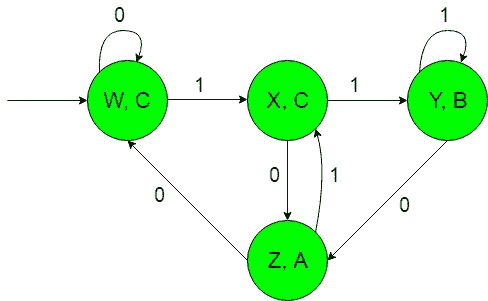
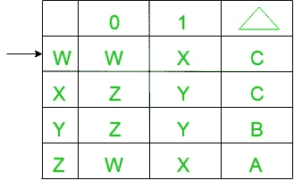
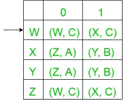
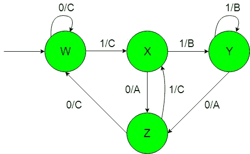

# 摩尔和米莱机器生产“A”、“B”、“C”依赖于以“10”或“11”结尾的输入，否则为其他

> 原文:[https://www . geesforgeks . org/Moore-and-mealy-machines-to-product-a-b-c-on-inputs-end-with-10-or-with-11-else-other/](https://www.geeksforgeeks.org/moore-and-mealy-machines-to-produce-a-b-c-depends-on-inputs-that-end-with-10-or-with-11-else-other/)

先决条件:[米莱和摩尔机器](https://www.geeksforgeeks.org/mealy-and-moore-machines/)、[米莱机器和摩尔机器的区别](https://www.geeksforgeeks.org/difference-between-mealy-machine-and-moore-machine/)、
**问题:**以{0，1}上的一组所有字符串作为输入，如果输入以“10”结尾，则产生“A”作为输出的机器的构造，或者如果输入以“11”结尾，则产生“B”作为输出的机器的构造。
假设:

```
Ε = {0, 1} and 
Δ = {A, B, C}  
```

其中ε和δ分别是输入和输出字母表。

**说明:**
所需的摩尔机构造如下:



在上图中，初始状态“w”在获得“0”作为输入时，它保持自身状态，并打印“C”作为输出，在获得“1”作为输入时，它传输到状态“X”，并打印“C”作为输出，以此类推其余状态。

因此，如果输入以“10”结尾，上面的系泊机器可以容易地产生“A”作为输出，或者如果输入以“11”结尾，则产生“B”作为输出，否则产生“C”

**摩尔机到美利机的转换:**
以上摩尔机以{0，1}上的一组所有字符串为输入，如果输入以‘10’结尾，则产生‘A’作为输出，如果输入以‘11’结尾，则产生‘B’作为输出，否则产生‘C’作为输出。
现在我们需要把上面摩尔机的过渡图转换成等效的 Mealy 机过渡图。

所需转换的步骤如下

*   **Step-1:** Formation of State Transition Table of the above Moore machine-
    
    In the above transition table, States ‘W’, ‘X’, ‘Y’ and ‘Z’ are kept in the first column which on getting ‘0’ as the input it transits to ‘W’, ‘Z’, ‘Z’ and ‘W’ states respectively, kept in the second column and on getting ‘1’ as the input it transits to ‘X’, ‘Y’, ‘Y’ and ‘X’ states respectively, kept in the third column and In the fourth column under Δ, there are corresponding outputs of the first column states. In the table, An arrow (→) indicates the initial state.
*   **Step-2:** Formation of Transition Table for Mealy machine from above Transition Table of Moore machine-
    Below transition table is going to be formed with the help of the above table and its entries just by using the corresponding output of the states of the first column and placing them in the second and third column accordingly.
    
    In the above table, the states in the first column like ‘W’ on getting ‘0’ as the input it goes to a state ‘W’ and gives ‘C’ as the output and on getting ‘1’ as the input it goes to the state ‘X’ and gives ‘C’ as the output and so on for the remaining states in the first column. In the table, An arrow (→) indicates the initial state.
*   **第三步:**最后我们可以借助上面的转换表来形成 Mealy 机器的状态转换图。
    如下图所示-
    
    以上美利机器将{0，1}上的所有字符串集作为输入，如果输入以“10”结尾，则产生“A”作为输出，如果输入以“11”结尾，则产生“B”作为输出，否则产生“C”作为输出。

**注意:**当从摩尔转换到米莱机时，摩尔和米莱机的状态数保持不变，但是在米莱到摩尔转换的情况下，它给出的状态数并不相同。