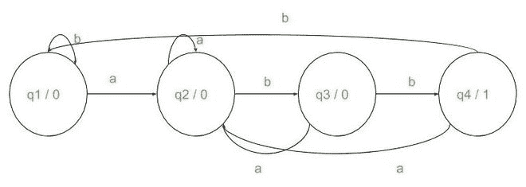
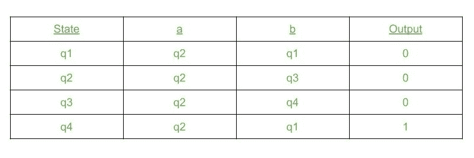
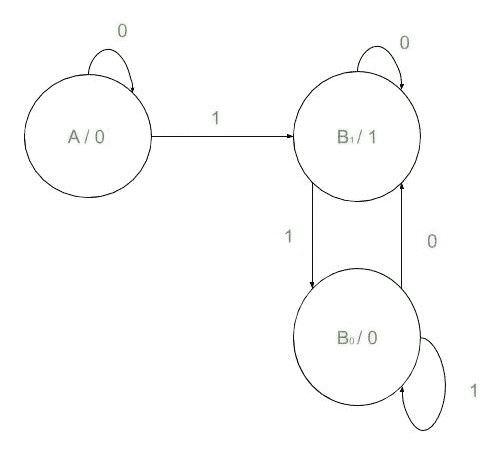

# 摩尔机器在 C++中的实现

> 原文:[https://www.geeksforgeeks.org/moore-machines/](https://www.geeksforgeeks.org/moore-machines/)

**摩尔机器:**一个[摩尔机器](https://www.geeksforgeeks.org/mealy-and-moore-machines-in-toc/)基本上是一个 [DFA](https://www.geeksforgeeks.org/designing-finite-automata-from-regular-expression-set-1/) 输出与每个状态相关联。这些机器可以用于各种各样的任务，例如计算给定字符串中特定子串的出现次数，寻找二进制数的 [2 补码，等等。](https://www.geeksforgeeks.org/1s-2s-complement-binary-number/)

**系泊机工作:**

*   它有一个与每个状态相关联的输出。
*   接受输入后，它会进入下一个状态。
*   到达下一个状态时，它会打印下一个状态的输出。
*   这一直持续到输入结束。

### <u>系泊机的一些应用</u>

**应用 1:**
给定一个由 **a** 和 **b** 组成的字符串 **S** ，以及一个子字符串**“abb”**，任务是使用摩尔机器统计给定的子字符串 **str** 在给定的字符串 **S** 中的出现次数。

**示例:**

> **输入:**S = " babbbabb "
> **输出:**
> 00010001
> 出现次数:2
> **解释:**
> 子串**“abb”**在给定字符串中出现两次。
> 因此，对于每个子串“abb”，产生一个‘1’。
> 1 的个数是 2。
> **输入:** S = "ab"
> **输出:**
> 000
> 出现次数:0
> **说明:**
> 给定字符串中没有出现子串**【abb】**。
> 因此，1 的数目是 0。

**方法:**
该问题所需的摩尔机由:
给出



机器的过渡表如下所示:



为了实现这一点，创建一个[结构](https://www.geeksforgeeks.org/structures-c/)，用于将输入映射到下一个状态:

```
struct item
{
     int value;
     State* next;
};
```

然后，将此**结构**作为数据成员包含到我们的**类状态**中。该类有三个数据成员:

*   **Input_1:** 这是上面定义的类型项的变量。它将第一种类型的输入**‘a’**映射到下一个状态。
*   **Input_2:** 这也是类型项的变量。它将第二种类型的输入**‘b’**映射到下一个状态。
*   **m_out:** 这是与[系泊机器](https://www.geeksforgeeks.org/mealy-and-moore-machines-in-toc/)的每个状态相关的输出。

该类的每个对象都表现为一种状态。它接受输入并进入适当的下一个状态。要进入下一个状态，可以使用对象指针。每个对象也有一个相关的输入。

以下成员函数将用于处理此数据:

*   **Initialize():** 这用输入和相应的下一个状态初始化类对象(状态)。
*   **Transition():** 这充当机器的转换表。它从输入字符串中获取一个字符，并将其传递到当前状态，然后在生成输出后进入适当的下一个状态。
*   **Traverse():** 这个函数获取一个输入字符串，一个字符一个字符地传递给转换函数，并返回输出字符串。
*   **mooreOut():** 此函数定义所需的状态(对象)，并将其初始化为所需的值。然后将输入字符串传递给遍历函数并接收输出字符串。
*   **countStr():** 该函数计算输出字符串中出现 1 的次数并返回。

下一步是存储机器的当前状态，同时向其传递字符串输入。这可以通过使用**静态对象指针**作为**类**数据成员来实现:

以下是上述方法的实现:

## C++14

```
// C++ program for the above approach

#include <bits/stdc++.h>
using namespace std;

// Define a class named State
class State {
private:
    // Item
    struct item {
        char value;
        State* next;
    };

    // Three states
    item Input1;
    item Input2;
    char m_out;

public:
    // Constructor
    State()
        : Input1{ ' ', nullptr },
          Input2{ ' ', nullptr },
          m_out{ ' ' }
    {
    }

    // Member functions
    static State* m_ptr;
    void Initialize(item input1,
                    item input2,
                    char out);
    static char Transition(char x);
    static string Traverse(string& str,
                           int n);
};

// Global object pointer points to
// current state
State* State::m_ptr{ nullptr };

// Function that initializes the states
// with appropriate values
void State::Initialize(item input1,
                       item input2,
                       char out)
{
    Input1 = input1;
    Input2 = input2;
    m_out = out;
}

// Transition function that takes each
// character of string
char State::Transition(char x)
{
    char ch{};

    // Prints the output
    if ((*m_ptr).Input1.value == x) {

        // Output the current state
        cout << (*m_ptr).m_out;
        ch = (*m_ptr).m_out;

        // Next input state
        m_ptr = (*m_ptr).Input1.next;
    }
    else {

        // Output the current state
        cout << (*m_ptr).m_out;
        ch = (*m_ptr).m_out;

        // Next input state
        m_ptr = (*m_ptr).Input2.next;
    }

    // Return ch
    return ch;
}

// Takes the whole string and pass
// it through machine
string State::Traverse(string& str,
                       int n)
{
    string str1{};

    // Add all the transition state to
    // the string str1
    for (int i = 0; i < n; i++)
        str1 += Transition(str[i]);

    // Append output
    str1 += (*m_ptr).m_out;
    cout << (*m_ptr).m_out << endl;

    // Return str1
    return str1;
}

// Function that create states and
// produce output
string mooreOut(string str, int n)
{
    State q1, q2, q3, q4;

    // Initializing the states
    q1.Initialize({ 'a', &q2 },
                  { 'b', &q1 }, '0');
    q2.Initialize({ 'a', &q2 },
                  { 'b', &q3 }, '0');
    q3.Initialize({ 'a', &q2 },
                  { 'b', &q4 }, '0');
    q4.Initialize({ 'a', &q2 },
                  { 'b', &q1 }, '1');
    State::m_ptr = &q1;

    // Traverse the string str1
    string str1{ State::Traverse(str, n) };
    return str1;
}

// Function that counts the occurrences
// of 1 in the output string
int countStr(string& str, int n)
{
    int count{};

    // Count the 1s in str
    for (int i = 0; i < n; i++) {
        if (str[i] == '1')
            count++;
    }

    // Return count
    return count;
}

// Driver Code
int main()
{

    // Given string
    string str{ "babbabbabbb" };

    int n{ static_cast<int>(str.length()) };

    // Function Call
    string str1{ mooreOut(str, n) };
    int n1{ static_cast<int>(str.length()) };

    // Print the count of substring
    cout << "abb occurs " << countStr(str1, n1)
         << " times\n";
    return 0;
}
```

**Output:** 

```
000010010010
abb occurs 3 times
```

***时间复杂度:** O(N)*
***辅助空间:** O(N)*
**应用 2:**
给定一个二进制字符串 **str** ，任务是找到给定字符串 **str** 的 [2s 补码。](https://www.geeksforgeeks.org/1s-2s-complement-binary-number/) 

> **输入:** str = "111010000"
> **输出:** 000110000
> **输入:** str = "111"
> **输出:** 001

**方法:**思路是从最右边的位开始，传入给出输出的机器。像这样从右向左传递整个字符串。可以观察到以下观察:
**例如:**给定的字符串是“111010000”。现在，2s 补语由(str) + 1 的 1s 补语给出。因此，

```
str =           "111010000"
1s compliment = "000101111"
                +        1
---------------------------
2s complement =  000110000
```

这里我们可以观察到，从最右边的位开始，以相同的方式复制位，直到出现 1。之后，所有的位都被反转。
因此，想法是定义一个[摩尔机器](https://www.geeksforgeeks.org/mealy-and-moore-machines-in-toc/)从最右侧开始输入。只要该位为 **0** ，它就会给出相同的输出 **(0)** 。当遇到 **1** 时，它会给出 **1** 。此后，对于任何作为输入的位，其倒数作为输出给出。

解决此问题的系泊机器如下所示:



要首先实现这一点，请为此机器映射转换表。需要三个状态，即开始定义的类状态的三个对象:

*   状态 1 = >初始化({'0 '，&State1}，{'1 '，&State2}，' 0 ')
*   状态 2 = >初始化({'0 '，&State2}，{'1 '，&State3}，' 1 ')
*   状态 3 = >初始化({'0 '，&State2}，{'1 '，&State3}，' 0 ')

初始化之后，需要一个类似上面定义的转换函数。它接受一个输入，然后打印当前状态的输出，并通过使用上面定义的转换表将输入映射到下一个状态来进入下一个状态。然后遍历字符串，转换从最右边的位开始，一直到最左边的位。

下面是上述方法的实现:

## C++

```
// C++ program for the above approach

#include <bits/stdc++.h>
using namespace std;

// Define a class named State
class State {
private:
    struct item {
        char value;
        State* next;
    };
    item Input1;
    item Input2;
    char m_out;

public:
    // Constructors
    State()
        : Input1{ ' ', nullptr },
          Input2{ ' ', nullptr },
          m_out{ ' ' }
    {
    }
    static State* m_ptr;

    // Member Functions
    void Initialize(item input1,
                    item input2,
                    char out);
    static char Transition(char x);
    static string Traverse(string& str,
                           int n);
};

// Global object pointer points to
// current state
State* State::m_ptr{ nullptr };

// Function that initializes the states
// with appropriate values
void State::Initialize(item input1,
                       item input2,
                       char out)
{
    Input1 = input1;
    Input2 = input2;
    m_out = out;
}

// Transition function takes each
// character of string
char State::Transition(char x)
{
    char ch{};

    // Prints the output
    if ((*m_ptr).Input1.value == x) {

        // Output the current state
        cout << (*m_ptr).m_out;
        ch = (*m_ptr).m_out;

        // Next input state
        m_ptr = (*m_ptr).Input1.next;
    }
    else {

        // Output the current state
        cout << (*m_ptr).m_out;
        ch = (*m_ptr).m_out;

        // Next input state
        m_ptr = (*m_ptr).Input2.next;
    }

    // Return ch
    return ch;
}

// Takes the whole string and passes
// through machine
string State::Traverse(string& str, int n)
{
    string str1{};

    // Add all the transition state to
    // the string str1
    for (int i = n - 1; i >= 0; i--) {
        str1 += Transition(str[i]);
    }

    // To read the characters from end
    // therefore we need to reverse
    reverse(str1.begin(), str1.end());

    return str1;
}

// Function to create states and
// produce output
string mooreOut(string str, int n)
{
    State q1, q2, q3;

    // Initializing the states
    q1.Initialize({ '0', &q1 },
                  { '1', &q2 }, '0');
    q2.Initialize({ '0', &q2 },
                  { '1', &q3 }, '1');
    q3.Initialize({ '0', &q2 },
                  { '1', &q3 }, '0');
    State::m_ptr = &q1;
    return State::Traverse(str, n);
}

// Driver Code
int main()
{
    // Given string
    string str{ "111010000" };
    int n{ static_cast<int>(str.length()) };

    // Function Call
    string str1{ mooreOut(str, n) };

    // Print the output
    cout << "2's complement: " << str1;
    return 0;
}
```

**Output:** 

```
2's complement: 000110000
```

***时间复杂度:** O(N)，其中 N 是给定二进制字符串的长度。*
***辅助空间:** O(N)*