# 多猿不确定图灵机模拟器

> 原文:[https://www . geeksforgeeks . org/multitape-不确定性-图灵机-模拟器/](https://www.geeksforgeeks.org/multitape-nondeterministic-turing-machine-simulator/)

本文论述了计算机科学中的理论和实践问题。它回顾了图灵机(TMs)，这是自动机的一个基本类别，并为 TMs 的一个广泛变体提供了一个模拟器:具有多个磁带的不确定性。通过计算树的广度优先搜索(BFS)来模拟非退化性。
模拟器用 Python 3 编写，利用了这种编程语言的强大和表现力，结合了面向对象和函数式编程技术。
组织机构如下。首先，TMs 以非正式的方式引入，提高了它在理论 CS 中的许多应用。然后，给出了基本模型和多模型变体的形式定义。最后，给出了模拟器的设计和实现，并给出了使用和执行的例子。

## 介绍

TMs 是艾伦·图灵在 1936 年为了研究计算极限而设计的抽象自动机。TMs 能够按照简单的规则计算函数。
一个 TM 是一个原始的计算模型，有 3 个组成部分:

*   存储器:分成存储符号的离散单元的输入输出带。磁带有一个最左边的单元，但是它的右边是无界的，所以它可以存储的字符串的长度没有限制。
*   一种控制装置，具有一组有限的状态和一个指向当前单元的磁头，在计算过程中可以向左或向右移动。
*   存储在有限控制器中的程序，控制机器的计算。

TM 的操作包括三个阶段:

1.  初始化。长度为 N 的输入字符串被加载到磁带的前 N 个单元上。其余无限多的单元格包含一个特殊的符号，称为空白。机器切换到启动状态。
2.  计算。每个计算步骤包括:
    *   读取当前单元格中的符号(磁头正在扫描的那个)。
    *   遵循程序为当前状态和符号读取的组合定义的规则。这些规则称为转换或移动，包括:(a)在当前单元格中写入新符号，(b)切换到新状态，以及(c)可选地将标题向左或向右移动一个单元格。
3.  定稿。当前状态和符号没有规则时，计算将停止。如果机器处于最终状态，TM 接受输入字符串。如果当前状态为非最终状态，TM 将拒绝输入字符串。请注意，并不是所有的 TM 都达到这个阶段，因为有可能一个 TM 在给定的输入上永远不会停止，进入一个无限循环。

TMs 在理论计算机科学中有许多应用，并且与形式语言理论密切相关。TMs 是语言识别器，它接受乔姆斯基语言层次结构的顶级:由不受限制的语法生成的 0 类型语言。它们也是语言转换器:给定一种语言的输入字符串，TM 可以计算相同或不同语言的输出字符串。这种能力允许 TMs 计算其输入和输出被编码为形式语言字符串的函数，例如被认为是字母表{0，1}上的字符串集合的二进制数。
Church-Turing 指出，TMs 能够计算任何可以用算法表达的函数。其含义是，TMs 实际上是通用计算机，作为抽象的数学设备，不受物理设备的时间和空间限制。如果这个论点是真的，就像许多计算机科学家相信的那样，图灵发现的事实，即有些函数不能用 TM 计算，意味着有些函数不能用任何计算机过去、现在或未来的算法计算。
TMs 在计算复杂性的研究中也非常重要，并且是 CS 和数学中的一个中心开放问题:P vs NP 问题。TMs 是一种方便的、与硬件无关的模型，用于根据计算期间执行的步骤数量(时间复杂度)或扫描的单元数量(空间复杂度)来分析算法的计算复杂度。

## 形式定义:基本模型

图灵机是一个 7 元组，其中:

*   是有限的非空状态集。
*   是一组有限的非空符号，称为磁带字母表。
*   是输入字母表。
*   是将状态符号对映射到三元组状态、符号、头部方向(左、右或停留)子集的转换或下一步功能。

*   是开始状态。
*   为最终受理状态。
*   为空白符号。

在计算的每一步中，TM 都可以用一个瞬时描述来描述。一个 ID 是一个三重的，其中是实际状态，是包含在机器正在扫描的单元格左侧的单元格中的字符串，是包含在当前单元格和磁带头右侧的其他单元格中的字符串，直到开始无限序列空白的单元格。
二元关系涉及两个 id，定义如下:对于所有和以及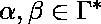 :

*   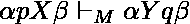 iff 
*    iff 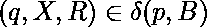
*   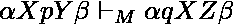 iff 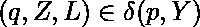
*    iff 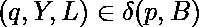
*   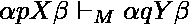 iff 
*    iff 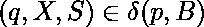

设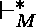为的传递自反闭包，即 id 之间零个或多个跃迁的应用。那么识别的语言定义为:。
如果对于所有状态和磁带符号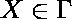，最多有一个元素，那么 TM 被认为是确定性的。如果存在不止一个选择的过渡，TM 是不确定的。
确定性 TMs 的 id 序列是线性的。对于不确定的 TMs，它形成一个**计算树**。不确定性可以被认为是机器创建了并行运行的自身副本。这个有用的类比将被我们的模拟器使用。
乍一看，我们可以认为非确定性的 TMs 比确定性的 TMs 更强大，因为“猜测”正确路径的能力。但事实并非如此:DTM 只是 NDTM 的一个特例，任何 NDTM 都可以转变为 DTM。所以，它们具有相同的计算能力。
事实上，已经提出了 TMs 的几种变体:具有双向无限磁带、具有多个磁道、没有停留选项等。有趣的是，所有这些变体都表现出与基本模型相同的计算能力。他们认识同一种类的语言。
在下一节中，我们介绍一个非常有用的变体:多猿非确定性 TMs。

## 形式定义:多模板

多磁带 TMs 有多个独立磁头的输入输出磁带。这种变体不会增加原始的计算能力，但正如我们将看到的，它可以使用辅助磁带简化 TMs 的构建。
一个 k-tape TM 是一个 7 元组，其中除了转换函数是一个映射之外，所有的元素都和基本 TM 一样。它将成对的状态读取符号映射到成对的新状态子集-写入符号+方向。
例如，下面的 2-tape TM 计算第一个磁带中以一元记数法存储的数字之和。第一盘磁带包含一些因素:由 0 分隔的 1 序列，代表自然数。机器将所有 1 写入磁带 2，计算所有因素的总和。
形式上，让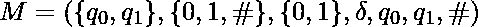其中定义如下:

*   跳过所有 0: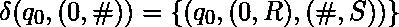
*   将 1 拷贝到磁带 2: 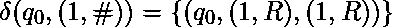
*   达到空白时停止: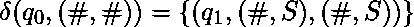

## 停顿问题

对于某些输入，TM 可能不会停止。比如考虑带的 TM 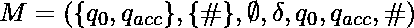。
停顿问题指出，检查任意 TM 是否会在给定的输入字符串上停顿是不可判定的。这个问题有着深刻的含义，因为它表明存在着 TMs 无法计算的问题，如果丘奇-图灵命题为真，则意味着没有任何算法能够解决这些问题。
对于 TM 模拟器来说，这是一个非常坏的消息，因为这意味着模拟器可能会进入无限循环。
我们不能完全避免这个问题，但我们可以解决它的一种限制形式。考虑一个不确定性 TM 的情况，如果有计算树的分支进入无限循环，并在其他分支到达最终状态的地方永远增长。在这种情况下，模拟器应该停止接受输入字符串。但是如果我们以深度优先搜索(DFS)的方式遍历树，当模拟器进入无限分支之一时，它会卡住。为了避免这种情况，模拟器将通过广度优先搜索(BFS)遍历计算树。BFS 是一种图遍历策略，它在进行后继之前探索分支的所有子代。

## 一个 Python 中的多模式 NDTMs 模拟器

在本节中，我们将展示一个用 Python 编写的多盘磁带的不确定性 TMs 模拟器。
模拟器由两个类组成:磁带类和 NDTM 类。
磁带实例包含当前扫描单元列表和磁带磁头索引，并提供以下操作:

*   readSymbol():返回头扫描的符号，如果头在最后扫描的单元格中，则返回空白
*   writeSymbol():将头扫描的符号替换为另一个符号。如果标题位于最后扫描的单元格中，则将符号追加到符号列表的末尾。
*   moveHead():将头部向左(-1)、向右(1)或无位置(0)移动一个位置。
*   clone():创建磁带的副本或拷贝。这对于模拟不确定性非常有用

NDTM 实例具有以下属性:

*   开始和结束状态。
*   当前状态。
*   磁带列表(磁带对象)。
*   过渡词典。

转换函数用一个字典来实现，该字典的关键字是元组(状态，read_symbols)，其值是元组列表(new_state，moves)。例如，将前面给出的一元记数法中的数字相加的 TM 将表示为:

```
{('q0', ('1', '#')): [('q0', (('1', 'R'), ('1', 'R')))],
 ('q0', ('0', '#')): [('q0', (('0', 'R'), ('#', 'S')))],
 ('q0', ('#', '#')): [('q1', (('#', 'S'), ('#', 'S')))]}
```

请注意，Python 表示非常类似于转换函数的数学定义，这要归功于 Python 多用途的数据结构，如字典、元组和列表。dict 的一个子类，来自标准集合模块的 defaultdict，用于减轻初始化的负担。
NDTM 对象包含读取磁带中当前符号元组的方法、添加、获取和执行转换的方法以及制作当前 TM 副本的方法。
NDTM 的主要方法是接招()。它的参数是一个输入字符串，如果计算树的任何分支达到接受状态，它将返回一个 NDTM 对象，如果两个分支都没有达到接受状态，它将返回无。它通过广度优先搜索(BFS)遍历计算树，以允许在任何分支达到接受状态时停止计算。BFS 使用队列来跟踪待处理的分支。来自集合模块的 Python 命令用于在队列操作中获得 0(1)性能。算法如下:

```
Add the TM instance to the queue
While queue is not empty:
   Fetch the first TM from the queue
   If there is no transition for the current state and read symbols:
      If the TM is in a final state: return TM
   Else:
      If the transition is nondeterministic:
         Create replicas of the TM and add them to the queue
      Execute the transition in the current TM and add it to the queue
```

最后，NDTM 类有方法将 TM 表示打印为瞬时描述的集合，并从文件中解析 TM 规范。像往常一样，这个输入/输出设备是模拟器最麻烦的部分。
规范文件具有以下语法

```
% HEADER: mandatory
start_state final_state blank number_of_tapes
% TRANSITIONS
state read_symbols new_state write_symbol, move write_symbol, move ...
```

以“%”开头的行被视为注释。例如，以一元符号添加数字的 TM 具有以下规范文件:

```
% HEADER
q0 q1 # 2
% TRANSITIONS
q0 1, # q0 1, R 1, R
q0 0, # q0 0, R #, S
q0 #, # q1 #, S #, S
```

状态和符号可以是任何不包含空格或逗号的字符串。
模拟器可以从 Python 会话中运行，以探索输出配置。例如，如果前面的文件以名称“2sum.tm”保存:

## 蟒蛇 3

```
from NDTM import NDTM
tm = NDTM.parse('2sum.tm')
print(tm.accepts('11011101'))
```

输出显示模拟器产生了磁带#1 中 1 的总和:

```
Output :
q1: ['1', '1', '0', '1', '1', '1', '0', '1']['#']
q1: ['1', '1', '1', '1', '1', '1']['#']
```

输出显示了两个磁带的内容、磁头的位置(每个磁带的第二个列表)和 TM 的最终状态。

## 模拟器的源代码

除去输入/输出代码和注释，模拟器不到 100 行代码。这是 Python 强大和经济的见证。它是面向对象的，但也使用像列表理解这样的函数构造。

## 蟒蛇 3

```
####
# NDTM.py: a nondeterministic Turing Machine Simulator
# Author: David Gil del Rosal (dgilros@yahoo.com)
#### from collections import defaultdict, deque

class Tape:
    # Constructor. Sets the blank symbol, the
    # string to load and the position of the tape head
    def __init__(self, blank, string ='', head = 0):
        self.blank = blank
        self.loadString(string, head)

    # Loads a new string and sets the tape head   
    def loadString(self, string, head):
        self.symbols = list(string)
        self.head = head

    # Returns the symbol on the current cell, or the blank
    # if the head is on the start of the infinite blanks
    def readSymbol(self):
        if self.head < len(self.symbols):
            return self.symbols[self.head]
        else:
            return self.blank

    # Writes a symbol in the current cell, extending
    # the list if necessary
    def writeSymbol(self, symbol):
        if self.head < len(self.symbols):
            self.symbols[self.head] = symbol
        else:
            self.symbols.append(symbol)

    # Moves the head left (-1), stay (0) or right (1)
    def moveHead(self, direction):
        if direction == 'L': inc = -1
        elif direction == 'R': inc = 1
        else: inc = 0
        self.head+= inc

    # Creates a new tape with the same attributes than this
    def clone(self):
        return Tape(self.blank, self.symbols, self.head)

    # String representation of the tape
    def __str__(self):
        return str(self.symbols[:self.head]) + \
               str(self.symbols[self.head:])

class NDTM:
    # Constructor. Sets the start and final states and
    # inits the TM tapes
    def __init__(self, start, final, blank ='#', ntapes = 1):
        self.start = self.state = start
        self.final = final
        self.tapes = [Tape(blank) for _ in range(ntapes)]
        self.trans = defaultdict(list)

    # Puts the TM in the start state and loads an input
    # string into the first tape
    def restart(self, string):
        self.state = self.start
        self.tapes[0].loadString(string, 0)
        for tape in self.tapes[1:]:
            tape.loadString('', 0)

    # Returns a tuple with the current symbols read
    def readSymbols(self):
        return tuple(tape.readSymbol() for tape in self.tapes)

    # Add an entry to the transaction table
    def addTrans(self, state, read_sym, new_state, moves):
        self.trans[(state, read_sym)].append((new_state, moves))

    # Returns the transaction that corresponds to the
    # current state & read symbols, or None if there is not
    def getTrans(self):
        key = (self.state, self.readSymbols())
        return self.trans[key] if key in self.trans else None

    # Executes a transaction updating the state and the
    # tapes. Returns the TM object to allow chaining   
    def execTrans(self, trans):
        self.state, moves = trans
        for tape, move in zip(self.tapes, moves):
            symbol, direction = move
            tape.writeSymbol(symbol)
            tape.moveHead(direction)
        return self

    # Returns a copy of the current TM
    def clone(self):
        tm = NDTM(self.start, self.final)
        tm.state = self.state
        tm.tapes = [tape.clone() for tape in self.tapes]
        tm.trans = self.trans        # shallow copy
        return tm

    # Simulates the TM computation. Returns the TM that
    # accepted the input string if any, or None.
    def accepts(self, string):
        self.restart(string)
        queue = deque([self])
        while len(queue) > 0:
            tm = queue.popleft()
            transitions = tm.getTrans()
            if transitions is None:
                # there are not transactions. Exit
                # if the TM is in the final state
                if tm.state == tm.final: return tm
            else:
                # If the transaction is not deterministic
                # add replicas of the TM to the queue
                for trans in transitions[1:]:
                    queue.append(tm.clone().execTrans(trans))
                # execute the current transition
                queue.append(tm.execTrans(transitions[0]))
        return None

    def __str__(self):
        out = ''
        for tape in self.tapes:
            out+= self.state + ': ' + str(tape)  + '\n'
        return out

    # Simple parser that builds a TM from a text file
    @staticmethod
    def parse(filename):
        tm = None
        with open(filename) as file:
            for line in file:
                spec = line.strip()
                if len(spec) == 0 or spec[0] == '%': continue
                if tm is None:
                    start, final, blank, ntapes = spec.split()
                    ntapes = int(ntapes)
                    tm = NDTM(start, final, blank, ntapes)
                else:
                    fields = line.split()
                    state = fields[0]
                    symbols = tuple(fields[1].split(', '))
                    new_st = fields[2]
                    moves = tuple(tuple(m.split(', '))
                                  for m in fields[3:])
                    tm.addTrans(state, symbols, new_st, moves)
        return tm

if __name__ == '__main__':
    # Example TM that performs unary complement
    tm = NDTM('q0', 'q1', '#')
    tm.addTrans('q0', ('0', ), 'q0', (('1', 'R'), ))
    tm.addTrans('q0', ('1', ), 'q0', (('0', 'R'), ))
    tm.addTrans('q0', ('#', ), 'q1', (('#', 'S'), ))
    acc_tm = tm.accepts('11011101')
    if acc_tm: print(acc_tm)
    else: print('NOT ACCEPTED')   
```

## 一个非同寻常的例子

作为最后一个例子，我们给出了识别非上下文无关语言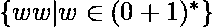的 3 带 TM 的规范。
TM 不确定地复制磁带#2 中字符串前半部分和磁带#3 中后半部分的内容。然后，它继续检查两个部分是否匹配。

```
% 3-tape NDTM that recognizes L={ ww | w in {0, 1}* }
q0 q4 # 3
% TRANSITIONS
% put left endmarkers on tapes #2 and #3
q0 0, #, # q1 0, S $, R $, R
q0 1, #, # q1 1, S $, R $, R
% first half of string: copy symbols on tape #2
q1 0, #, # q1 0, R 0, R #, S
q1 1, #, # q1 1, R 1, R #, S
% guess second half of string: copy symbols on tape #3
q1 0, #, # q2 0, R #, S 0, R
q1 1, #, # q2 1, R #, S 1, R
q2 0, #, # q2 0, R #, S 0, R
q2 1, #, # q2 1, R #, S 1, R
% reached end of input string: switch to compare state
q2 #, #, # q3 #, S #, L #, L
% compare strings on tapes #2 and #3
q3 #, 0, 0 q3 #, S 0, L 0, L
q3 #, 1, 1 q3 #, S 1, L 1, L
% if both strings are equal switch to final state
q3 #, $, $ q4 #, S $, S $, S
```

用法示例。将上述文件保存为“3ww.tm”并运行以下代码:

## 蟒蛇 3

```
from NDTM import NDTM
tm = NDTM.parse('3ww.tm')
print(tm.accepts('11001100'))
```

产生的输出与预期一致:TM 达到最终状态，输入字符串的两半的内容在磁带#2 和#3 中。

```
Output :
q4: ['1', '1', '0', '0', '1', '1', '0', '0']['#']
q4: []['{content}apos;, '1', '1', '0', '0', '#']
q4: []['{content}apos;, '1', '1', '0', '0', '#'] 
```

一个有趣的练习是试图将这个 TM 转换成一个单磁带的不确定性 TM，甚至是一个单磁带的确定性 TM。这是完全可能的，但是规格会更麻烦。这就是拥有多盘磁带的好处:没有更多的计算能力，但更简单。