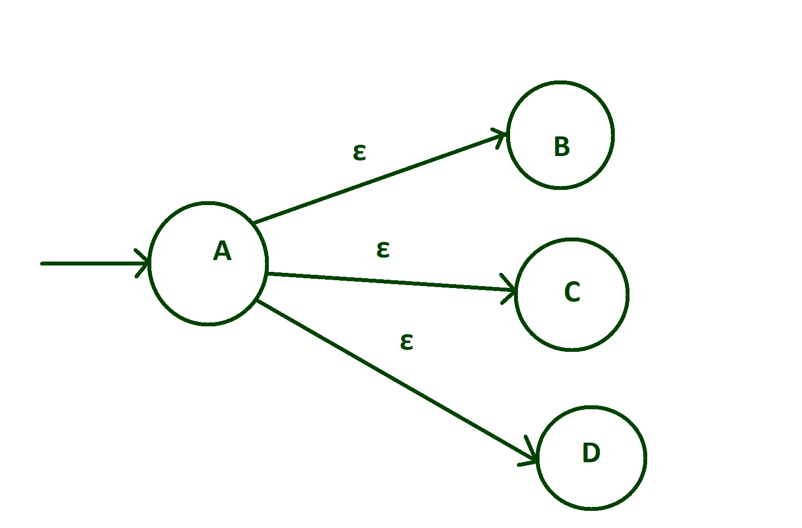
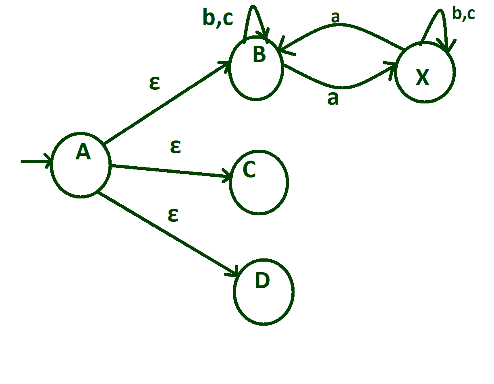
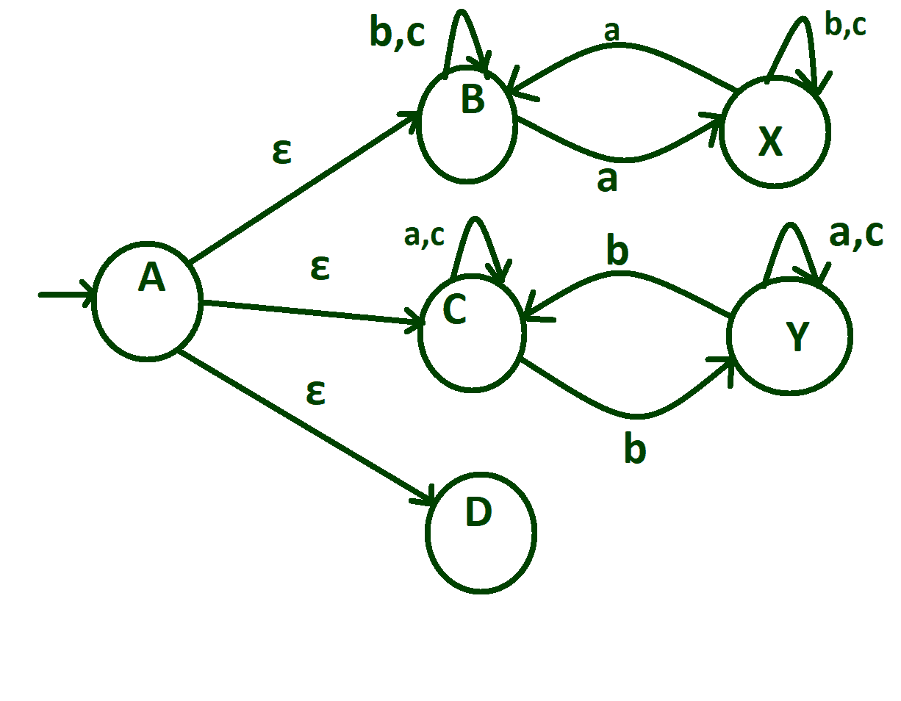
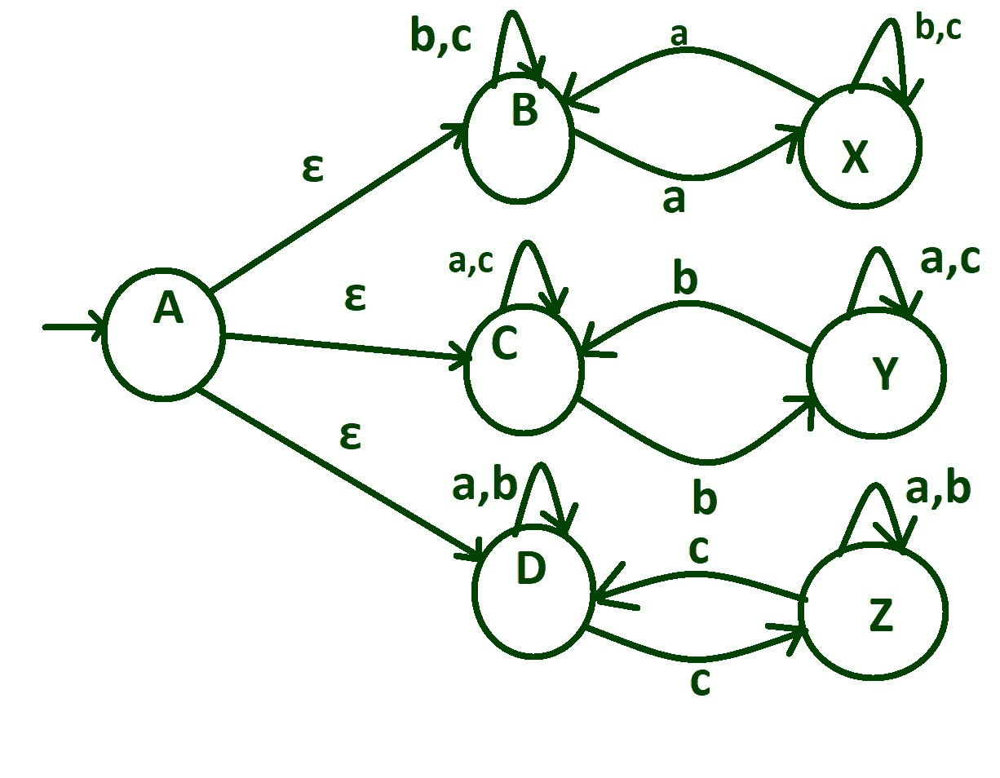
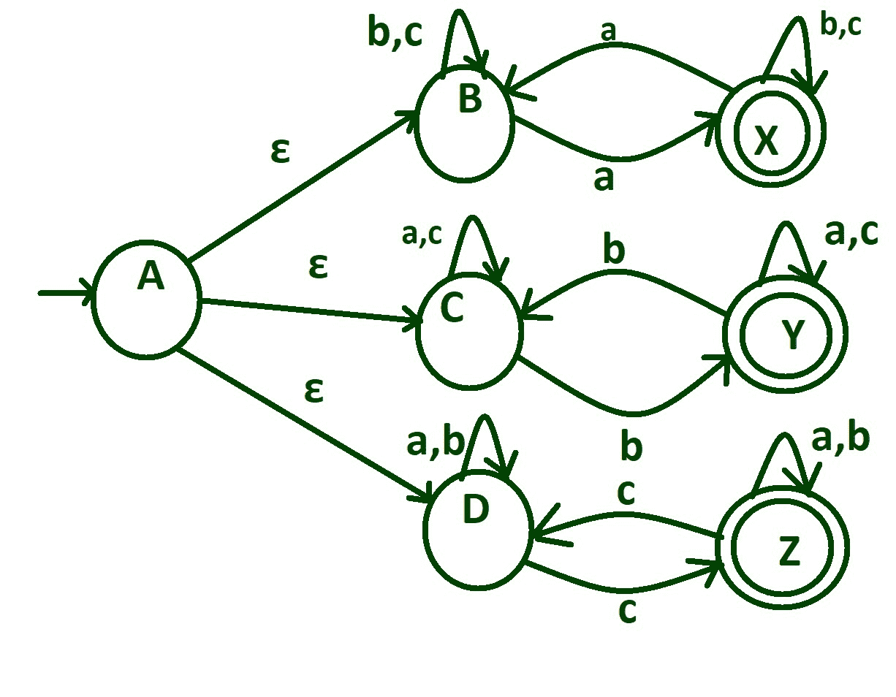

# NFA 对于语言符号中的至少一个出现奇数次

> 原文:[https://www . geeksforgeeks . org/NFA-for-language-至少一个出现奇数次的符号/](https://www.geeksforgeeks.org/nfa-for-language-at-least-one-of-the-symbols-occurring-an-odd-number-of-times/)

**问题陈述:**
设计并构造非确定性有限自动机，该机器接受输入字母(a，b，c)上的字符串，其中至少一个(输入符号)在字符串中有奇数个存在。

**示例:**

```
aaabbbb, ababac, ababababccc ... 
```

**进场:**

*   用–>标记构建初始状态。
*   相应地在每个输入字母上进行从一种状态到另一种状态的转换。
*   检查是否有构建自循环的要求。
*   用两个同心圆标记最终状态。

**按部就班设计 NFA:**

**步骤-1:**
创建一个初始状态“A”，它过渡到三个不同的状态，分别为“B”、“C”、“D”表示空。



**第 2 步:**
在状态“B”上如果输入字母是‘a’，那么进行‘a’从状态“B”到“X”的转换，如果状态“B”上的输入字母是‘B’或‘c’，那么在状态“B”本身上进行‘B’和‘c’的自循环。


**步骤 3:**
在状态“X”上，输入字母“B”和“c”本身转换到状态“X”，但是“a”的转换从状态“X”转换到状态“B”。



**步骤-4:**
On 状态“C”如果输入字母是‘B’，那么进行‘B’从状态“B”到“Y”的转换，如果状态“C”上的输入字母是‘B’或‘C’，那么在状态“C”本身上进行‘B’和‘C’的自循环，在状态“Y”上，输入字母‘a’和‘C’转换到状态“Y”本身，但是‘B’的转换是从状态“Y”到状态“B”。



**第 5 步:**
On 状态“D”如果输入字母是‘c’，则进行‘c’从状态“D”到“Z”的转换，如果状态“D”上的输入字母是‘b’或‘a’，则在状态“D”本身上进行‘b’和‘a’的自循环。在状态“Z”上，输入字母“a”和“b”本身转换到状态“Z”，但是“c”的转换从状态“Z”转换到状态“D”。



**Step-6:**
状态“X”保证‘a’的奇数，状态“Y”保证‘b’的奇数，状态“Z”保证‘c’的奇数。所以把这些州标记为最终州。

