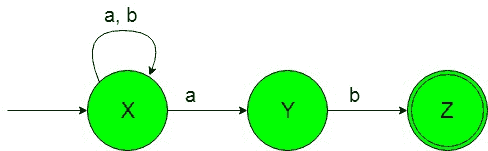
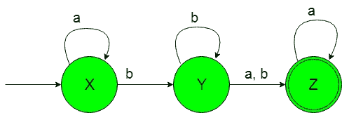

# NFA 机器接受所有以子串‘ab’

结束或非结束的字符串

> 原文:[https://www . geesforgeks . org/NFA-machines-accept-all-string-end-or-not-end-with-substring-ab/](https://www.geeksforgeeks.org/nfa-machines-accepting-all-strings-that-ends-or-not-ends-with-substring-ab/)

**先决条件:** [有限自动机简介](https://www.geeksforgeeks.org/toc-finite-automata-introduction/)

**问题-1:**
构造一个最小 NFA，接受{a，b}上的一组字符串，其中语言的每个字符串都以“ab”结尾。

**解释:**
想要的语言会是这样的:

```
L1 = {ab, abbab, abaab, ...........}
```

这里我们可以看到，上面语言的每个字符串都以“ab”结尾，但是下面的语言不被这个 NFA 接受，因为下面语言的一些字符串不以“ab”结尾。

```
L2 = {bba, abb, aaabbbb, .............}
```

所需语言的状态转换图如下所示:



在上面的 NFA 中，初始状态“X”在获得“a”作为输入时，要么保持在自身状态，要么过渡到“Y”状态，在获得“b”作为输入时，它保持在自身状态。获得“b”作为输入时的状态“Y”传输到最终状态“Z”。

**问题-2:**
构造一个极小的 NFA，接受{a，b}上的一组字符串，其中语言的每个字符串都不以“ab”结尾。

**解释:**想要的语言会是这样的:

```
L1 = {bba, abb, aaabbbb, .............}
```

在这里，我们可以看到上面语言的每个字符串都不是以“ab”结尾，但是下面的语言不被这个 NFA 接受，因为下面语言的一些字符串是以“ab”结尾的。

```
L2 = {ab, abab, ababaab..............}
```

所需语言的状态转换图如下所示:



在上面的 NFA 中，初始状态“X”在获得“a”作为输入时，它保持在自身状态，在获得“b”作为输入时，它传输到状态“Y”。获得“b”作为输入时的状态“Y”要么保持其自身的状态，要么传输到最终状态“Z”。最后的状态“Z”在得到“a”作为输入时它保持在自身的状态。