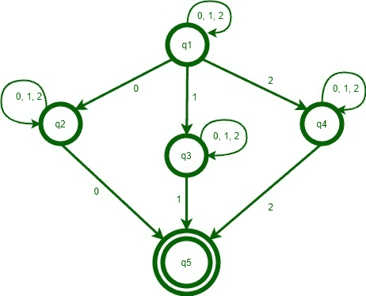

# NFA，它接受字母表{0，1，2}上的一组字符串，使得最后一个数字出现在

之前

> 原文:[https://www . geesforgeks . org/NFA-接受字母上的一组字符串-0-1-2-这样-最后一个数字-在/](https://www.geeksforgeeks.org/nfa-which-accepts-set-of-strings-over-an-alphabet-0-1-2-such-that-the-final-digit-has-appeared-before/) 之前出现过

先决条件–[有限自动机介绍](https://www.geeksforgeeks.org/introduction-of-finite-automata/)
C++程序，用于构造一个 NFA，该程序接受字母表{0，1，2}上的一组字符串，以便最后一个数字之前已经出现过。

**示例:**

```
Input : 01101 
Output : Accepted

Input : 012
Output : Not Accepted

Input : 2
Output : Not Accepted

Input : 0122
Output : Accepted 
```

**解释:**
在第一个例子 01101 中，最后一个数字‘1’出现在字符串的字母数字 2 和 3 处。因此，它被接受。在第二个例子 012 中，“2”只出现在最后一个地方。因此，它被拒绝。同样，对于第三个示例，2 被拒绝。在最后一个示例中，最后一个数字“2”出现在字符串末尾之前，因此它被接受。

**进场:**

1.  构造一个开始状态。
2.  为 0、1 和 2 的输入构造 3 个状态。
3.  对所有输入重复所有状态的循环。
4.  用最终状态连接所有状态。

**NFA 状态交易图:**



**实施:**

## C++

```
#include <bits/stdc++.h>
using namespace std;

// function of state one or starting state
void q1(string s, int pos, int len);

// function of state two
void q2(string s, int pos, int len);

// function of state three
void q3(string s, int pos, int len);

// function of state four
void q4(string s, int pos, int len);

// function of state five
void q5(string s, int pos, int len);

// See diagram for help

vector<string> states;
int accepted = 0;

// Uncomment this function and the function calls to see
// the path of string from the start state to end state
/*
void printVector()
{
    for (auto i = states.begin(); i != states.end(); i++)
        cout << *i << " ";
    cout << endl;
}
*/
void q5(string s, int pos, int len)
{
    states.push_back("Q5->");
    if (pos == len) {
        // printVector();
        accepted = 1;
    }
    else {
        states.push_back("Dead");
        // printVector();
        states.pop_back();
    }
    states.pop_back();
    return;
}

void q4(string s, int pos, int len)
{
    states.push_back("Q4->");
    if (pos == len) {
        // printVector();
        states.pop_back();
        return;
    }
    if (s[pos] == '2')
        q5(s, pos + 1, len);
    q4(s, pos + 1, len);
    states.pop_back();
    return;
}

void q3(string s, int pos, int len)
{
    states.push_back("Q3->");
    if (pos == len) {
        // printVector();
        states.pop_back();
        return;
    }
    if (s[pos] == '1')
        q5(s, pos + 1, len);
    q3(s, pos + 1, len);
    states.pop_back();
    return;
}

void q2(string s, int pos, int len)
{
    states.push_back("Q2->");
    if (pos == len) {
        // printVector();
        states.pop_back();
        return;
    }
    if (s[pos] == '0')
        q5(s, pos + 1, len);
    q2(s, pos + 1, len);
    states.pop_back();
    return;
}

void q1(string s, int pos, int len)
{
    states.push_back("Q1->");
    if (pos == len) {
        // printVector();
        states.pop_back();
        return;
    }
    if (s[pos] == '0')
        q2(s, pos + 1, len);
    else if (s[pos] == '1')
        q3(s, pos + 1, len);
    else if (s[pos] == '2')
        q4(s, pos + 1, len);

    q1(s, pos + 1, len);
    states.pop_back();
    return;
}

int main()
{
    string s;
    // cin >> s;
    s = "01101";

    int pos = 0;
    q1(s, pos, s.length());

    if (accepted)
        cout << "Accepted" << endl;
    else
        cout << "Not Accepted" << endl;
    return 0;
}
```