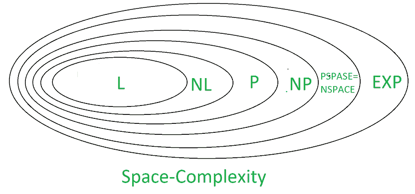
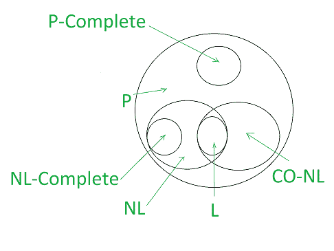

# NL-完整性和 PSPACE-完整性

> 原文:[https://www . geesforgeks . org/nl-completion-and-PS pace-completion/](https://www.geeksforgeeks.org/nl-completeness-and-pspace-completeness/)

为了解决复杂的问题，我们需要有效的算法。我们面临着如此多的问题，其中一些问题可以通过使用一种算法来解决，并且每种算法都需要一些空间和时间。为了提高程序的性能，我们需要降低算法的空间和时间复杂度。

在本文中，我们将简要讨论 NL-完备性、PSPACE-完备性以及一些基本定义。

需要更多记忆的例子:网络图、基因组等。

我们需要使用少量内存的算法，这样就可以处理大量数据，而不必一次将所有数据存储到计算机硬盘上。算法采用亚线性空间，因为输入 n 位采用线性空间。

这里使用的是双带图灵机--

1.  包含输入的只读磁带
2.  可以自由使用的工作带

工作磁带占用的空间增加了空间的复杂性。

我们有，

```
 L = SPACE ( log n ) , and  
 NL = NSPACE ( log n ) 
```

**SPACE COMPLEXITY :**
它被定义为作为输入的函数来解决任何给定计算问题所需的计算机内存空间量，或者我们可以说它是一个算法在执行完成之前所需的内存量。如果一个算法将终止，并且如果它的解存在，那么它被称为完整的。



**NL-完备性:**
NL 包含决策问题，由非确定性图灵机求解。在理解 NL-完备性之前，我们先了解日志空间-可约性。

**对数空间-可约性:**
A 是可约为 B 的对数空间，如果对于所有函数 f:

```
 {0, 1}* → {0, 1}* such that x ∈ A if f (x) ∈ B for every x ∈ {0, 1}* 
```

为了定义 NL 的完备性，我们需要适当的约简。L = NL 是否是复杂性理论问题。因此，归约就是对数空间归约，即给定一个输入字符串 x，我们有一个函数 f(x)，这样 f(x)可以由 DTM 通过在工作带中最多使用 O(log |x|)个单元来计算。

**语言“A”如果满足以下两个条件，则为 NL-complete-**

1.  “A”在 NL 中。(阿∈ NL)
2.  属于 NL 语言可以被日志空间还原为“A”

(对于 NL 中的所有 B，存在 B ≤L A)。

**应用:**

*   ST-连通性
*   命题逻辑
*   2-满足性

**PSPACE-完备性:**
所有可以在多项式输入长度内求解的决策问题，如果每隔一个在多项式空间内求解的问题都可以转化为多项式时间。确定性上下文相关语法的“单词问题”是第一个 PSPACE 完整问题。

如果语言“A”满足以下两个条件，它就是 PSPACE-complete

1.  “A”在 PSPACE 中。(阿∈ PSPACE)
2.  属于 PSPACE 的语言可以在多项式时间内约化为“A”

(对于 PSPACE 中的所有 B，存在 B ≤L A)。

注意，如果“A”只遵循第二个条件，那么我们说它是 PSPACE-hard。

**应用:**

*   Hex(棋盘游戏)。
*   平等的一阶逻辑
*   有序集的一阶理论
*   λ演算等。



**为什么对数空间缩减用于 NL-完备性，而 PSPACE 缩减不用于 PSPACE-完备性？**
由于 L ⊆ NL ⊆ P .因此使用多项式时间约简来实现 nl-完备性是没有意义的，因为 poly 时间约简比 l 类更强大。因此我们使用对数空间约简来实现 nl-完备性。

使用较弱的约简，完整性结果更令人印象深刻，因为约简能够做较少的工作，因此约简实际上做了所有的工作，因此我们使用多项式时间约简，而不是多项式空间约简。