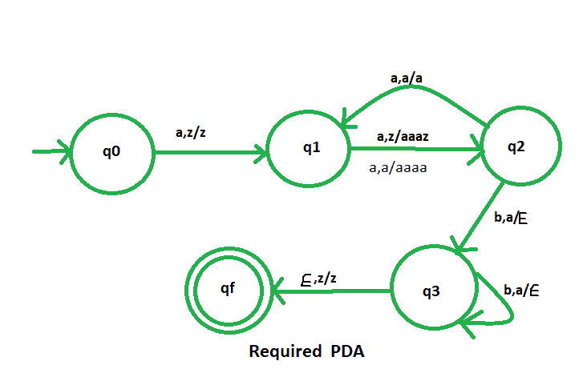

# NPDA 接受语言 L = {a2mb3m | m ≥ 1}

> 原文:[https://www . geesforgeks . org/npda-for-accepting-language-l-a2 mb3m-m-% E2 % 89% a5-1/](https://www.geeksforgeeks.org/npda-for-accepting-the-language-l-a2mb3m-m-%e2%89%a5-1/)

先决条件–[下推自动机](https://www.geeksforgeeks.org/theory-of-computation-pushdown-automata/)、[按最终状态接受下推自动机](https://www.geeksforgeeks.org/pushdown-automata-acceptance-final-state/)
**问题–**设计一个接受语言 L = { a<sup>2m</sup>b<sup>3m</sup>| m≥1 }的非确定性 PDA，即，

```
L = {aabbb, aaaabbbbbb, aaaaaabbbbbbbbb, aaaaaaaabbbbbbbbbbbb, ......} 
```

在每一个字符串中，每 2 个“a”就有 3 个“b”。

**解释–**
在这里，我们需要维持 a 和 b 的顺序，也就是所有的 a 先来，然后所有的 b 来。因此，我们需要一个堆栈和状态图。a 和 b 的计数由堆栈维护。这里，每 2 个 a 对应 3 个 b。我们将取两叠字母:

```
 = {a, z}
Where,  = set of all the stack alphabet
z = stack start symbol 
```

**PDA 建设中采用的手法–**
由于我们要设计一个 NPDA，因此每次‘a’都排在‘b’之前。我们将连续两个“a”将三个“a”推入堆栈，接下来的两个“a”将再次将三个“a”推入堆栈。也就是说，对于第一个“a”，我们什么都不做，只有状态会改变，对于下一个“a”，我们将执行推送操作，类似地，我们交替执行此操作，即
对于两个 a，我们推送三个“a”
对于四个 b，我们推送六个“a”
之后，当“b”出现时，每次从堆栈中弹出一个“a”。

最后，如果堆栈变空，那么我们可以说字符串被 PDA 接受了。

**堆栈转换功能–**

```
(q0, a, z) (q1, z)     [ Indicates no operation only state change ]
(q1, a, z) (q2, aaaz)  [ Indicates push operation for alternate 'a'] 
(q2, a, aaaz) (q1, aaaz) [ Indicates no operation only state change ]
(q1, a, aaaz) (q2, aaaa) [ Indicates push operation for alternate 'a']
(q2, b, a) (q3,  )  [Indicates pop operation ]
(q3, b, a) (q3,  )  [Indicates pop operation ]
(q3, , z) (qf, z )    

```

其中，q0 =初始状态
qf =最终状态
 =表示弹出操作

**正确的过渡图-**
