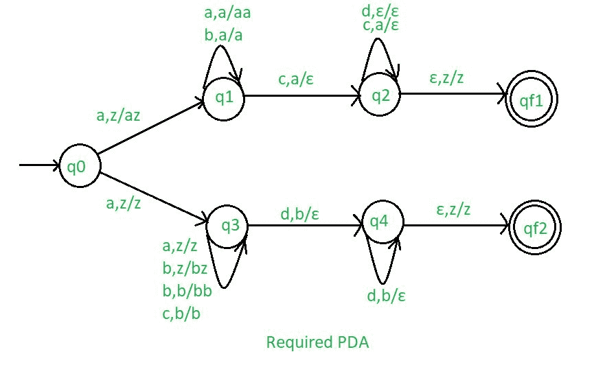

# NPDA 因接受语言 L = { aibjckdl | i = = k 或 j==l，i > =1，j > =1}

> 原文:[https://www . geesforgeks . org/npda-for-accept-language-l-aibjkdl-ik-or-jl1 J1/](https://www.geeksforgeeks.org/npda-for-accepting-the-language-l-aibjckdl-ik-or-jli1j1/)

先决条件–[下推自动机](https://www.geeksforgeeks.org/theory-of-computation-pushdown-automata/)、[下推自动机按最终状态接受](https://www.geeksforgeeks.org/pushdown-automata-acceptance-final-state/)
**问题–**设计一个非确定性的 PDA 接受语言 L = {     : i==k 或 j==l，i > =1，j > =1}，即，

```
L = {abcd, aabccd, aaabcccd, abbcdd, aabbccdd, aabbbccddd, ......} 
```

在每个字符串中，a 后面跟任意数量的 b，b 后面跟等于 a 的 c，c 后面跟等于 b 的 d。

**解释–**
在这里，我们需要维持 a、b、c、d 的顺序，也就是所有的 a 先来，然后所有的 b 来，然后所有的 c 来，然后所有的 d 来。因此，我们需要一个堆栈和状态图。a 和 b 的计数由堆栈维护。我们将取两叠字母:

```
 = { a, b, c, d, z } 
```

其中，
 =所有堆叠字母表的集合
z =堆叠开始符号

**建造 PDA 所用的方法–**
在设计 NPDA 时，对于每一个 a、【b】、【c】和【d】的意愿都是按照适当的顺序出现的。

*   因为 i==k:每当‘a’出现时，把它推入堆栈，如果‘a’再次出现，也把它推入堆栈。之后，如果 b 来了，不要做任何操作。之后，当“c”出现时，每次从堆栈中弹出“a”。之后，如果‘d’来了就不要做任何手术。
*   对于 j==l:每当‘a’出现时，不要做任何操作。然后，如果“b”来了，就把它推进堆栈，如果“b”又来了，就把它推进堆栈。之后，当‘c’来的时候不要做任何操作。之后，如果“d”出现，则每次从堆栈中弹出“b”。

这样堆栈就变成空的了。如果 stack 是空的，那么我们可以说这个字符串被 PDA 接受了。

**堆栈转换功能–**

```
(q0, a, z)  (q1, az)
(q0, a, z)  (q3, z)
(q1, a, a)  (q1, aa)
(q1, b, a)  (q1, a)
(q1, c, a)  (q2, ) 
(q2, c, a)  (q2, ) 
(q2, d,  )  (q2, ) 
(q2, , z)  (qf1, z)   
(q3 a, z)  (q3, z)
(q3 b, z)  (q3, bz)
(q3 b, b)  (q3, bb)
(q3 c, b)  (q3, b)
(q3, d, b)  (q4, ) 
(q4, d, b)  (q4, ) 
(q4, , z)  (qf2, z)   

```

其中，q0 =初始状态
qf1，qf2 =最终状态
 =表示弹出操作



所以，这就是我们所要求的非确定性 PDA 对于接受语言 L ={     : i==k 或 j==l，i > =1，j > =1}。