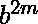
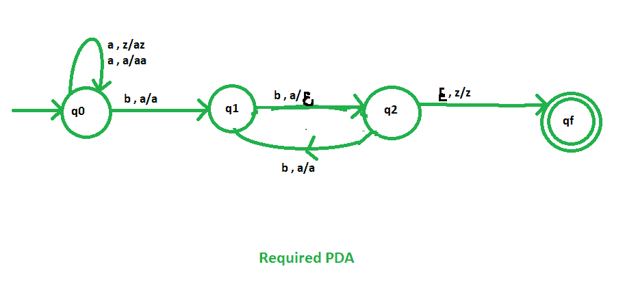

# NPDA 接受语言 L = {am b(2m) | m > =1}

> 原文:[https://www . geesforgeks . org/npda-for-accepting-language-l-am-b2m-m1/](https://www.geeksforgeeks.org/npda-for-accepting-the-language-l-am-b2m-m1/)

先决条件–[下推自动机](https://www.geeksforgeeks.org/theory-of-computation-pushdown-automata/)、[按最终状态接受下推自动机](https://www.geeksforgeeks.org/pushdown-automata-acceptance-final-state/)
**问题–**设计一个非确定性的 PDA 接受语言 L = {   : m > =1}，即，

```
L = {abb, aabbbb, aaabbbbbb, aaaabbbbbbbb, ......} 
```

在每一个字符串中，a 的数字后面是 b 的双倍数字。

**解释–**
在这里，我们需要维持 a 和 b 的顺序，也就是所有的 a 都先来，然后所有的 b 都来。因此，我们需要一个堆栈和状态图。a 和 b 的计数由堆栈维护。这里，b 的数量正好是 a 的两倍。我们将取两叠字母:

```
 = { a, z } 
```

其中，
 =所有堆叠字母表的集合
z =堆叠开始符号

**PDA 建设中采用的手法–**
由于我们要设计一个 NPDA，因此每次‘a’都排在‘b’之前。当“a”出现时，将它推入堆栈，如果“a”再次出现，也将它推入堆栈。之后，当“b”出现时，从堆栈中弹出一个“a”。但是我们对 b 的交替位置进行这种弹出操作，即对于两个 b，我们弹出一个“a”，对于四个 b，我们弹出两个“a”。
所以，最后如果堆栈变空，那么我们可以说字符串被 PDA 接受了。

**堆栈转换功能–**

```
(q0, a, z)  (q0, az)
(q0, a, a)  (q0, aa)

[ Indicates no operation only state change ]
(q0, b, a)  (q1, a) 

[ Indicates pop operation for alternate 'b'] 
(q1, b, a)  (q2, ) 

[ Indicates no operation only state change ] 
(q2, b, a)  (q1, a) 

[ Indicates pop operation for alternate 'b'] 
(q1, b, a)  (q2, )  
(q2, , z)  (qf, z)     

```

其中，q0 =初始状态
qf =最终状态
 =表示弹出操作



所以，这是我们接受语言 L = {   : m > =1}所需要的非确定性 PDA。