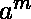
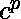
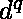
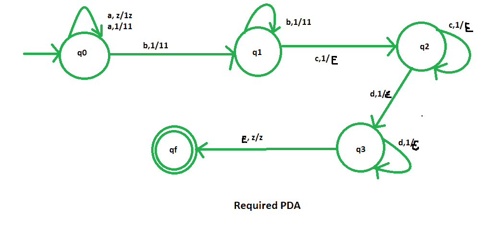

# NPDA 因接受语言 L = { am bn CP dq | m+n = p+q；m，n，p，q > =1}

> 原文:[https://www . geesforgeks . org/npda-for-accepting-language-l-am-bn-CP-dq-mnpq-mnpq 1/](https://www.geeksforgeeks.org/npda-for-accepting-the-language-l-am-bn-cp-dq-mnpq-mnpq1/)

先决条件–[下推自动机](https://www.geeksforgeeks.org/theory-of-computation-pushdown-automata/)、[下推自动机按最终状态接受](https://www.geeksforgeeks.org/pushdown-automata-acceptance-final-state/)
**问题–**设计一个非确定性的 PDA 接受语言 L = {     | m + n = p + q : m，n，p，q > =1}，即，

```
L = {abcd, abbcdd, abbccd, abbbccdd, ......}
```

在每个字符串中，“a”和“b”的总数等于“c”和“d”的总数。

**解释–**
在这里，我们需要维持‘a’、‘b’、‘c’和‘d’的顺序。因此，我们需要一个堆栈和状态图。“a”、“b”、“c”和“d”的计数由堆栈维护。我们将取两叠字母:

```
 = { 1, z } 
```

其中，
 =所有堆叠字母表的集合
z =堆叠开始符号

**建造 PDA 所用的方法–**
由于我们想要设计一个 NPDA，因此每次‘a’、‘b’、‘c’和‘d’都会以适当的顺序出现。当“a”和“b”出现时，我们将把“1”推入堆栈。之后，当“c”和“d”出现时，每次从堆栈中弹出“1”。最后，如果堆栈变空，那么我们可以说字符串被 PDA 接受了。

**堆栈转换功能–**

```
(q0, a, z)  (q0, 1z)
(q0, a, 1)  (q0, 11)
(q0, b, 1)  (q1, 11)
(q1, b, 1)  (q1, 11)
(q1, c, 1)  (q2, )
(q2, c, 1)  (q2, )
(q2, d, 1)  (q3, )
(q3, d, 1)  (q3, )
(q3, , z)  (qf, z)     

```

其中，q0 =初始状态
qf =最终状态
 =表示弹出操作



所以，这就是我们所要求的非确定性 PDA 对于接受语言 L = {| m+n = p+q；m，n，p，q > =1 }。