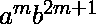
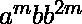
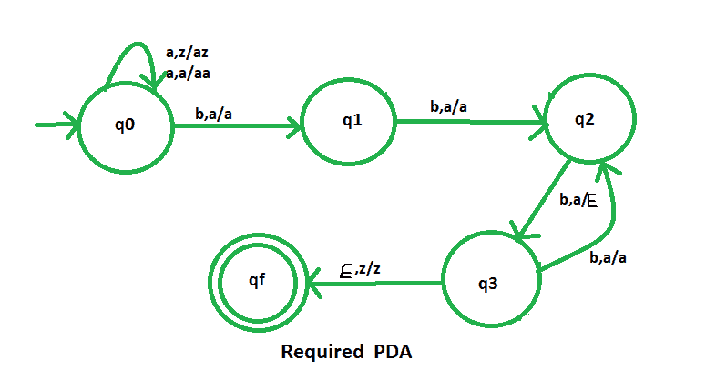

# NPDA 接受语言 L = {amb(2m+1) | m ≥ 1}

> 原文:[https://www . geesforgeks . org/npda-for-accepting-language-l-AMB 2m 1-m-% E2 % 89% a5-1/](https://www.geeksforgeeks.org/npda-for-accepting-the-language-l-amb2m1-m-%e2%89%a5-1/)

先决条件–[下推自动机](https://www.geeksforgeeks.org/theory-of-computation-pushdown-automata/)、[按最终状态接受下推自动机](https://www.geeksforgeeks.org/pushdown-automata-acceptance-final-state/)、
T5】问题–设计一个非确定性 PDA 接受语言 L = {  | m ≥ 1}，或者，L = {  | m ≥ 1}，即，

```
L = {abbb, aabbbbb, aaabbbbbbb, aaaabbbbbbbbb, ......}
```

在每个字符串中,“b”的数量是“a”的两倍多。

**解释–**
在这里，我们需要维持 a 和 b 的顺序，也就是所有的 a 都先来，然后所有的 b 都来。因此，我们需要一个堆栈和状态图。a 和 b 的计数由堆栈维护。我们将取两叠字母:

```
 = { a, z }
Where,  = set of all the stack alphabet
z = stack start symbol

```

**PDA 建设中采用的手法–**
由于我们要设计一个 NPDA，因此每次‘a’都排在‘b’之前。对于每个 a，我们将把一个 a 推入堆栈，对于下一个 a，我们将把一个 a 推入堆栈。然后当“b”来临时，对于第一个“b”，我们什么也不做，只有状态会改变。对于接下来的两个 b，我们将弹出一个 a，对于接下来的两个 b，我们将弹出一个 a。类似地，我们交替进行。
即，对于第三个“b”，我们首先弹出“a”
对于第五个“b”，我们弹出第二个“a”
对于第七个“b”，我们弹出第三个“a”

最后，如果堆栈变空，那么我们可以说字符串被 PDA 接受了。

**堆栈转换功能–**

```
(q0, a, z) (q0, az)        
(q0, a, a) (q0, aa)     
(q0, b, a) (q1, a)  [ Indicates no operation only state change ]
(q1, b, a) (q2, a)  [ Indicates no operation only state change ]
(q2, b, a) (q3,  )  [Indicates pop operation ]
(q3, b, a) (q2, a )  [ Indicates no operation only state change ]
(q3, , z) (qf, z )    

```

其中，q0 =初始状态
qf =最终状态
 =表示弹出操作

