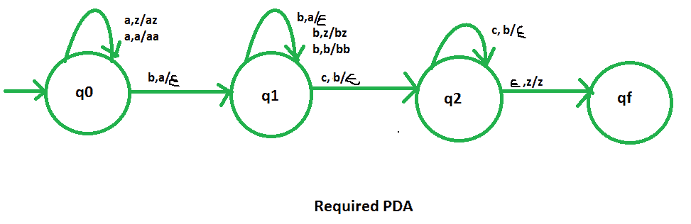

# NPDA 接受语言 L = {amb(m+n)cn | m，n ≥ 1}

> 原文:[https://www . geesforgeks . org/npda-for-accepting-language-l-ambmncn-Mn-% E2 % 89% a5-1/](https://www.geeksforgeeks.org/npda-for-accepting-the-language-l-ambmncn-mn-%e2%89%a5-1/)

先决条件–[下推自动机](https://www.geeksforgeeks.org/theory-of-computation-pushdown-automata/)、[下推自动机按最终状态接受](https://www.geeksforgeeks.org/pushdown-automata-acceptance-final-state/)
**问题–**设计一个非确定性 PDA 接受语言 L = {  | m，n ≥ 1}

给定语言的字符串将是:

```
L = {abbc, abbbcc, abbbcc, aabbbbcc, ......} 
```

在每个字符串中，“a”和“c”的总数等于“b”的数量。所有的 c 都在 a 和 b 之后。

**解释–**
在这里，我们需要维持 a、b、c 的顺序。也就是说，所有的 a 是先来的，然后所有的 b 是后来的。因此，我们需要一个堆栈和状态图。a、b 和 c 的计数由堆栈维护。我们将采用 3 个堆叠字母:

```
 = { a, b, z }
```

其中， =所有堆栈字母表的集合
z =堆栈开始符号

**PDA 建设中使用的方法–**
由于我们想设计一个 NPDA，因此每次“a”都在“b”之前，“b”在“c”之前。首先我们要计算 a 的个数，这个数应该等于 b 的个数。当所有的 a 都被 b 完成时，计算 b 的个数，这应该等于 c 的个数。

对于所有的“a”，我们每次都会将“a”推入堆栈，然后在“b”到来时开始弹出它们。在完成了所有的 a 之后，我们将开始为其余的 b 推 b。当“c”出现时，我们每次都会从堆栈中弹出这些“b”。最后，如果堆栈变空，那么我们可以说字符串被 PDA 接受了。

**堆栈过渡功能–**

```
(q0, a, z)  (q0, az)

(q0, a, a) (q0, aa)

(q0, b, a)  (q1, )

(q1, b, a) (q1, )  

(q1, b, z) (q1, bz)  

(q1, b, b)  (q1, bb)

(q1, c, b)  (q2, )

(q2, c, b)  (q2, )

(q2, , z)  (qf, z) 
```

其中，q0 =初始状态
qf =最终状态
 =表示弹出操作

